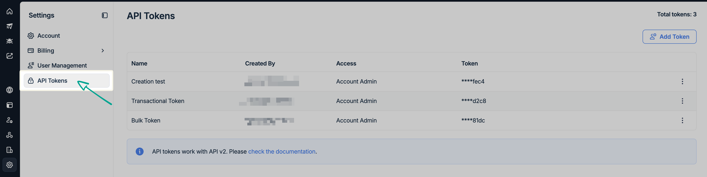
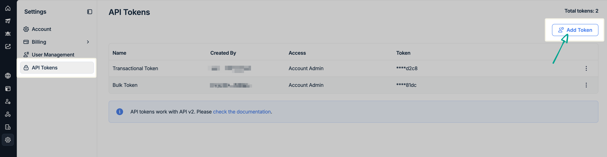
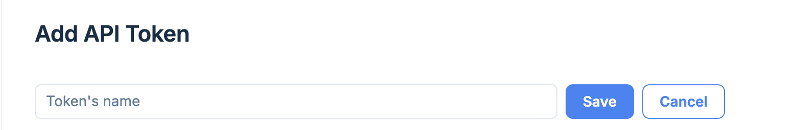
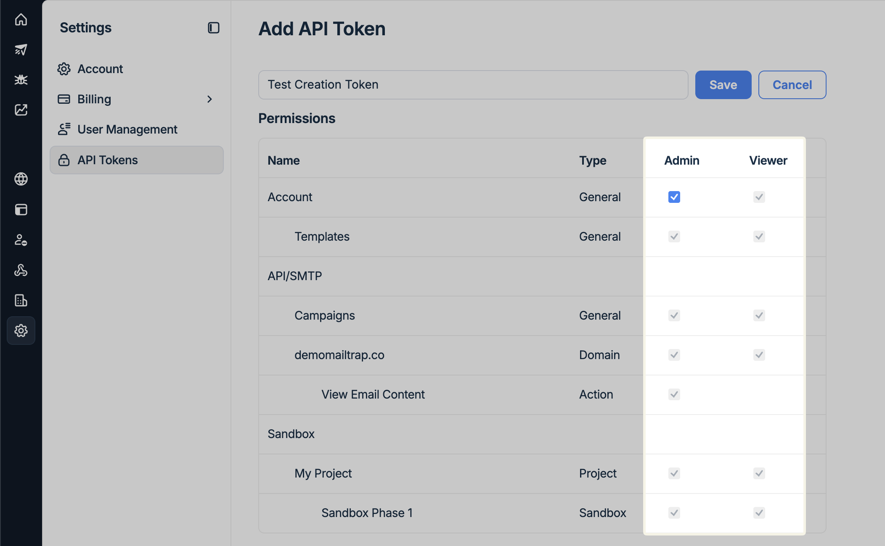
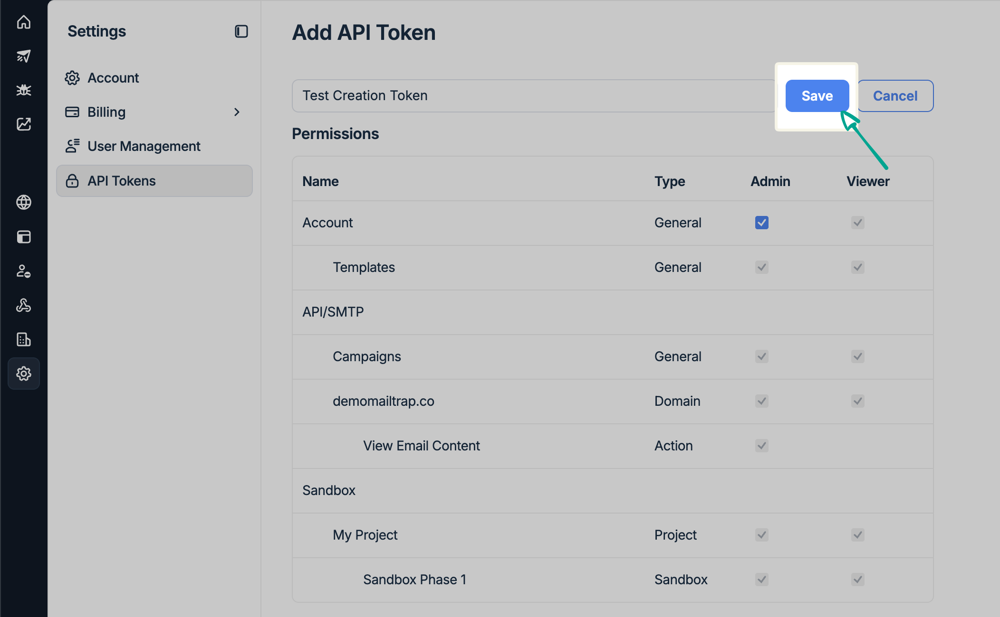
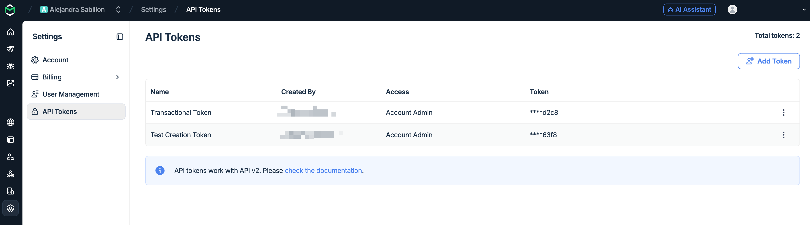
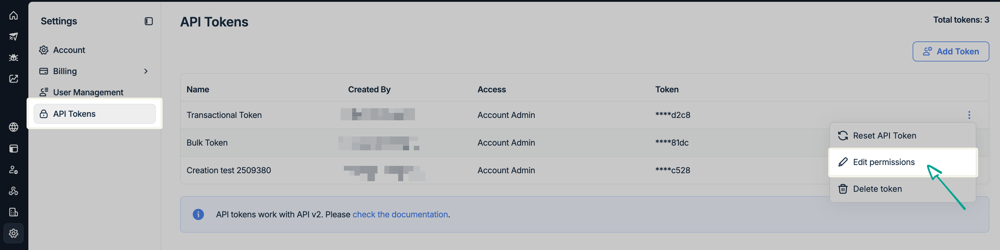
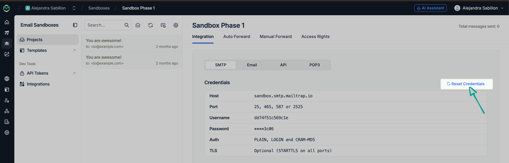
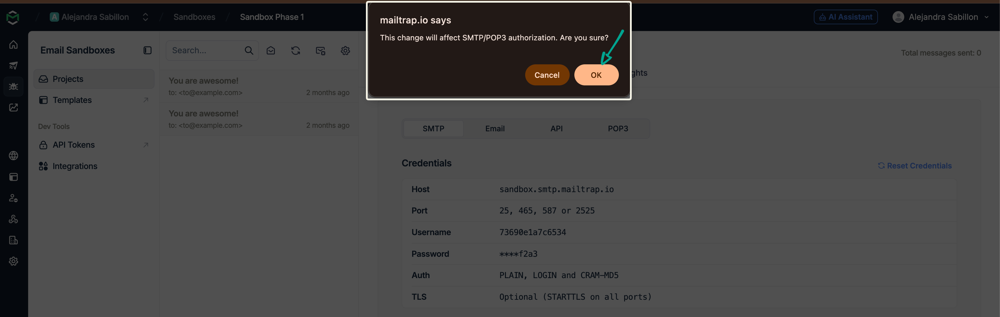

# API Tokens

You need an API Token if you want to integrate Email Sandbox via the [API](https://docs.mailtrap.io/developers/email-sandbox/send-test-emails). If you're working with the SMTP, you don't need the API Tokens.

#### Add and manage tokens manually





Navigate to **Settings** in the menu on the left and select **API Tokens**.




<figure><figcaption></figcaption></figure>




To add a new token, click the **Add Token** button in the upper-right corner.

<figure><figcaption></figcaption></figure>




**Type the token name** into the designated field.

It’s perfectly fine to have a custom name for the API token, as it’s only for your reference, regardless of the use case.

<figure><figcaption></figcaption></figure>




**Assign permissions** by checking the boxes in the corresponding access level columns.

<figure><figcaption></figcaption></figure>




Click the **Save** button and preview the new token under the **API Tokens** main menu.

<figure><figcaption></figcaption></figure>




#### Where to find tokens?

#### Settings > API Tokens

Select **Settings** in the left menu, then **API Tokens**. You'll see all active tokens, their creator, and their access level.

<figure><figcaption></figcaption></figure>

Click the three-dot menu to the far right of the specific user token and select Edit permissions.

<figure><figcaption></figcaption></figure>


**Important notes:**

* You can also give Account Admin access to the token and get access to all Projects, Sandboxes, and domains on that account.
* If you want to test how it works, you need to get authenticated using your API token. Mailtrap uses Bearer Authentication, so you must pass the token under the Authorization header of your email.


### Reset token

There are two ways to reset API tokens:

#### Resetting API tokens in the Sandboxes

To reset tokens, go to your Sandbox under the **Sandboxes** tab and click the **Reset Credentials** function next to your credentials.

<figure><figcaption></figcaption></figure>

Then confirm your choice with the **OK** button.

<figure><figcaption></figcaption></figure>

#### Resetting API Tokens from the API Tokens menu

Go to API Tokens, click the three-dot menu icon next to the token you want to reset, and click Reset API Token.

<figure><figcaption></figcaption></figure>

Confirm your choice by clicking on the corresponding button.

<figure><figcaption></figcaption></figure>


**Important notes:**

* After clicking the Reset credentials or Reset API Token buttons, the existing token becomes invalid after 12 hours. So, you have a 12-hour window to update all apps that use the old API token. Once the old token expires, some parts of your application will not work properly unless you've updated the token. All expired tokens get deleted from your account within 24 hours after expiration.
* After the API token is reset and expired, a new token is created. The token ID is added to the token name the same way it's done for automatically generated tokens, e.g., mailtrap.example token 4231.


### Edit permissions

As mentioned earlier, click the menu icon at the far right of a token and select Edit permissions.

<figure><figcaption></figcaption></figure>

Click on the corresponding boxes to add or remove token permissions. Then, confirm your selection with the Save button.

### Delete token

To delete a token, click the three-dot menu icon and choose the **Delete token** option.

<figure><figcaption></figcaption></figure>

Confirm the action by clicking the **Confirm** button.

<figure><figcaption></figcaption></figure>


**Important:** Keep in mind that a token is deleted immediately, and you can't delete the last token per domain.

