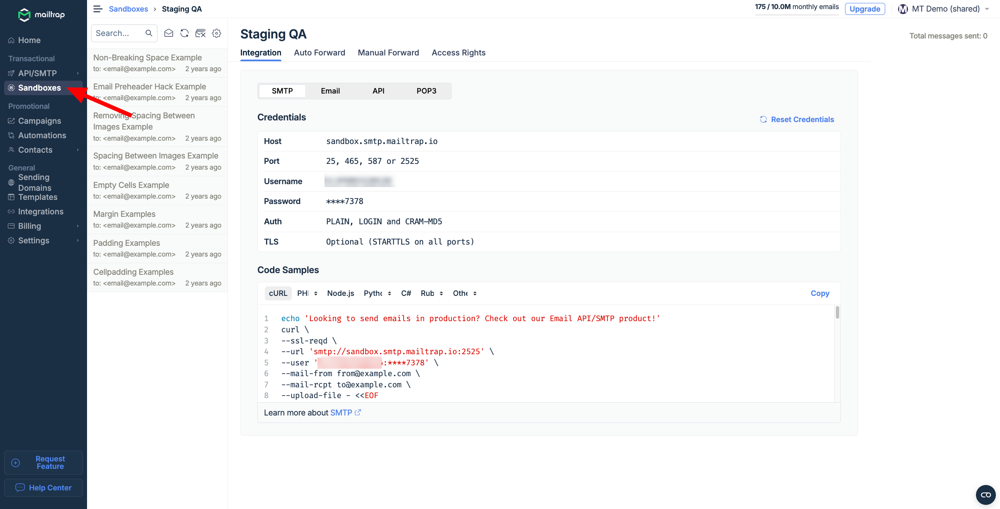
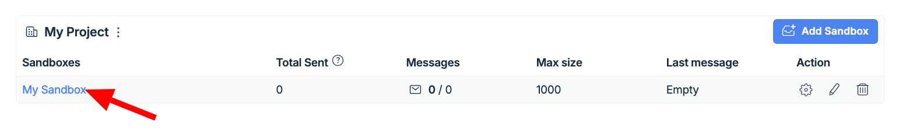
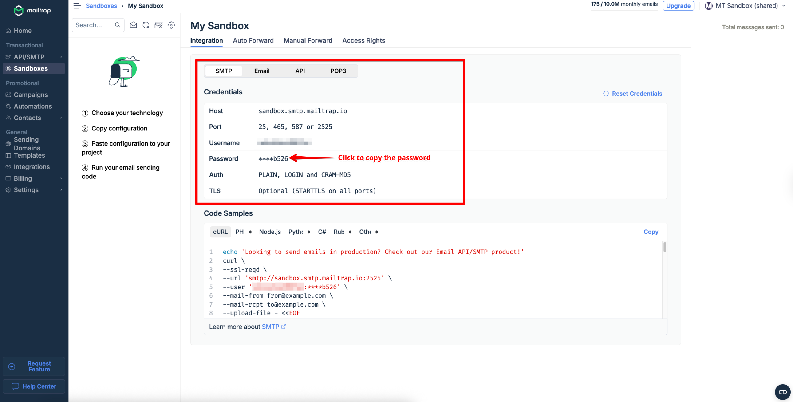
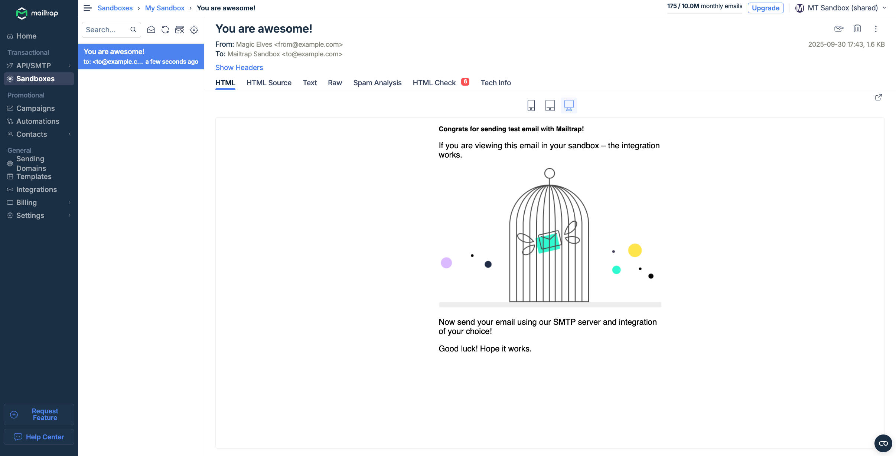
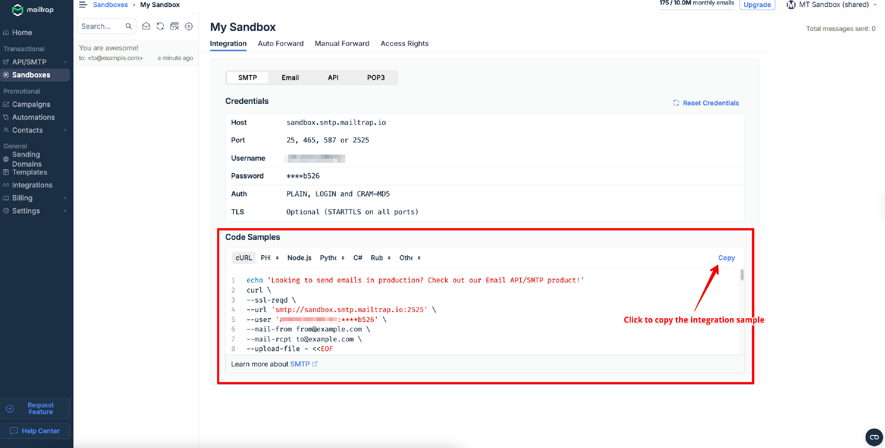

# Sandbox SMTP Integration

## Copy SMTP credentials



Go to **Email Testing** → **Sandboxes**.




Open the sandbox (named **My Sandbox**) created by default.




Under the **Integration** tab, select **SMTP** and copy the credentials such as Host, Port, Username, and Password.




Paste them into your email-sending script, service, or MTA (any service that supports SMTP integration), and run it. The email will arrive in your sandbox in a few seconds.




## Select your integration

Instead of copy-pasting the SMTP credentials, you can use the code samples already containing your credentials.



In the **Integration** tab of your sandbox, scroll down to **Code Samples** and select the programming language or framework you're working with.




Copy the configuration and paste it into your email-sending script. Then, run it. The email will arrive in the sandbox in a few seconds.




_Learn how exactly Mailtrap can help you streamline email testing processes from our_ [_case study with The Software House_](https://mailtrap.io/case-studies/the-software-house/)_._

