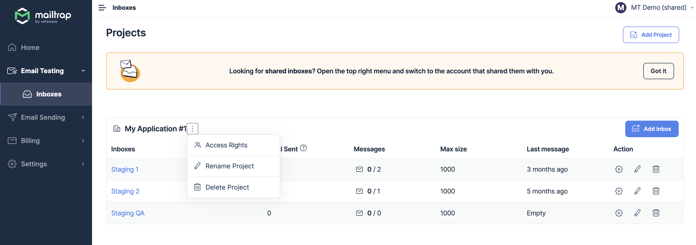
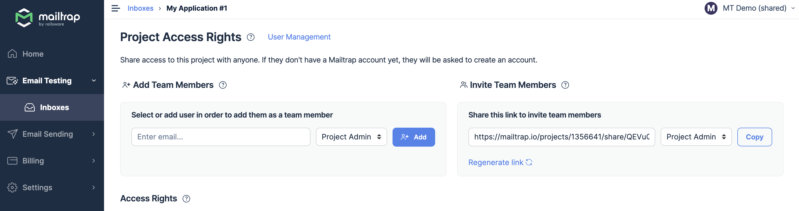
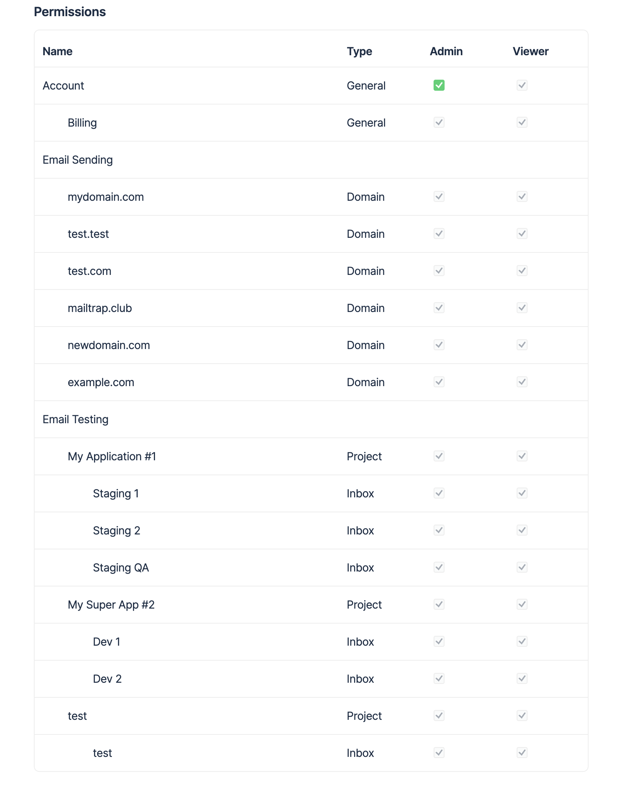

# Sharing Projects

### How to organize projects

All incoming emails in Sandbox are organized into sandboxes, the folders that are grouped into projects. Usually, projects are used to separate companies, environments, or (surprisingly) projects.

### How to share your projects

Sharing options are available starting from the Team plan.

You can share any of the projects in your account. Users that receive access to your project also receive access to all of its sandboxes and can manage or view their content. To learn how to share a specific sandbox, check out the [Sharing sandboxes](sharing-sandboxes.md) article.

To share a project including all of its sandboxes, you have three options:&#x20;

* Use the three vertical dots next to My Project under Sandboxes

* Share a link from Project Team Members

* Utilize the User Management feature

It doesn't matter which option you choose. New users will be visible in the Sandbox Team Members, Project Team Members tab and in the User Management list. But to share a project, you need to be one of the following:

* Project or account admin
* Account owner

### Important notes

The User Management section is visible to Account Admins and the Account owner.

In the "Project Team Members" window, you see all people who have access to this project, whether they were invited directly to the project or they have access to it. For example, the users could be account admins and thus have access to all projects.

If you select the "Team Members" tab of an sandbox, you see all people who have access to this sandbox. That goes for those invited directly to the sandbox and users who have access to the sandbox. Again, they could be project admins and thus have access to all project sandboxes.
