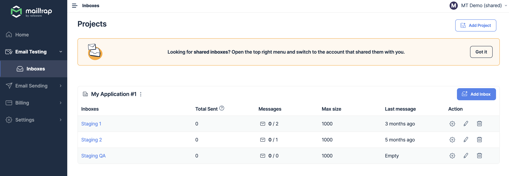
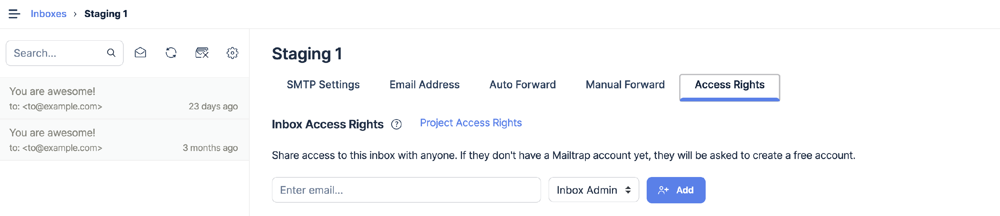
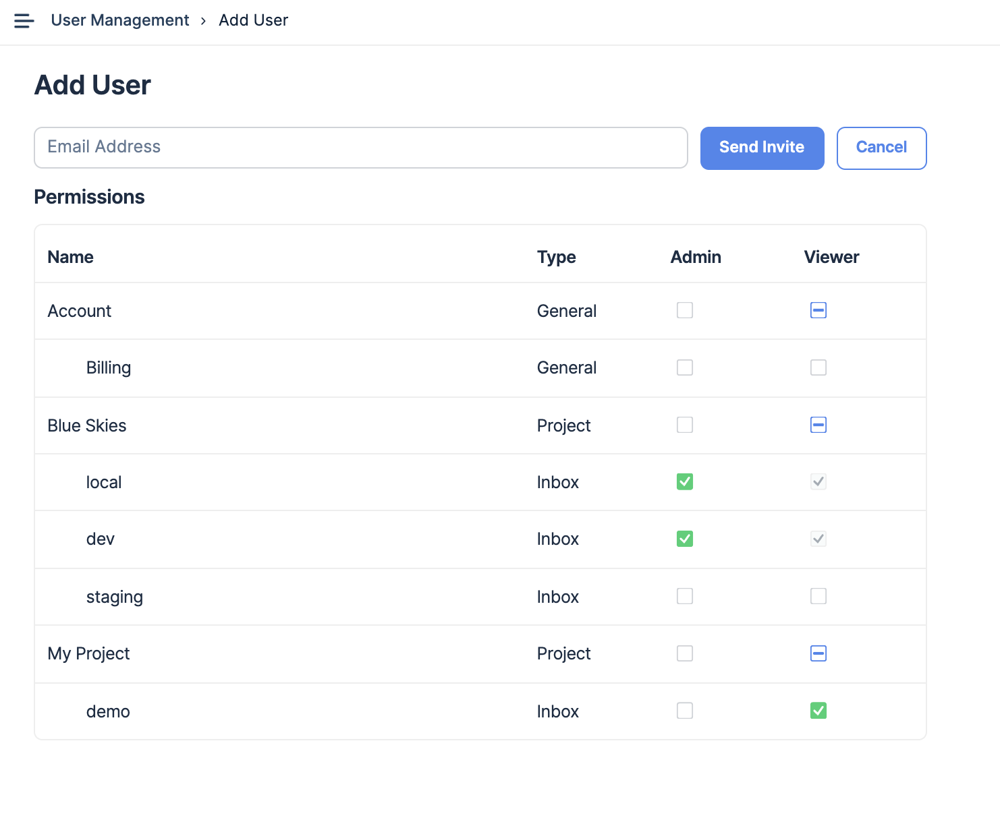

# Sharing Sandboxes

### How to organize your sandbox data

The best practice is to create separate sandboxes for different environments: development, test, or staging. Each sandbox is defined by SMTP credentials (your username and password). If necessary, you can reset them at any time.

### How to share your sandboxes with others

For effortless collaboration with your colleagues or customers, you can share data of your choice with them: separate sandboxes or whole projects (to learn how to share projects, check this article - [Sharing projects](sharing-projects.md)).

There are two ways to share your sandbox:

1. Invite users directly to sandbox
2. Share sandbox via User Management

To share an sandbox, you need to be one of the following:

1. Sandbox, project, or account admin
2. Account owner

Also, sharing options are available starting from the Team plan.

You can invite anyone, even if they don't have a Mailtrap account yet.

1. Click the gear icon on the far right of the sandbox you'd like to share.
2. Go to the Access Rights tab.
3. Enter the email address of your team member.
4. Choose the invitee's permission level (e.g. Sandbox Viewer or Admin)

Once you click the **Add** button, the email invitation will be sent to the specified email address. The recipient should accept the email invitation.

But if a person is already in your account the sandbox will immediately become visible to them.

Alternatively, you can use the **User Management** feature. Select it and click the **Add Member** button. Type the user's email address and tick the box under the permission level for an sandbox you'd like to share.

And yes, you can share multiple sandboxes at the same time. To finalize sharing, hit Send Invite and you're good to go.

### Sandboxes shared with you by others

Clicking on Sandboxes in the menu bar on the left reveals only the sandboxes associated with the account you're currently using.

If you want to access a different account and sandboxes that were shared with you, click on the account switcher in the upper right corner of the window, then select an account from the drop-down menu.

Note that you can be invited to any sandbox or project as a user, regardless of the subscription plan you currently use.
