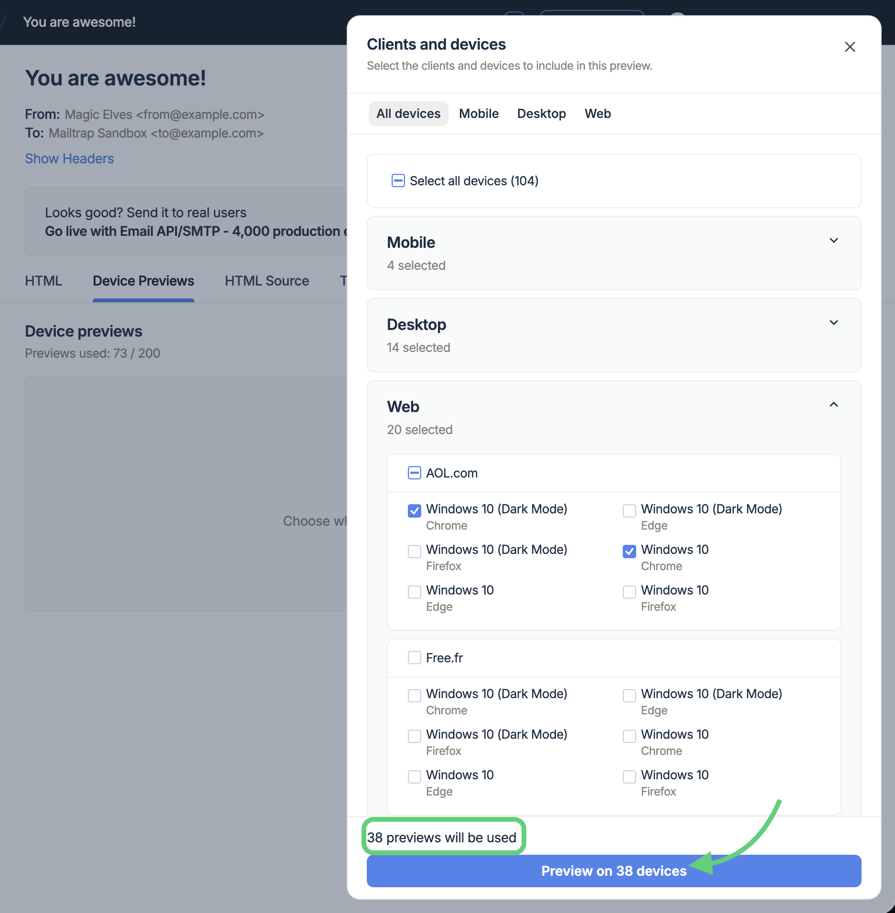
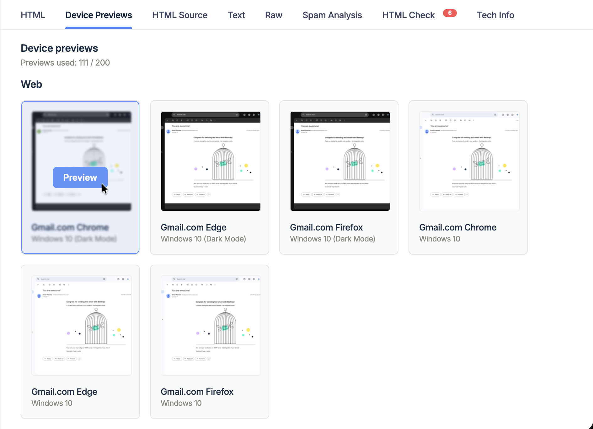
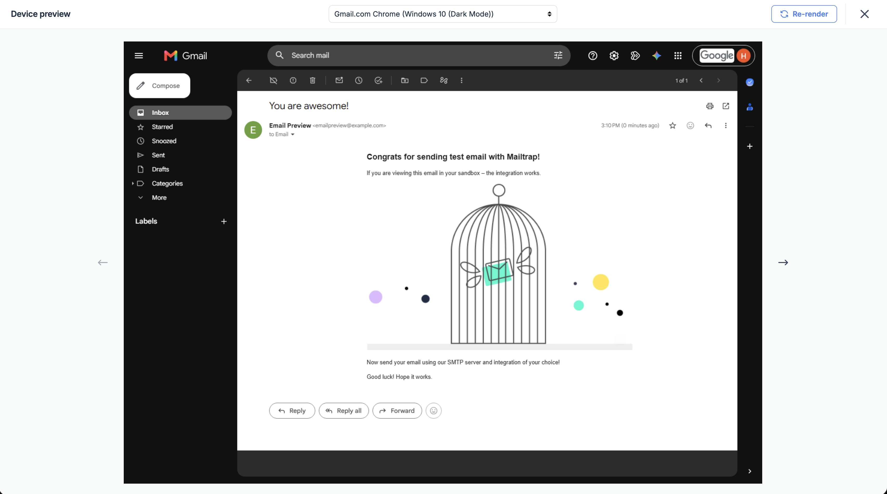
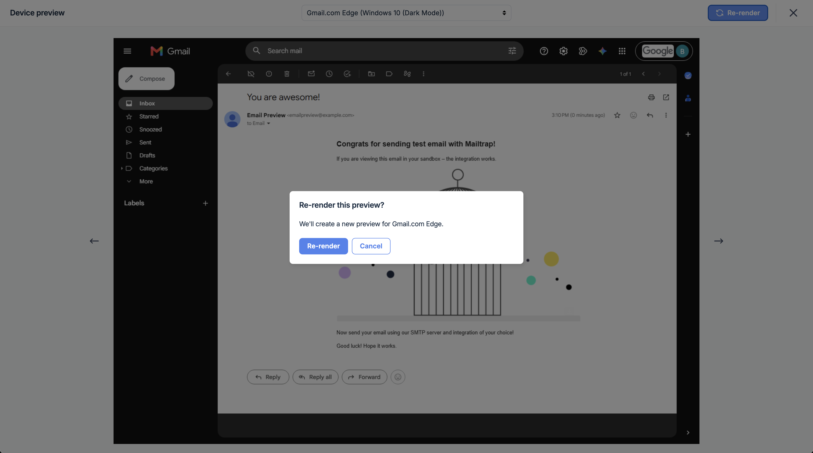

# Device Previews

**Device Previews** renders any HTML email captured in Email Sandbox across a catalog of real email clients and devices. The catalog contains more than 100 mobile, desktop, and web configurations, including Gmail, Outlook, Apple Mail, mobile clients, and available light- and dark-mode variants.

Choose the clients you want to test and start the preview. Mailtrap returns a screenshot for each successfully rendered configuration and shows results progressively. This way, you can check how the email will look before sending it to recipients.

<figure><figcaption>
<em>Review screenshots from selected email clients in the Device Previews tab.</em>
</figcaption></figure>


Device Previews produces screenshots for visual review. Use **HTML Check** for HTML/CSS compatibility and **Spam Analysis** for spam-related checks.


### Availability and access

Device Previews is available as a paid add-on on the **Business** and **Enterprise** [Email Sandbox plans](https://mailtrap.io/pricing/?tab=email-sandbox).

If your account is eligible, open **Device Previews** and click **Request Add-on**. Our customer support team will then confirm the commercial terms and enable the add-on for your account.

<figure><figcaption>
<em>Request the add-on from the Device Previews tab.</em>
</figcaption></figure>

### How to create Device Previews

* Open **Email Sandboxes**.
* Select **Projects**, open a Sandbox, and select a message with an HTML body.
  * Plain-text-only messages do not have the Device Previews tab
* Select the **Device Previews** tab and click **Test on Devices**.

<figure><figcaption>
<em>Start from an HTML message in Sandbox</em>
</figcaption></figure>

* In **Clients and devices**, browse **Mobile**, **Desktop**, and **Web**, and select the configurations to test (select light- and dark-mode variants separately when both are available).
* Click **Preview on N devices**.

<figure><figcaption>
<em>Choose the client configurations relevant to your recipients.</em>
</figcaption></figure>


Check the usage message at the bottom of the drawer. For example, '**8 previews will be used**' means the test consumes eight previews.


Mailtrap will then render your previews and show client results as they become available.

<figure><figcaption>
<em>Choose the client configurations relevant to your recipients.</em>
</figcaption></figure>


One captured message supports one Device Previews test. You cannot add clients after submitting it. To test changed HTML or another selection, send a new message to Sandbox.


### Review and re-render previews

Screenshots are usually available within about a minute. However, keep in mind that completed results can appear while other clients are still rendering, and some clients may take longer.

#### Open a completed preview

* Hover over a completed tile and click **Preview**.

<figure><figcaption></figcaption></figure>

* Inspect the email in fullscreen. Check layout width, stacking, text wrapping, fonts, spacing, images, buttons, backgrounds, dark-mode transformations, and footer content.

<figure><figcaption>
<em>Inspect completed results in fullscreen.</em>
</figcaption></figure>

Close fullscreen to return to the results grid. The selector contains completed results only.

#### Re-render a completed preview

Use Re-render to request a fresh screenshot of the same captured HTML for a completed result.

* Open the completed result in fullscreen.
* Click **Re-render**.
* Confirm the client in **Re-render this preview?**
* Click **Re-render**.

The action does not use another preview. It uses the same captured HTML; send a new message if the source changed.

<figure><figcaption>
<em>Confirm the client before requesting a fresh screenshot.</em>
</figcaption></figure>


A **Couldn’t render preview** tile cannot be opened or re-rendered. If the client is required, capture a new message and run another test, or contact Support if the same client repeatedly fails.


### Preview templates, campaigns, and automation emails

* Open the template, campaign, or automation email.
* Click **Send Test**.

<figure><figcaption></figcaption></figure>

* Select **Device Previews**, an active Sandbox, and click **Send Email to Sandbox**.

<figure><figcaption></figcaption></figure>

* Mailtrap creates the message and opens its **Device Previews** tab.


The send uses the regular Sandbox email quota and rate limit. The selected configurations use the separate Device Previews allowance.


### Usage and limits

A **test** belongs to one captured message. A **preview** is one selected client configuration and its screenshot:

* One selected configuration uses one preview.
* Selecting eight configurations uses eight previews.
* Separate light- and dark-mode selections count separately.

After the add-on is enabled, the tab header shows **Previews used: X / Y. X** is the number used in the current period, and **Y** is the account’s allowance. The **Sandboxes usage** card also shows the count under **Email previews**.

When all previews are used:

* **Test on Devices** is disabled for messages without results.
* A banner shows **You’ve used all your previews**.
* The banner shows the reset date when available, or says the allowance resets at the next billing period.
* Clicking on **Contact Support** opens a request for additional previews.

If a selection exceeds the remaining allowance, reduce the number of configurations and submit again.

<figure><figcaption>
<em>Wait for the reset or contact Support about additional previews.</em>
</figcaption></figure>

### Troubleshooting

| Device Previews tab is missing             | The message has no HTML body                                           | Send an HTML message and open the new capture                                                            |
| ------------------------------------------ | ---------------------------------------------------------------------- | -------------------------------------------------------------------------------------------------------- |
| The page shows **Upgrade**                 | The account is on an ineligible plan                                   | Upgrade to a Business or Enterprise Email Sandbox plan                                                   |
| The page shows **Request Add-on**          | Eligible plan, add-on not enabled                                      | Request activation from Support                                                                          |
| Test on Devices is disabled                | Monthly allowance is exhausted                                         | Wait for the displayed reset or contact Support                                                          |
| Selection is rejected                      | Selection exceeds remaining usage, or the catalog changed              | Reduce the selection; reopen the drawer if needed                                                        |
| Some clients keep processing               | Clients complete independently                                         | Check again later; contact Support if required clients remain stuck                                      |
| **Couldn’t render preview**                | That client did not return a screenshot                                | Use a new message/test; contact Support if it repeats                                                    |
| Completed result looks incomplete          | Source HTML, external assets, or client support differs                | Check the captured HTML, public assets, and HTML Check; re-render only if a remote asset may have failed |
| Device Previews is temporarily unavailable | Request or result service failed                                       | Try later; contact Support with account, Sandbox, message, time, and failed action                       |
| **Send Email to Sandbox** fails            | Sandbox inactive, Sandbox email quota/rate limit, or invalid test data | Fix the Sandbox sending error and send again                                                             |
| Old previews disappeared                   | Retention ended or the message was removed                             | Capture a new message and run a new test                                                                 |
