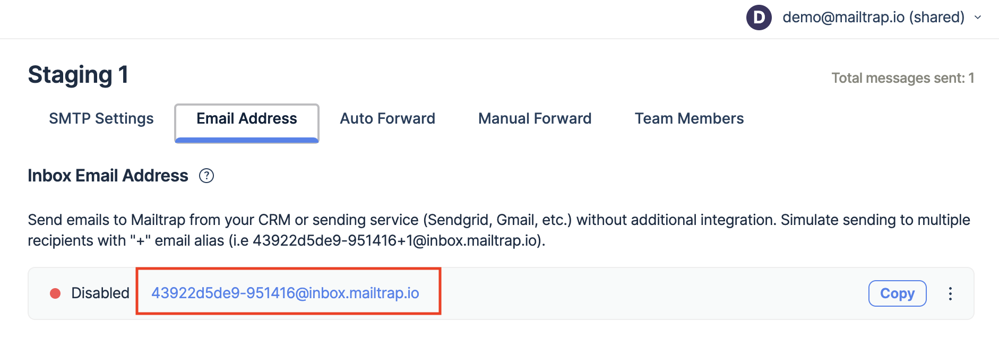
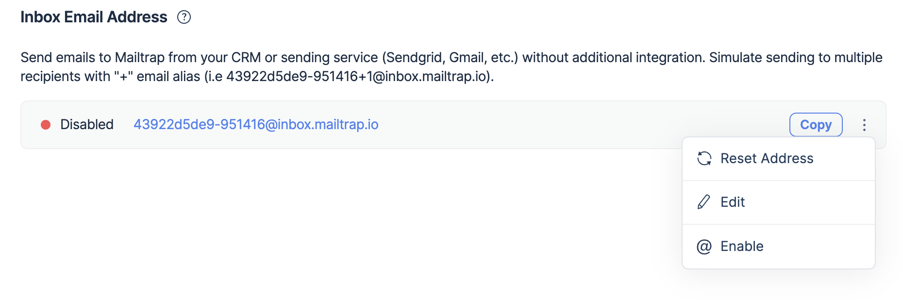

# Load Testing

Email app load testing is one of the most popular cases of using Sandbox Enterprise plan. This plan allows you to send up to 150 emails every 10 seconds to as many as 300 sandboxes.

Every sandbox has a unique email address that can be customized (the "email per sandbox" feature). It consists of two parts:

* A **customizable alias, which you can edit manually**. You can use any combination of numbers and Latin symbols. For example, your company name or the name of the current sandbox with an identifying number. Sandboxes support dynamic aliased addresses. For example, mailtrap-load-test-12ab34+1@inbox.mailtrap.io and mailtrap-load-test-12ab34+2@inbox.mailtrap.io will both be accepted and delivered to the same sandbox.
* **Technical hash, which cannot be changed**. It consists of 6 symbols and acts as our internal sandbox identifier. Using this feature, you can use an infinite number of address combinations, and can imitate sending emails to a large number of users (with unique email addresses). The sandbox name changes are applied instantly, meaning that you don't have to pause your email testing and wait until a new alias becomes valid.


_Also, note that if you try to send a message to a custom sandbox address that doesn't exist, you will get the "554 5.5.1 Error: no sandbox for this email" message._


By default, the sandbox email address is disabled for security reasons. To activate it, go to the **Email Address** tab and open the three dots menu next to the **Copy** button. Click **Enable**. In this menu, you will also find the **Edit** and **Reset Address** buttons.

### Load testing use case

Large-scale systems employ numerous servers to distribute loading. Specifying **a separate testing email address for each server** allows you to follow and inspect failures or unexpected behavior. This way you can test and load all your resources at once and then filter the results accordingly.

Here is how it looks in practice:

* email **server A** sends messages to the [servera-12ab32@inbox.mailtrap.io](mailto:servera-12ab32@mailtrap.io) sandbox
* email **server B** sends messages to the [serverb-12ab44@inbox.mailtrap.io](mailto:servera-12ab32@mailtrap.io) sandbox
* email **server C** sends messages to the [serverc-12ab55@inbox.mailtrap.io](mailto:servera-12ab32@mailtrap.io) sandbox
* …
* email **server L** sends messages to the [serverl-12ab99@inbox.mailtrap.io](mailto:servera-12ab32@mailtrap.io) sandbox, etc.

Afterward, you can enter a corresponding project in your account and see a list of these sandboxes with the number of messages in each sandbox.

This way, you can check and compare your sending capabilities and instantly identify which of your servers is experiencing problems.

_You can disable the email addresses any time you need it. We recommend disabling them as soon as you finish testing, for improved safety._
