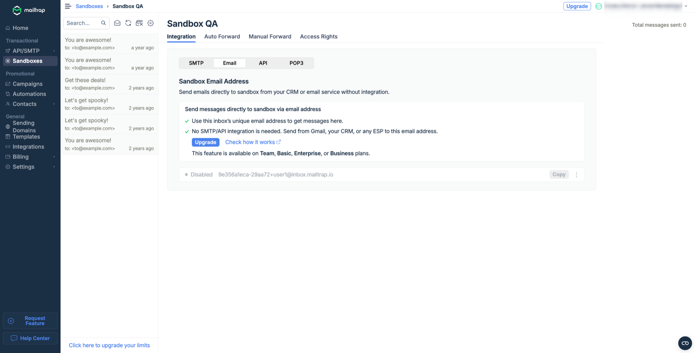
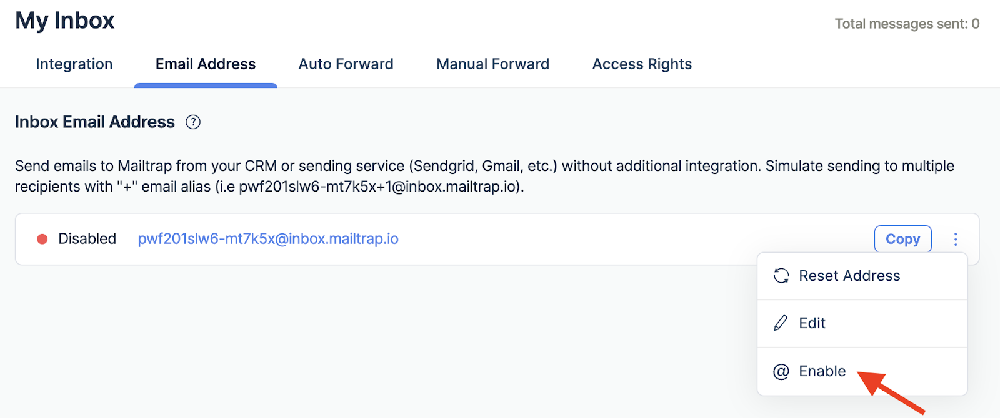
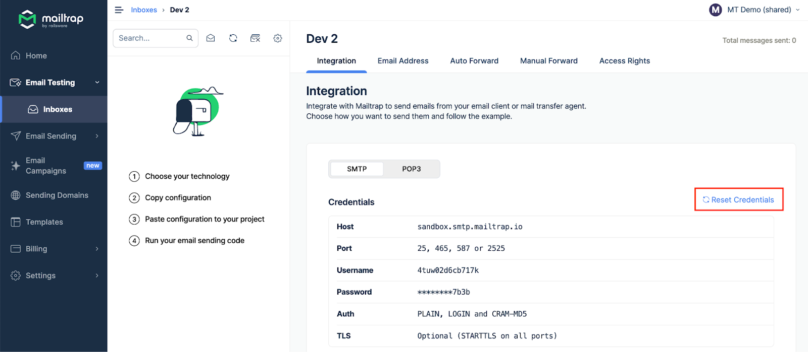

# Troubleshooting

This page covers common issues you might encounter when using Email Sandbox and their solutions.

### Connection errors

If you can't connect to the Sandbox SMTP server and receive errors like **Connection cannot be established** or **Connection timed out**, follow these troubleshooting steps:



**Test your connection using the Telnet utility**


```bash
telnet sandbox.smtp.mailtrap.io 2525
```


If Telnet shows that a connection can't be established with our server, you should:



**Try alternative SMTP ports**&#x20;

Use another SMTP port, such as **2525**, **465**, or **25**.


In most cases, connection issues are related to the firewall blocking the SMTP port.




**If none of these ports work, try connecting with:**

* A different machine
* A different location
* A different ISP
* A VPN connection

This will help identify the route affected by the issue.



**Check idle timeout**

If you've opened an SMTP connection and haven't closed it afterward, the SMTP server will close the session after the idle timeout time.



**Verify server status**

To make sure our SMTP server is up and running, go to the [Status page](http://status.mailtrap.info/). Here, you can check the SMTP server availability from different locations.




If the issue persists after trying all these steps, please contact us at [support@mailtrap.io](mailto:support@mailtrap.io).


### Authentication error (530)

**Error message:**

```
Expected response code 250 but got code "530", with the message "530 5.7.1 Authentication required"
```

When you receive the **5.7.1 Authentication required** error, it means that either:

* The SMTP authentication is disabled in your configuration, or
* The authentication failed


In either case, an email was not sent.


**Solution:**

1. Enable SMTP authentication in your settings
2. Configure your app to enable SMTP authentication
3. If it is already enabled, revise your credentials and authentication settings
4. Try sending an email again

### Messages not delivered to Sandbox

If your messages aren't appearing in your sandbox, follow these troubleshooting steps:



**Verify your** [**SMTP integration**](setup/sandbox-smtp.md) **is correct**

1. Go to your sandbox **Integration** tab
2. Compare hostname, username, and password with those in your app


If you reset SMTP/POP3 credentials, all existing integrations are affected and must be updated.




**Verify limits**

Make sure that the number and frequency of the messages sent correspond to the terms of your [billing plan](https://mailtrap.io/pricing/). Check:

* Rate limits (emails per 10 seconds)
* Monthly message limits
* Email size limits



**Check SMTP logs**

View your SMTP logs and check whether you received any errors. To view SMTP logs, enable debugging in your email code.

For example, see [how to enable debugging in PHPMailer](https://mailtrap.io/blog/phpmailer/).



**Contact support**

If you still can't figure out why your emails aren't getting delivered to your sandbox:

1. Save an undelivered message in **.eml** format
2. Remove any sensitive information
3. Send it to us at [support@mailtrap.io](mailto:support@mailtrap.io)



### Sandbox email address disabled

Email per sandbox is a premium feature available in the Basic, Team, Enterprise, or Business plans.

<div data-with-frame="true"><figure><figcaption></figcaption></figure></div>

**Enabling after upgrade**

Once you upgrade your plan, make sure you activate the address:



Go to the **Email Address** tab in your sandbox.



Click the three-dot menu to the right, and select **Enable**.

<div align="left" data-with-frame="true"><figure><figcaption></figcaption></figure></div>



**Alternative: SMTP integration**


You can freely test emails without this feature. With any plan (including the free tier), you can integrate SMTP credentials into your app and receive every email this way.


You'll find the integration samples for over 20 frameworks and libraries on the Integration page of your sandbox. You can also use the API without any restrictions.

### Tech info / headers unavailable

The **Tech Info** tab will show the following headers if they're present in an email:

* `Message_id`
* `X_mailer`
* `Sender`
* `From`
* `To`
* `Cc`
* `Reply_to`
* `Return_path`


If any of these headers haven't been specified (for example, an email doesn't have a `reply_to` header specified), it won't be displayed.


**BCC Header**

If you are on the Business plan or higher ([view plans](https://mailtrap.io/pricing/)), you will also see the **BCC** header in this tab (if specified for the message).

On lower plans, no BCC field will appear even if it was included in a message.

### Team members limit reached

If you can't add more team members, you may have reached the user limit of your plan.

**Solution:** Upgrade your plan to increase the team member limit. Check [pricing plans](https://mailtrap.io/pricing/) for details.

### Automatic forwarding issues

If your test emails aren't being forwarded automatically, there's very probably an error in the auto-forwarding configuration.

**How auto-forwarding works**

When auto-forwarding to predefined addresses/domains, sandbox verifies the `TO` and `CC` headers of a message (BCC is ignored).

An email is forwarded if:

* `TO` or `CC` of your email matches the value in the **Emails** list, **OR**
* The domain in the `TO` or `CC` of your email matches the value in the **Domains** list


A forwarding rule needs to be verified (its status must be **Active**) before it can be considered. To do that, you'll need to confirm the email address or the domain's ownership.


**Troubleshooting steps**

If a particular email is not forwarded:

1. Check its headers via the **Tech Info** tab
2. Verify you have the correct `TO` or `CC` address set
3. Ensure your forwarding rule status is **Active**
4. Confirm the email address or domain has been verified

**Furher reading**: [Automatic Email Forwarding](automatic-email-forwarding.md)

### Suspicious emails in sandbox

If you see emails in your sandbox that you didn't send from your app, someone may have accessed your SMTP credentials.


If you suspect unauthorized access to your sandbox, reset your credentials immediately.


**How to reset credentials**

Don't panic — it's very easy to reset your credentials:



Log in to your dashboard, open your sandbox, and go to the **Integration** tab.



Click the **Reset Credentials** button, and your details will be reset right away.

<div data-with-frame="true"><figure><figcaption></figcaption></figure></div>



Make sure you update the credentials in your app, as old credentials will no longer be valid.




We don't store information about the server or IP address that sent messages. As such, we won't be able to help you track down the sender.


#### Related articles

* [How to integrate Email Sandbox with your application](setup/sandbox-smtp.md)
* [Features and Limits](help/features-and-limits.md)
* [Automatic Email Forwarding](automatic-email-forwarding.md)
* [Email Sandbox FAQs](faqs.md)

#### Need More Help?

If you don't find the solution to your problem here, contact our support at [support@mailtrap.io](mailto:support@mailtrap.io).
