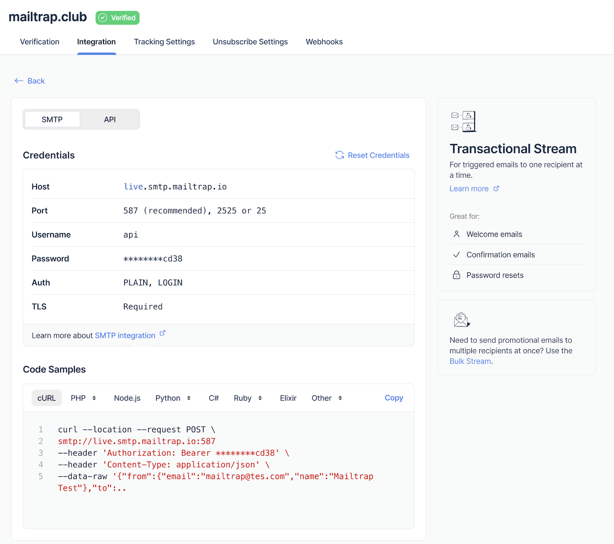
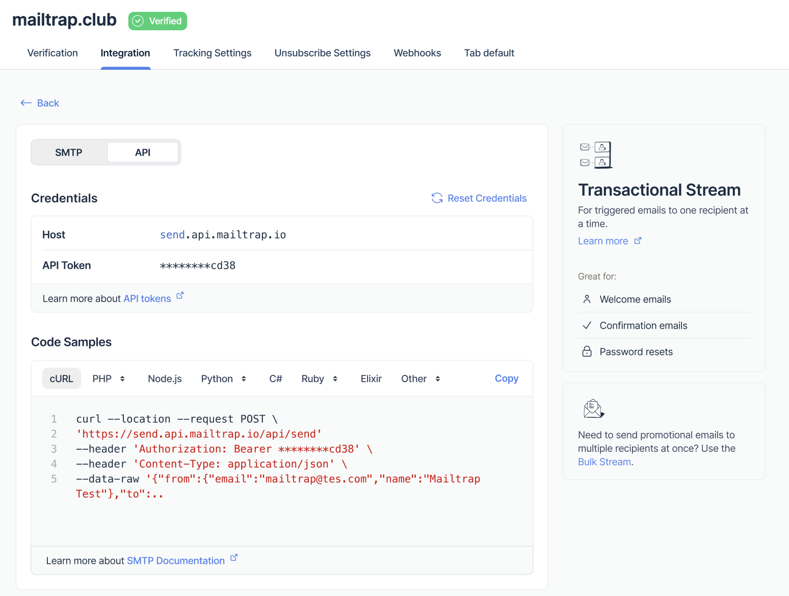

# Email API/SMTP

Learn how to send your application emails with Mailtrap

**Migration guides:**

* [SendGrid](https://mailtrap.io/sendgrid-migration/)
* [Mailchimp](https://mailtrap.io/mandrill-migration/)
* [Mailgun](https://mailtrap.io/mailgun-migration/)
* [Postmark](https://mailtrap.io/postmark-migration/)
* [Amazon SES](https://mailtrap.io/amazon-ses-migration/)

Big-volume sender? [Contact us for onboarding assistance](https://mailtrap.io/talk-to-sales/).

### Overview


**Good to know**

* To send emails to your recipients, you must own a domain and add it to Mailtrap.
* Every new domain requires a Compliance Check after DNS verification. In most of cases it takes a few minutes.
* You can try out all features with the Demo domain we provided once you sign up.




**Verify the sending domain you own**

To add a domain you own, go to the Sending Domains tab and click Add Domain. Type your domain name and confirm with the Add button.

<figure><figcaption>
Add Domain form
</figcaption></figure>

Then, add the DNS records Mailtrap provides to your domain provider.

<figure><figcaption>
DNS records for domain verification
</figcaption></figure>

Check our [Sending Domain Setup Guide](../email-api-smtp/sending-domain-setup.md) for detailed instructions on adding and verifying your domain.



**Integrate your application via Email API or SMTP**

**SMTP Integration**

To send emails via Mailtrap SMTP, follow the instructions [in this article](../email-api-smtp/smtp-integration.md).

<figure><figcaption>
SMTP integration credentials and code samples
</figcaption></figure>

**Email API Integration**

To send emails via Mailtrap Email API, follow the steps [in this article](../email-api-smtp/api-integration.md).

<figure><figcaption>
Email API integration credentials and code samples
</figcaption></figure>



### What else you can do with Mailtrap Email API/SMTP

* [Set up Tracking Settings](../email-api-smtp/sending-domain-setup.md#optional-tracking-settings-ffi49)
* [Set up Unsubscribe Settings](../email-api-smtp/sending-domain-setup.md#unsubscribe-settings-ekyqh)
* [Set up Webhooks](../email-api-smtp/sending-domain-setup.md#optional-webhooks-4hmes)
* [Set up Email Categories](../email-api-smtp/statistics/email-categories.md)
* [Add or import Suppressions](../email-api-smtp/suppressions-list.md)
* [Create templates](../email-api-smtp/email-templates.md)
