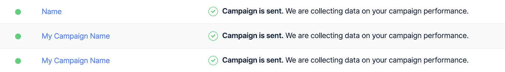
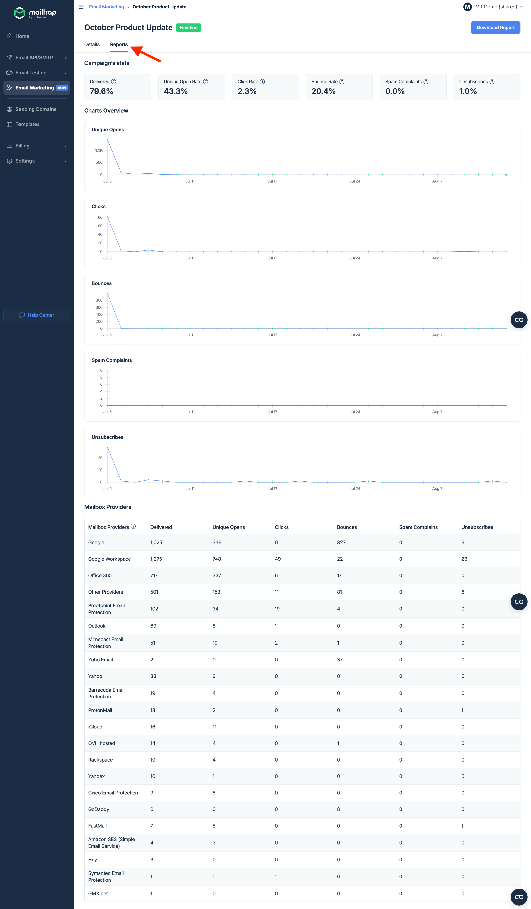

# Email Marketing

Make sure you've added and [verified a domain](../email-api-smtp/setup/sending-domain.md), or you won't be able to send a campaign.

### How to set up and send a campaign





Go to **Email Marketing** and click **Create New Campaign**.



Choose a domain from the **Select domain** dropdown, then set the **Campaign name**, **Subject**, and **From** email address. Optionally, set the From name, Reply-To name, and Reply-To email. If you have only one domain, no need to choose anything, it's selected for you by default. Click **Continue**.



You'll be taken to the Design step, where you can choose between Drag & Drop and HTML editors. If you have templates stored, you'll see them here. You can use them in your campaigns. Read more about creating templates [here](../email-api-smtp/email-templates.md).



Create your campaign design, click **Save**, and then **Continue**.


Instead of continuing to the next step, you can click **Send Test** to send a test to one email address to check the design in your email client or click **Finish Later** to return to the campaign **Details**, where you can change any of the parameters you set in previous steps.




If you've already imported your contacts, select your audience by including or excluding specific lists. Then, click **Confirm Audience**.


With **Including** and **Excluding** features, you can easily send campaigns to specific audience groups only.



If you didn't upload your contacts before creating a campaign, you'll be prompted to import contacts at this stage. Simply click **Import Contacts** and follow the steps ([refer to this section](../email-marketing/contacts.md#how-to-upload-contacts-nag8y) in our Contacts guide for more details). **Important**: you should create Fields beforehand to be able to assign variables to the fields (map fields) when importing contacts.




Choose whether to send all emails **at once** or send them **gradually (throttling)** by setting how many emails are sent per hour. For more details, refer to the [email throttling guide.](https://docs.mailtrap.io/email-marketing/campaigns/email-throttling)



At this point, you can click **Send Test** to send a test email to one email address, choose **Send now** to send the campaign immediately, or select **Schedule campaign** to send it at a specific date and time.


To schedule the campaign, click **Schedule Campaign**, select the date, and choose the time. Then, confirm the action by clicking **Schedule Sending**.




### What's next?

Once your campaign has been sent, you can check the campaign deliverability data and stats. Here's how to do it:



Click **Email Marketing** in the left navigation panel, and you'll have a quick preview of all the campaign data. If we're still collecting the data, you'll be notified accordingly.

<figure><figcaption></figcaption></figure>




If you want more details for a particular campaign, click the campaign name, then select the **Reports** tab, where you'll see the full [Statistics report](../email-marketing/campaigns/statistics.md).

<figure><figcaption></figcaption></figure>



