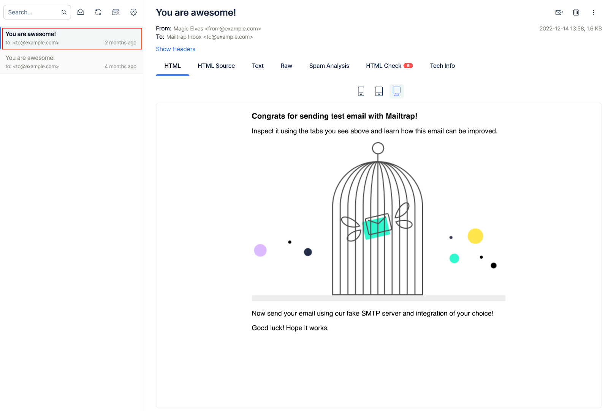

# Email Sandbox

Learn how to inspect and debug emails with sandbox functionality.

**What you can do:**
1. Catch testing emails from staging.
2. Preview and analyze content for spam.
3. Validate HTML/CSS before sending emails.

## Good to know

* Your emails won't reach your users as you use our Sandbox SMTP.
* You don't need to verify a domain to use sandbox.

## Overview

### Step 1: Navigate to Email Sandbox

Go to [your first Sandbox](https://mailtrap.io/inboxes) by clicking Sandboxes, then My Sandbox. 

**Tip:** By default, we created an sandbox for you and called it "My Sandbox". The Edit button on the far right allows you to rename either a project or an sandbox.

Once inside “My Sandbox”, copy the credentials from the "Integration" tab to your clipboard.

Or, use one of the pre-made code snippets for major programming languages and frameworks:

### Step 2: Send your first test email

After sending the first test email, you can immediately find it in your Mailtrap sandbox.

<figure><figcaption>
Test email in sandbox inbox
</figcaption></figure>

Click on the email, and proceed to inspect and debug it by selecting the HTML Check tab.

<figure><figcaption>
HTML Check results
</figcaption></figure>

Lastly, you can automate the QA flow with [API](https://api-docs.mailtrap.io/docs/mailtrap-api-docs/a2041e813d169-email-testing-api) if you need it.

### Bonus: Invite your colleagues

Mailtrap is a collaborative tool. Starting from the [Team Plan](https://mailtrap.io/billing/plans/testing), you can create different sandboxes and projects and share them with your colleagues.

That allows you to organize all testing-related workflows among different people - from user management with different permissions to SSO.

## What else you can do with Email Sandbox

* [Enable email per sandbox feature](../email-sandbox/email-address-per-sandbox.md)
* [HTML or RAW format preview](../email-sandbox/inspect-your-email-template.md)
* [HTML Check](../email-sandbox/html-check.md)
* [Automatic Forwarding](../email-sandbox/automatic-email-forwarding.md) and [Manual Forwarding](../email-sandbox/manual-email-forwarding.md) to view emails in real sandboxes
* [Test Bcc and email headers](../email-sandbox/checking-email-headers-and-bcc.md)
