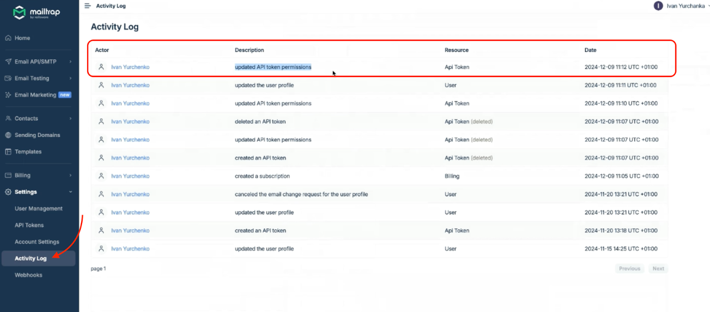
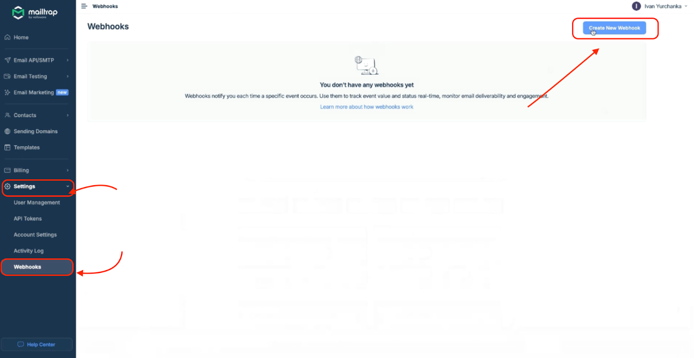
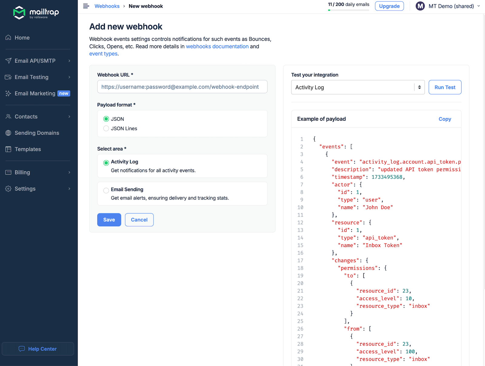

# Overview

Activity Log automatically tracks the activities and actions performed by users within your account. It's a stream of events, logging actions taken and indicating who performed them, which is used for security purposes.


This feature is available to Enterprise plan users only.


## How to view Activity Log

To view the Activity Log:

1. Log in to your Mailtrap account.
2. Click on **Settings** in the left-side menu and select **Activity Log**.

Once you're on the Activity Log page, you'll be able to see the activities performed by users:

<div align="left" data-with-frame="true"><figure><figcaption><p>Activity Log page</p></figcaption></figure></div>


Events start saving the moment you upgrade to Enterprise plan.


## Activity Log event examples

In the Activity Log, you can see events such as:

- John Doe added a domain.
- John Doe created the field First Name.
- John Doe deleted a sandbox QA.
- John Doe invited the user email@example.com to the account.
- Someone attempted to log in to the user John Doe using GitHub.
- John Doe removed the webhook Logging from Transactional.

## Why should you use the Activity Log?

Some of the reasons you should use the Activity Log include:

- **Security** – With events being tracked automatically, you can easily debug and investigate security incidents.
- **Transparency** – See what's happening in your account in real time by having a transparent overview of actions performed by users.
- **User management** – Monitor how your team members are interacting with Mailtrap services.

## Using Activity Log with Mailtrap Webhooks

You can also pair the Activity Log with Mailtrap Webhooks and build an integration to monitor activities live.

Here's what you need to do:

1. Navigate to **Settings** → **Webhooks** and click on **Create New Webhook**.

<div align="left" data-with-frame="true"><figure><figcaption><p>Create New Webhook</p></figcaption></figure></div>

2. Enter your unique webhook URL, choose the Payload format, and select **Activity Log**.

<div align="left" data-with-frame="true"><figure><figcaption><p>Webhook configuration for Activity Log</p></figcaption></figure></div>

Now you can build an integration to monitor activities live, increasing your security measures.

Here's an example of a webhook payload:


```json
{
  "events": [
    {
      "event": "activity_log.user.updated",
      "description": "updated the user profile",
      "actor": {
        "id": 783,
        "type": "user",
        "name": "Jane Doe"
      },
      "resource": {
        "id": "783",
        "type": "user",
        "name": "Jane Doe"
      },
      "changes": {
        "name": {
          "to": "[FILTERED]",
          "from": "[FILTERED]"
        }
      },
      "timestamp": 1733739084
    }
  ]
}
```

