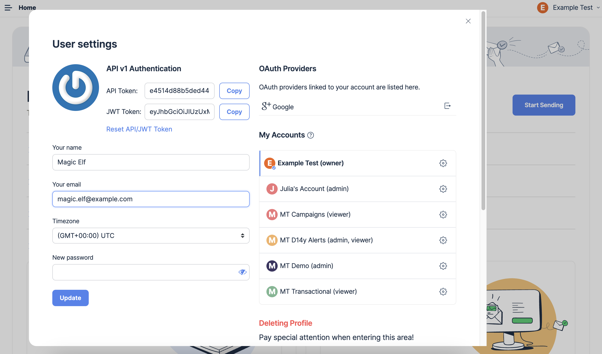

# My Profile

Mailtrap defines your user profile by your email address, and you can't use Mailtrap without the address.

To manage **User settings**, select your user name or email in the upper right corner and click My Profile. As a Mailtrap user, you can own or belong to multiple Mailtrap Accounts. When you sign up with Mailtrap, a free account is created for you automatically.

By default, the account name is either the owner's email address or name, if the latter was provided by OAuth.

When you delete your user, all your data is deleted. Check your [rights to be forgotten](https://mailtrap.io/privacy/#39-Data-Retention).If you own account(s) and delete your user profile, all the account data, including projects, sandboxes, and team mate accesses will be deleted. This action is irreversible. If you need this data in the future, consider downgrading to the Free plan instead of terminating your subscription.If you don't own any account, deleting your user profile results in losing access to Mailtrap as well as all your user data, such as email, billing plan, account accesses, linked OAuth providers, etc.And within the **User settings** menu, you can see which account(s) you belong to and your level of access for each.

* **Owner** means you have the highest account access - can delete accounts, transfer ownership and manage team mates.
* **Admin** means that you have rights to fully manage all or some account entities (projects, sandboxes). You can, for example, delete them and provide access for team mates.
* **Viewer** access gives you read-only rights to some or all account entities. [See User Management](user-management.md) to learn more about permissions.

Clicking gear icon near the account name will bring you to the [Account settings](https://mailtrap.io/account-management). Depending your access level, you'll be able to rename or delete an account, transfer its ownership, or leave it.
