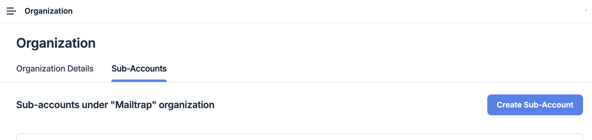
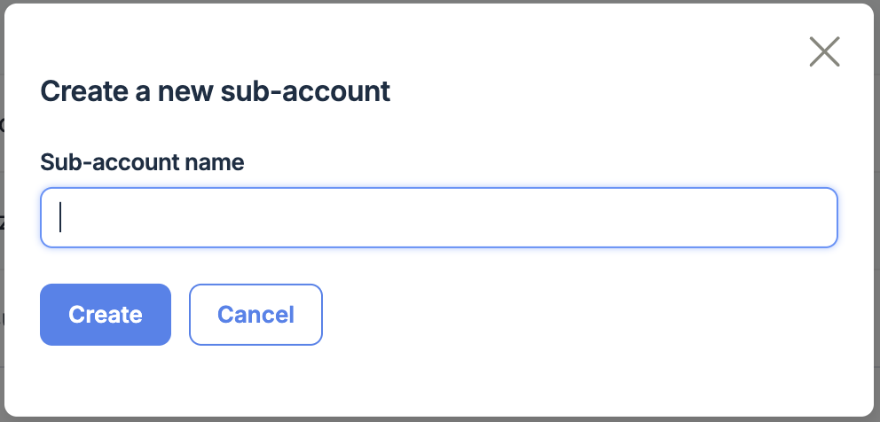
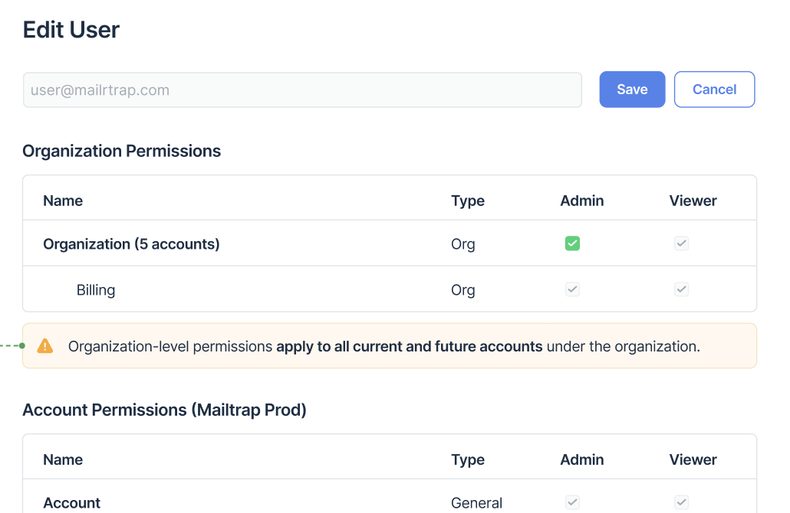

# Organization & Sub-Accounts

### Overview

The Organization & Sub-Accounts structure is designed to help you manage complex setups involving multiple teams, clients, environments, or products - all under a single Organization.

Each sub-account functions as a fully isolated workspace with its own set of projects, sending domains, email templates, stats, credentials (SMTP/API), and even team members. This separation ensures that data, permissions, and sending behavior in one sub‑account will never affect the others.

At the same time, your Organization acts as the central hub:

* Centralized billing lets you keep all sub‑accounts under one subscription plan and one invoice.
* Shared quota pools apply across all sub‑accounts using Email API/SMTP, Email Campaigns or Email Sandbox, making it easy to allocate resources flexibly.
* Org-level permissions give users access to all current and future sub‑accounts by default - ideal for admins or managers.
* Sub-account-level permissions can be assigned when you need to restrict access to just selected environments or clients.
* Clear separation of data. Projects, templates, stats, and domains stay neatly separated between sub‑accounts.
* Deliverability isolation. Each sub‑account's sending reputation stays isolated. If one goes off track, others remain unaffected.
* Smooth migration of accounts. Existing standalone accounts can be converted to sub‑accounts, bringing over settings, stats, and domains seamlessly.

This structure is ideal whether you're working with:

* API/SMTP
* Email Campaigns
* Email Sandbox

No matter the product, sub‑accounts remain consistently isolated and manageable.

Additionally, if your teams or clients shift over time, you can transfer sub‑accounts between Organizations without losing historical data, settings, or domain authentications. Our support team can guide you through this process to make it smooth and safe.

Note: The Organization & Sub‑Accounts feature is available only on Business and Enterprise Email Sending or Sandbox plans. If you don't see this option in your user panel, you may need to upgrade your plan to access it.

Note: If your account is currently using Braintree as the payment gateway, you'll need to migrate to Stripe in order to enable and use the Organization & Sub‑Accounts feature.

### When to use Organization & Sub-accounts

Use Organization & Sub‑accounts to:

* Isolate own projects or products.
* Serve multiple clients or brands without overlap.
* Control access for different teams, business units or clients.
* Prevent issues in one sub‑account affecting others.
* Keep email stats, templates, or sender configurations isolated.

### Creating a sub-account

1. Go to the left-side menu and select Settings → Organization.
2. This will open the Organization page.

3. Click Create sub-account.

4. Enter the sub-account name and click Create.

5. You will be automatically redirected to the new account settings page, where you can manage other account settings.

You're ready! Each sub‑account starts fresh with no domains, tokens, or stats - configure however you like.

You can create as many sub‑accounts as needed - there is no limit, making this feature scalable for any organization size.

Note: At the moment, sub‑accounts can be created and managed only through the user interface. Soon, it will be possible through the API as well.

Switch between sub‑accounts from the top-right menu (under your profile) anytime.

### Migrating an already existing account

If you have multiple Mailtrap accounts and want to merge them under a single Organization (without re-authenticating domains or losing data), our Support Team can help make the process smooth. You can transfer any account, including free ones. The only requirement is that the **destination Organization** is on a subscription plan that includes **Organization & Sub-accounts**.

To start, email us at [support@mailtrap.io](mailto:support@mailtrap.io) from the account owner's email address (the one who owns the account you want to move) and include:

* **Account name or ID** you want to transfer
* **Destination Organization name or ID**
* **Email address of the destination Organization Owner** (for security verification)
* **Reason for the transfer** (e.g., merging workspaces, restructuring your team, etc.)

Once we receive your request, our team will confirm the transfer with both sides.

**Important notes**

* If you need to transfer multiple accounts, please submit **one request per account**. Always send each request from the account owner's email.
* The transferred account will be **removed from the original Organization**.
* Original Organization admins and viewers will lose access to this account. **Account-level admins and viewers will retain their access.**
* If the transferred account was the **only one** in the original Organization, the subscription for that Organization will be canceled. If no accounts remain, the empty Organization will be deleted.

**Transfer and access**

After both sides approve:

* The account will be moved from the Original Organization to the Destination Organization.
* The account will now use the **subscription and usage limits of the Destination Organization**.
* Usage counters will reset, since the account is now part of a new shared plan.

### Permissions & user management

The Organization & Sub‑Accounts structure offers flexible and secure user access controls, so you can easily tailor permissions based on team roles, client needs, or project scope.

#### Types of access

There are two levels of user access:

* _Organization-level access_

Users with this access-level can see and manage all current and future sub-accounts within the Organization. This is ideal for admins, finance, or central teams that need a global overview. You can assign roles such as:

* Org Owner – The highest-level role within Organization structure. This role is automatically assigned to the person who created the Organization and comes with full, unrestricted access.
* Org Admin – Full access to organization settings and billing, as well as admin access to all sub‑accounts.
* Org Viewer – View-only access to organization settings and billing, as well as view access to all sub‑accounts.

Note: A user with organization-level permissions will always have access to all organization-related pages in the Mailtrap UI, regardless of which sub‑account they are currently logged into.

* Billing Admin - Full access to billing.
* Billing Viewer - View-only access to billing.
* _Account-level access_

If a user only needs access to selected sub‑accounts, you can invite them to those accounts only. Description of account-level roles can be found here: [Account-level User Management](user-management.md).

Note: Users can be invited with a single email address to both Organization and selected Sub‑accounts as needed. You don't need to create multiple invitations for the same person.

#### Viewing current users

You can easily check who has access to your account.

* Account users:

Go to the Settings → User Management tab to see a list of all users with account-level access. Permissions can be updated at any time from this panel - you can change access rights or remove users with just a few clicks.

* Organization-level users:

All users with Organization-level access also have access to your account, and they are listed in a separate "Organization" tab. These users automatically have access to all current and future sub‑accounts.

If you are an Organization Owner or Organization Admin, you can edit organization-level users (e.g., invite, remove, or change roles). If you don't have admin rights, you will still see the full list of org-level users, but only in view-only mode.

### API tokens

API tokens in Mailtrap are account–level only. That means each sub‑account has its own isolated set of tokens used for authentication when interacting with Mailtrap's API or SMTP services.

#### Key Points:

* Isolated by design: Tokens are unique to each sub‑account and cannot be used to access resources from other sub‑accounts or the entire Organization.
* Scoped access: API tokens grant access only to the specific data and resources within the sub‑account they were created in, helping maintain strict separation between teams or environments.
* Management via UI: Tokens can currently be created, viewed, and revoked via the API Tokens section inside each sub‑account.

Coming soon: We're working on adding support for managing sub‑accounts via API, which may include extended token management capabilities at the organization level.

### FAQ

#### Users and Permissions

Are the number of users shared for all the sub-accounts under the organization?

Yes, user counts are shared across all sub-accounts within the organization.

How am I counted as a user if I have permissions to more than 1 sub-account?

You'll still be counted as one user, regardless of how many sub-accounts you have access to within the organization.

Can a user be in multiple sub-accounts?

Yes, just invite them to each sub‑account and assign the right role. You can also add users to the entire Organization, and thus, they will have access to all sub-accounts within your Organization.

#### Organization and Sub-Account Management

How can a sub-account be removed from the organization they're currently in?

You can either fully delete the sub-account (using the same process as deleting standard accounts) or contact our Support Team to transfer the sub-account to another Organization.

Need to migrate existing accounts into one Organization?

Sure! Reach out to us, and we'll help you move everything over without losing data or re-verifying domains.

Can sub-accounts have different plan levels?

No, the subscription plan is defined at the Organization level and shared across all sub‑accounts.

What about billing?

All usage is tracked and billed under the Organization's plan. If you need billing per account, we recommend keeping them as standalone accounts.

How to update the organization owner?

Submit a support request to update the organization owner.

#### Quotas and Stats

Can we set a per sub-account quota limit?

This feature is currently in development and will be available soon.

Are stats and email quotas shared?

Quotas apply at the Organization level, but stats are tracked separately for each sub‑account.

#### General

Can sub-accounts share templates?

No, templates are isolated per sub‑account. You can manually export and import them if needed.

Not seeing the "Organization" menu item?

Your current plan may not include this feature. You can check our pricing or contact support for help.

