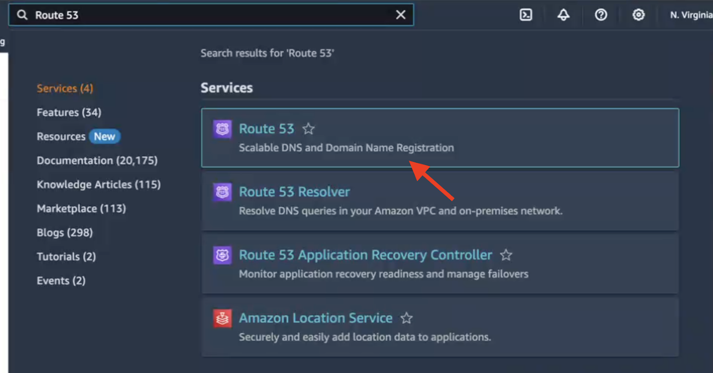
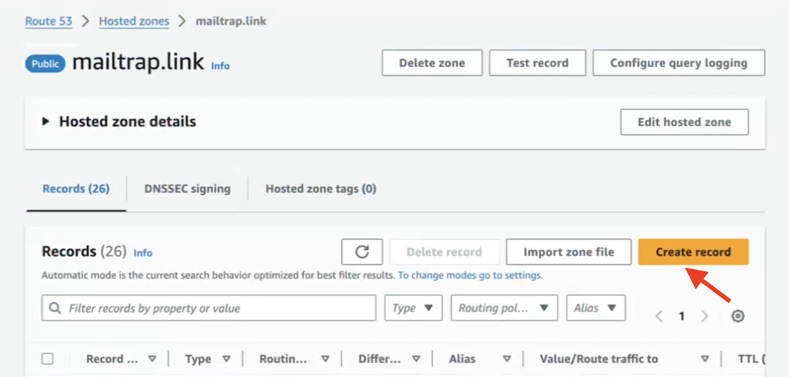
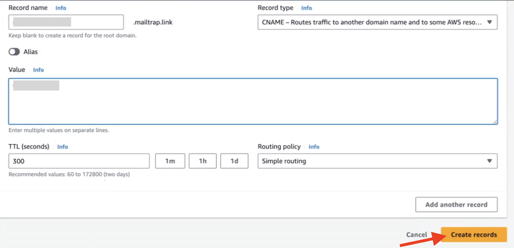

# AWS Route 53

To add and verify a sending domain in Mailtrap, you need access to your domain’s DNS records and your domain provider account.

<a href="broken-reference" class="button secondary">Sending Domain Setup</a> check it for more details on setting up your sending domain. Continue reading to learn how to add Mailtrap DNS records to AWS Route 53.


This guide assumes that your domain is either registered and managed with AWS Route 53 or registered elsewhere but points to AWS Route 53. It also assumes that you've already created and configured a Hosted Zone for your domain.


1. Go to the AWS Management Console, type Route 53 in the search bar, and click on it.

<figure><figcaption>
Search for Route 53 in AWS Console
</figcaption></figure>

2. Navigate to Hosted Zone settings for the domain you've added to Mailtrap.

<figure><figcaption>
Navigate to Hosted zones
</figcaption></figure>

3. Click the domain you've added to Mailtrap.

<figure><figcaption>
Select your domain
</figcaption></figure>

4. Click Create record button.

<figure><figcaption>
Click Create record
</figcaption></figure>

5. Return to Mailtrap. On the Domain Verification page, you'll see the DNS records you need to add to AWS Route 53. These are Domain Verification, DKIM, SPF, DMARC, and Domain Tracking. You'll need the values under Type, Name, and Value.

<figure><figcaption>
Mailtrap DNS records to add
</figcaption></figure>

Make sure you check the type next to each record in Mailtrap and choose a relevant one in AWS Route 53. There are four CNAME type records (Domain Verification, DKIM (2), and Custom Tracking Domain) and two TXT type records (SPF and DMARC).

<figure><figcaption>
DNS Types and Categories in Mailtrap
</figcaption></figure>


You should have only one SPF record. So, if you already have one for your domain, update its value to include Mailtrap. It's okay to have multiple DMARC records.


6. Copy the Name and Value for each record one by one. You can do this by hovering and clicking each record.

<figure><figcaption>
Copy DNS record values from Mailtrap
</figcaption></figure>

7. And paste them into AWS Route 53. The namings of the records are the same in AWS Route 53 as in Mailtrap.

<figure><figcaption>
Paste DNS values into AWS Route 53
</figcaption></figure>

8. Use the default value for TTL as indicated in Mailtrap.
9. Click Add another record after adding each record in AWS Route 53.
10. Repeat the process of copying and pasting for each record until you've added all the Mailtrap DNS records to AWS Route 53. Click Create Records.

<figure><figcaption>
All DNS records added in AWS Route 53
</figcaption></figure>

11. Then, return to Mailtrap. Some records may be verified immediately, while some may take more time. Mailtrap will check the DNS records automatically every hour, but you can force a check by clicking the Re-check DNS Records button.

<figure><figcaption>
Re-check DNS records in Mailtrap
</figcaption></figure>

12. If you add all the required DNS records correctly, the Status of DNS records will change from Missing to Verified, and the red dots will turn green.

<figure><figcaption>
All DNS records verified
</figcaption></figure>


If you have additional questions, [consult AWS documentation](https://docs.aws.amazon.com/Route53/latest/DeveloperGuide/resource-record-sets-creating.html) or contact us at [support@mailtrap.io](mailto:support@mailtrap.io)

