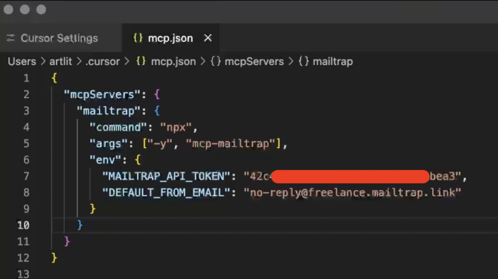
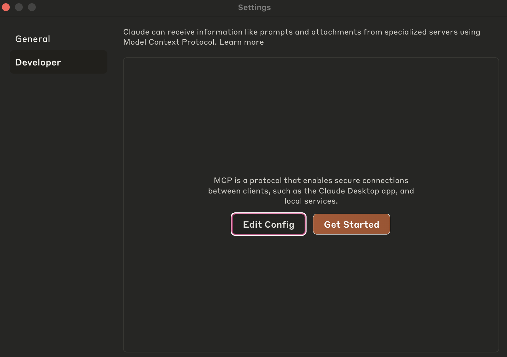
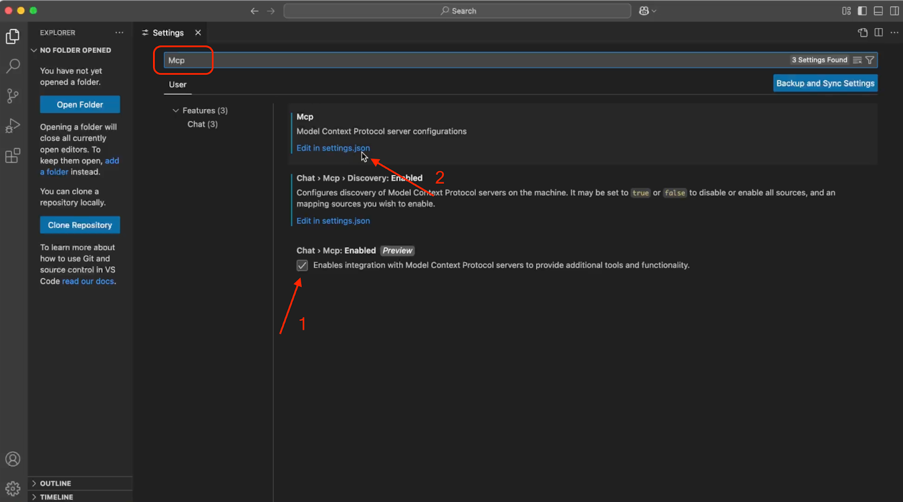

# Overview

Mailtrap MCP Server lets you automate email workflows from your AI IDE (e.g., VS Code) or send emails with simple prompts from AI assistants (e.g., Claude or Cursor).

For a more detailed overview of MCP, check out the [YouTube video](https://www.youtube.com/watch?v=casBpY6nAmw). Or, visit the official [GitHub repository](https://github.com/railsware/mailtrap-mcp).


Mailtrap MCP server is implemented as a Node.js command line utility, so please install the [latest Node.js version](https://nodejs.org/en) before getting started.


## Adding Mailtrap MCP to Cursor

Open your Cursor editor and navigate to **Settings** > **Cursor Settings**.

<div align="left" data-with-frame="true"><figure><figcaption><p>Cursor Settings menu</p></figcaption></figure></div>

Go to the **MCP tab** and click on **Add new global MCP server**.

<div align="left" data-with-frame="true"><figure><figcaption><p>MCP tab in Cursor</p></figcaption></figure></div>

The **Add new global MCP server** should open a new **mcp.json** config file, where we'll store the Mailtrap MCP configuration.


You can also open the **mcp.json** file in the following locations:
- **MacOS:** `~/.cursor/mcp.json`
- **Windows:** `%USERPROFILE%\.cursor\mcp.json`


Once you open the **mcp.json** file, copy/paste the following configuration inside it:


```json
{
  "mcpServers": {
    "mailtrap": {
      "command": "npx",
      "args": ["-y", "mcp-mailtrap"],
      "env": {
        "MAILTRAP_API_TOKEN": "your_mailtrap_api_token",
        "DEFAULT_FROM_EMAIL": "your_sender@example.com"
      }
    }
  }
}
```



If you're using [asdf](https://github.com/asdf-vm/asdf) to manage Node.js, you must use an absolute path to the executable. See the example configuration for Mac in the [GitHub repository](https://github.com/railsware/mailtrap-mcp).


Open your Mailtrap account and navigate to **Sending Domains** > **Integration** > **API**.

<div align="left" data-with-frame="true"><figure><figcaption><p>Mailtrap API credentials</p></figcaption></figure></div>

Update the following values in your **mcp.json** file with Mailtrap credentials:

- `MAILTRAP_API_TOKEN` – Used to authenticate API requests, which you can copy/paste from the credentials tab.
- `DEFAULT_FROM_EMAIL` – Make sure the email's domain matches your own domain from the **Sending Domains** tab in Mailtrap.

<div align="left" data-with-frame="true"><figure><figcaption><p>Example mcp.json configuration</p></figcaption></figure></div>

Save the file, reload, and you can start sending emails via Cursor with simple prompts.

## Adding Mailtrap MCP to Claude

In Claude settings, go to the **Developer** tab, click on **Edit Config**, and open the **claude_desktop_config.json** file.

<div align="left" data-with-frame="true"><figure><figcaption><p>Claude Developer settings</p></figcaption></figure></div>


You can also open the **claude_desktop_config.json** file in the following locations:
- **MacOS:** `~/Library/Application Support/Claude/claude_desktop_config.json`
- **Windows:** `%APPDATA%\Claude\claude_desktop_config.json`


Copy/paste the following configuration into the file:


```json
{
  "mcpServers": {
    "mailtrap": {
      "command": "npx",
      "args": ["-y", "mcp-mailtrap"],
      "env": {
        "MAILTRAP_API_TOKEN": "your_mailtrap_api_token",
        "DEFAULT_FROM_EMAIL": "your_sender@example.com"
      }
    }
  }
}
```


Update the `MAILTRAP_API_TOKEN` and `DEFAULT_FROM_EMAIL` values with your Mailtrap credentials from **Sending Domains** > **Integration** > **API**.

## Adding Mailtrap MCP to VS Code

Open your VS Code editor, navigate to **Settings**, and find the **Mcp** tab via the search bar.

Tick the **Chat > Mcp: Enabled** option and click on **Edit in settings.json**.

<div align="left" data-with-frame="true"><figure><figcaption><p>VS Code MCP settings</p></figcaption></figure></div>


You can also open the **settings.json** file by typing the following in the Command Palette: `Preferences: Open User Settings (JSON)`.


Copy/paste the following configuration:


```json
{
  "mcp": {
    "servers": {
      "mailtrap": {
        "command": "npx",
        "args": ["-y", "mcp-mailtrap"],
        "env": {
          "MAILTRAP_API_TOKEN": "your_mailtrap_api_token",
          "DEFAULT_FROM_EMAIL": "your_sender@example.com"
        }
      }
    }
  }
}
```



Make sure to restart your MCP server after changing the "env" section.


Replace the `MAILTRAP_API_TOKEN` and `DEFAULT_FROM_EMAIL` values with your credentials from **Sending Domains** > **Integration** > **API**.

<div align="left" data-with-frame="true"><figure><figcaption><p>Mailtrap credentials location</p></figcaption></figure></div>

## Use cases and examples

Once configured, you can prompt the AI/agent to send emails, such as:

- **Plain-text emails** – "Send an email to john.doe@example.com with the subject 'Meeting Tomorrow' and a friendly reminder about our upcoming meeting."
- **HTML emails** – "Send an HTML email to john.doe@example that wishes them a happy work anniversary and make sure the message is nicely formatted"
- **Multiple recipients** – "Email sarah@example.com about the project update, and CC the team at team@example.com"
- **Summarize and send info** – "Summarize this PDF for me and send the summary to john.doe@example.com and jane.doe@example.com"


You can also combine Mailtrap MCP with other MCP servers for advanced functionality. For example, send a report email via Mailtrap MCP, and use the [Slack MCP](https://mcp.so/server/slack) to post a message in the team's channel.


## send-email parameters

To send emails through Mailtrap, you'll use `send-email`. Here are the available parameters:

| Parameter | Required | Description |
|-----------|----------|-------------|
| `to` | Yes | Email address of the recipient |
| `subject` | Yes | Email subject line |
| `from` | No | Sender's email address. Defaults to `DEFAULT_FROM_EMAIL` |
| `text` | No | Plain text email body. Required if `html` is not provided |
| `html` | No | HTML version of the email body. Required if `text` is empty |
| `cc` | No | Array of CC recipient email addresses |
| `bcc` | No | Array of BCC recipient email addresses |
| `category` | No | Email category for tracking |

## Running the server locally

You can also run the server locally during development:



## Clone the repository

```bash
git clone https://github.com/railsware/mailtrap-mcp.git
cd mailtrap-mcp
```



## Install dependencies

```bash
npm install
```



## Configure your JSON file

Add the following configuration to your main .json file:



```json
{
  "mcp": {
    "servers": {
      "mailtrap": {
        "command": "node",
        "args": ["/path/to/mailtrap-mcp/dist/index.js"],
        "env": {
          "MAILTRAP_API_TOKEN": "your_mailtrap_api_token",
          "DEFAULT_FROM_EMAIL": "your_sender@example.com"
        }
      }
    }
  }
}
```



```json
{
  "mcp": {
    "servers": {
      "mailtrap": {
        "command": "node",
        "args": ["/path/to/mailtrap-mcp/dist/index.js"],
        "env": {
          "MAILTRAP_API_TOKEN": "your_mailtrap_api_token",
          "DEFAULT_FROM_EMAIL": "your_sender@example.com"
        }
      }
    }
  }
}
```



Replace the placeholders with your actual Mailtrap credentials.



## Run the server

Test the server using [MCP inspector](https://github.com/modelcontextprotocol/inspector) and npm:

```bash
npm run dev
```


