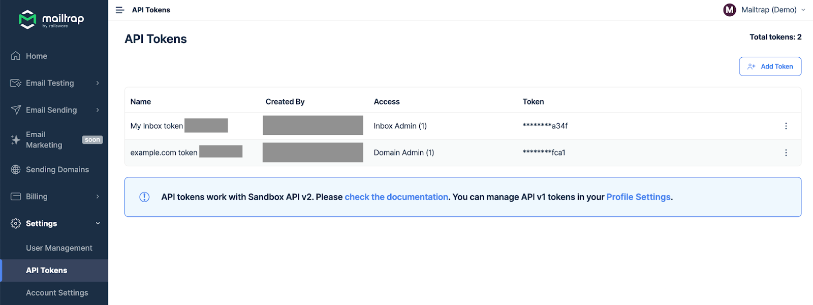
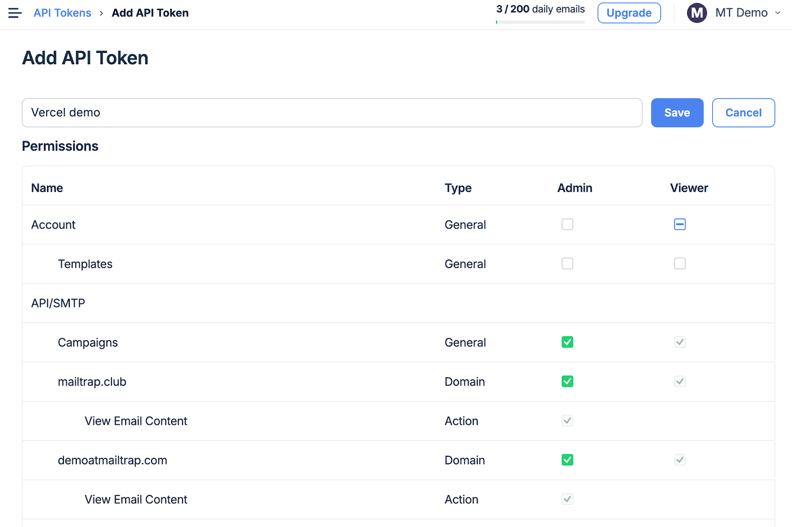
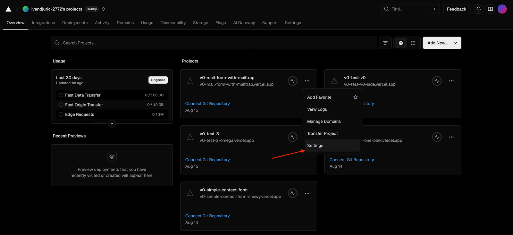
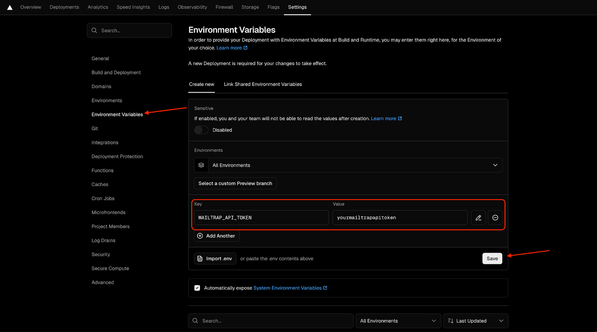

# Overview

[Mailtrap](https://mailtrap.io/) is an email-sending solution for developer and product teams. It is focused on fast delivery and high inboxing rates for transactional and promotional emails, providing a highly customizable API and 24/7 technical support.

## Prerequisites

Before you start, ensure you have:

- A [Vercel account](https://vercel.com/) with a project where you'll add your Mailtrap API key
- A verified sending domain in Mailtrap (setup takes approximately 5 minutes—see our [sending domain setup guide](https://help.mailtrap.io/article/69-sending-domain-setup) for instructions)

## Step 1: Find your Mailtrap API key

In your Mailtrap dashboard, navigate to **Settings → API Tokens**. You can view all active tokens, their creators, and access levels.



If you don't already have an API key, click **Add Token** and assign the desired permissions. For this integration, ensure you check the **API/SMTP** permissions.



Click **Save** and store your API key securely, as you won't be able to view it again. For more information, see our guide on [Mailtrap API Tokens](https://help.mailtrap.io/article/103-api-tokens).

## Step 2: Add your key to Vercel

Open your Vercel dashboard and go to the **Settings** for the project where you want to add Mailtrap:



In the **Environment Variables** section of Settings, locate the **Key** field and add `MAILTRAP_API_TOKEN` with your actual token value, then click **Save**.




Since Vercel environment variables only become available after you redeploy your project, make sure to either push a new commit or click the **Deploy** button again in the Vercel dashboard.


## Step 3: Reference the key in your code

Reference the Mailtrap API key in your code so your application can use it when making requests. Add the Mailtrap API key and the Mailtrap URL `https://send.api.mailtrap.io/api/send` to your code.

For example, here's how it would look in your `route.ts` file:


```typescript
const MAILTRAP_API_TOKEN = process.env.MAILTRAP_API_TOKEN;

const res = await fetch("https://send.api.mailtrap.io/api/send", {
  method: "POST",
  headers: {
    "Authorization": `Bearer ${MAILTRAP_API_TOKEN}`,
    "Content-Type": "application/json"
  },
  body: JSON.stringify({
    from: { email: "no-reply@yourdomain.com" },
    to: [{ email: "support@yourdomain.com" }],
    subject: "Hello from Vercel + Mailtrap",
    text: "This is a test email sent via Mailtrap API."
  })
});
```


## Next Steps

Your Mailtrap integration with Vercel is now complete. You can now send transactional emails through your Vercel-hosted application using the Mailtrap Email API.