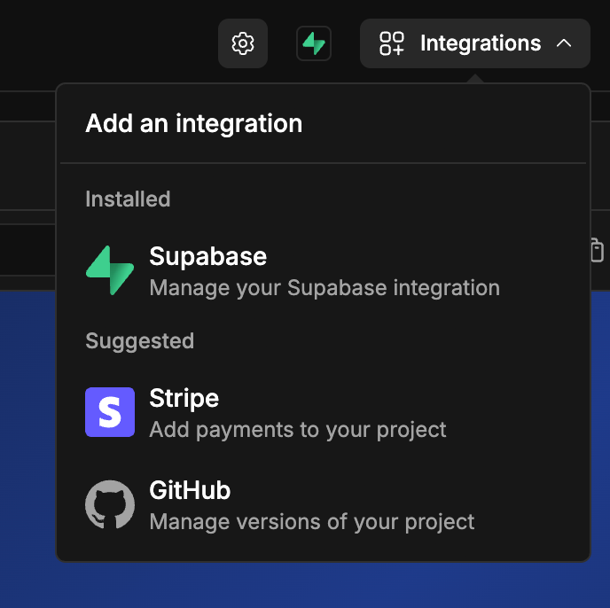
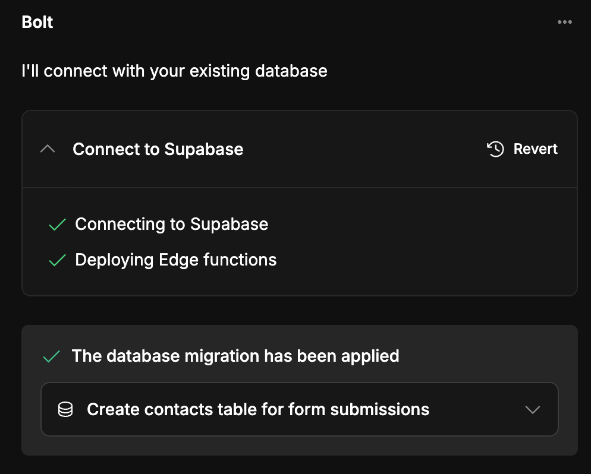
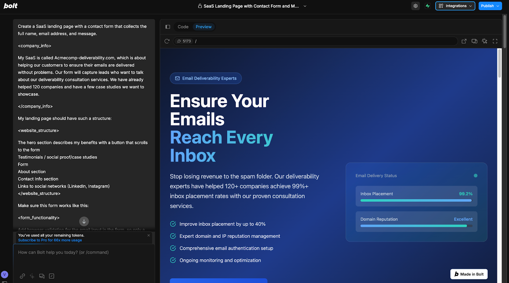
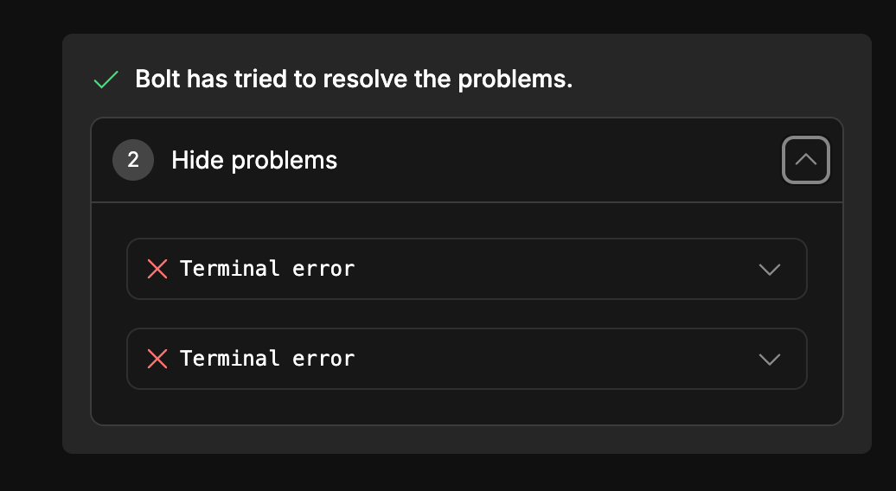
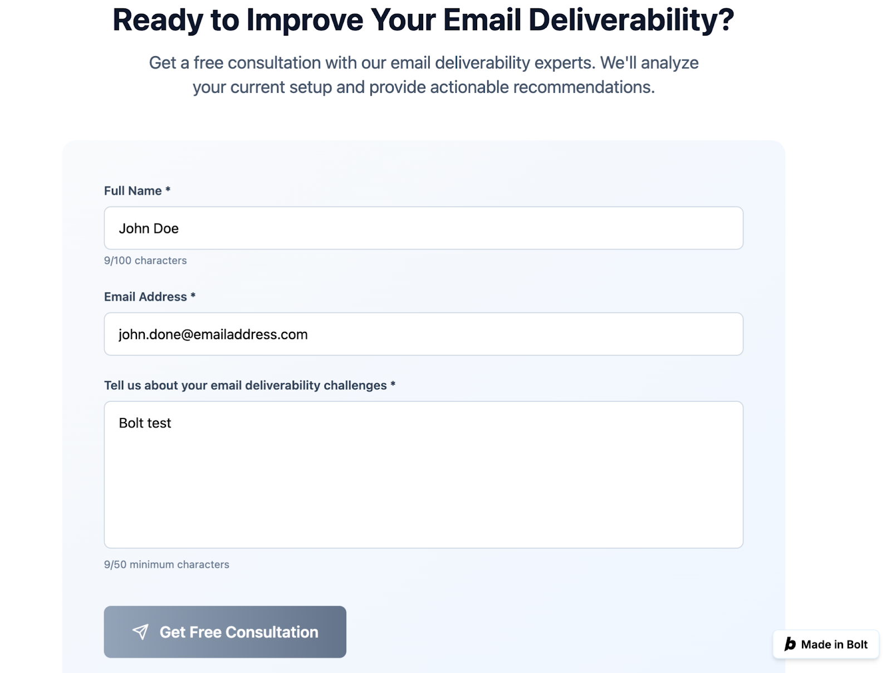

# Overview

[Mailtrap](https://mailtrap.io/) is an email-sending solution for developer and product teams. It is focused on fast delivery and high inboxing rates for transactional and promotional emails, providing a highly customizable API and 24/7 technical support.

This integration allows you to:

- Send transactional emails (notifications, order confirmations, password-change messages) from a verified sending domain using the Mailtrap Node.js SDK
- Manage contacts in Mailtrap and push recipient information to the Contacts feature


Make sure to adjust the prompts to your specific needs—this is an exemplary tutorial. We created these prompts in August 2025 based on experience with GPT-5 and Bolt.new. As LLM models and platforms constantly evolve, your integration may differ slightly.


## Prerequisites

Before you begin, ensure you have:

- A verified sending domain in Mailtrap (see how to [verify a domain with GoDaddy](https://help.mailtrap.io/article/126-domain-verification-with-godaddy))
- An Admin API token with access to your domain, Contacts, and Email API (see how to [create an API token](https://help.mailtrap.io/article/103-api-tokens#Mailtrap-Email-Sending-C-ZqM))
- Your **Account ID** (go to Mailtrap Settings, then select Account Settings)
- (Optional) **Custom fields** for storing extra contact data (see [creating custom fields](https://help.mailtrap.io/article/147-contacts#:~:text=uploading%20your%20contacts.-,How%20to%20upload%20Contacts,-Go%20to%20Contacts))
- (Optional) **List IDs** for assigning contacts to lists (see Managing lists)
- A **Bolt.new** account and **Supabase** account (connect the two when prompted by Bolt)

## Send emails with Mailtrap Email API

Below is the prompt you can use to send emails from your Bolt.new project. For this example, we created a simple landing page with a contact form.


Bolt.new will ask you to update environment variables (`MAILTRAP_API_KEY`, `MAILTRAP_ACCOUNT_ID`, `MAILTRAP_MY_EMAIL`) in Supabase. You must do this—otherwise, you won't be able to send emails.


### Bolt.new Email Sending Prompt

Copy and paste the following prompt into Bolt.new:

> Email should be sent via Mailtrap.io, as I have an account there.
>
> My Mailtrap verified domain is [demoatmailtrap.com](http://demoatmailtrap.com)
>
> I want to send emails from [hello@demoatmailtrap.com](mailto:hello@demoatmailtrap.com)
>
> Save my Mailtrap API key in MAILTRAP_API_KEY secret.
>
> Include and use Mailtrap NodeJS SDK https://www.npmjs.com/package/mailtrap to send emails. Use the latest available version of the npm package. Its documentation:
> - Readme: https://github.com/railsware/mailtrap-nodejs/blob/main/README.md
> - Examples for implementation: https://github.com/railsware/mailtrap-nodejs/tree/main/examples
> - How to send an email example: https://github.com/railsware/mailtrap-nodejs/blob/main/examples/sending/everything.ts


Update the prompt with your verified domain and the sending address you'll be using.


### Optional: Add users or leads to Mailtrap Contacts

Adding contacts to Mailtrap enables you to send email campaigns, create recipient segments, and manage them. You can also use contacts for automated email sequences.

To add contacts:

- Prepare [Mailtrap Custom Fields](https://help.mailtrap.io/article/147-contacts#:~:text=uploading%20your%20contacts.-,How%20to%20upload%20Contacts,-Go%20to%20Contacts) beforehand
- Locate your email list ID:
  - Click on an email list to reveal all contacts and the list URL
  - Paste the list URL into [URL Decoder](https://www.urldecoder.org/) and click **Decode**
  - The decoded URL will show your list ID (e.g., `list_id: 23`)

Then paste the following prompt into Bolt.new:

> Pass all my new users/form submissions to Mailtrap contacts.
>
> Use the latest version of Mailtrap NodeJS SDK (https://www.npmjs.com/package/mailtrap, https://github.com/railsware/mailtrap-nodejs/blob/main/README.md) to add contacts.
> - Here is an example: https://github.com/railsware/mailtrap-nodejs/blob/main/examples/contacts/everything.ts
>
> My MAILTRAP_ACCOUNT_ID env variable (from Supabase Secrets)
>
> Use the same Token I use for the production mode of Mailtrap, as it can also create Contacts.
>
> Pass the name from my form to name field in Mailtrap. Add users to MAILTRAP_LIST_ID.
>
> Create contacts table in Supabase with such columns as:
> - id: UUID, primary key
> - name: text
> - email: text
> - message: text
> - created_at: timestamp
> - mailtrap_contact_id: text
>
> Apply Supabase Row-Level Security (RLS) to restrict access to only authenticated users.
>
> Save form contacts info from submissions in DB and use Mailtrap NodeJS SDK to create a contact in Mailtrap.
>
> Save Mailtrap contact_id (Mailtrap provides it with a response) to mailtrap_contact_id column in contacts table.

## Integration example: Form submission landing page

We used Bolt.new to create a simple landing page with a lead-capture form. This page is used for email sending, submission notifications, and contacts management.


This guide is referential to help you understand Mailtrap integration. Remember, your experience with Bolt.new might differ because it's non-deterministic and constantly evolving. Make sure to store all sensitive information with Supabase, not in code. Also, adjust Supabase project SMTP settings to Mailtrap—see our [Supabase and Mailtrap integration guide](https://help.mailtrap.io/article/165-supabase-and-mailtrap-integration) to avoid their hourly email sending limit.


### Step 1: Connect Bolt and Supabase

The integration is straightforward since Bolt has it pre-built. Here's what to do:

- Click the **Integrations** button at the top right and select **Supabase**

- Follow the wizard—it will handle everything for you
- Pay close attention to selecting the Supabase project related to this task
- Once complete, Bolt will confirm the connection

### Step 2: Landing page creation

Here is the prompt for creating a landing page that creates a new Mailtrap contact with each form submission and emails you a notification:

Create a SaaS landing page with a contact form that collects full name, email address, and message.

**Company Information:**

My SaaS is called Acmecomp-deliverability.com, which helps customers ensure their emails are delivered without problems. Our form captures leads interested in our email deliverability consultation services. We have already helped 120 companies and have several case studies to showcase.

**Website Structure:**

- Hero section describing benefits with a button that scrolls to the form
- Testimonials/social proof/case studies
- Form
- About section
- Contact Info section
- Links to social networks (LinkedIn, Instagram)

**Form Functionality:**

- Add browser validation for the email input—only valid emails should pass
- Add a minimum length of 50 characters for the message field and maximum length of 100 characters for the Name input
- On form submission:
  - Send an email with its content to MAILTRAP_MY_EMAIL secret variable
    - Emails should be sent from form-submissions@demoatmailtrap.com (MAILTRAP_FROM_EMAIL), as demoatmailtrap.com is your verified domain in Mailtrap
  - Create a contact in Mailtrap (name, email)
  - Pass the form's "Full name" input value to Mailtrap's custom field name
  - Create a contacts table in Supabase with columns: id (UUID, primary key), name (text), email (text), message (text), created_at (timestamp), mailtrap_contact_id (text)
  - Add form submission info to the Supabase contacts table and write whether the contact was submitted and its Mailtrap Contact ID (returned with response)
  - Apply Supabase Row-Level Security (RLS) to restrict access to only authenticated users
  - Display form submission state and notify the visitor it's been submitted
- Email should be sent via Mailtrap:
  - My Mailtrap account is MAILTRAP_ACCOUNT_ID (from Supabase Secrets)
  - Link to Mailtrap NodeJS SDK: https://github.com/railsware/mailtrap-nodejs
  - Use it to create contacts and send emails
  - Save Mailtrap API key in MAILTRAP_API_KEY secret
  - Include and use Mailtrap NodeJS SDK (https://www.npmjs.com/package/mailtrap) to send emails and create contacts. Use the latest available version of the npm package. Its documentation:
    - Readme: https://github.com/railsware/mailtrap-nodejs/blob/main/README.md
    - Examples: https://github.com/railsware/mailtrap-nodejs/tree/main/examples
    - How to send an email: https://github.com/railsware/mailtrap-nodejs/blob/main/examples/sending/minimal.ts
    - How to create a contact: https://github.com/railsware/mailtrap-nodejs/blob/main/examples/contacts/everything.ts

Plan step-by-step, verify results after each step. Verify all steps work before continuing. Write code in TypeScript and generate atomic files in the Supabase Edge function for easier verification and debugging.

After pasting the prompt and hitting Enter, Bolt will take a few minutes to engineer everything for you.

Typically, Bolt will ask you to apply necessary changes for your software to run, review its flow, and apply the changes.

If Bolt encounters bugs, it will list them and attempt to fix them when you click the associated button.

### Step 3: Use the landing page form to send emails

In Bolt Preview, navigate to the contact form, fill it out, and click submit.

Once you submit the form, you should see a confirmation message.

If there are any errors in sending, Bolt will attempt to fix it when prompted. Keep an eye on the message thread—it's helpful to check Edge Functions ([Supabase context](https://supabase.com/docs/guides/functions)) error logs and paste them into Bolt.

If everything runs successfully, you'll see a new contact under Mailtrap Contacts, and you'll receive the form notification in your inbox.

## Troubleshooting for Bolt.new

- **Environment variables not loading**: Ensure you've properly integrated Supabase and added environment variables in Supabase Project Settings
- **Email sending fails**: Verify your domain is verified and your `from` address matches the verified domain

## Next Steps

- Automate welcome emails using [Mailtrap's Automations](https://mailtrap.io/automations/)
- Explore Template Sending for dynamic email content
- Use Lists to segment your Contacts for campaigns
