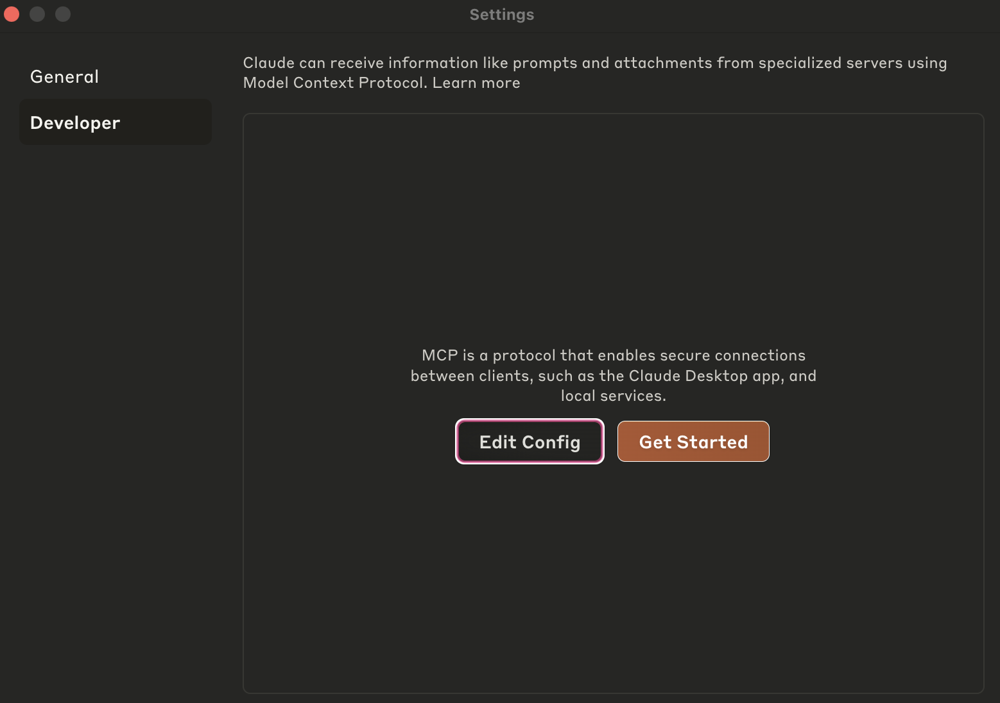
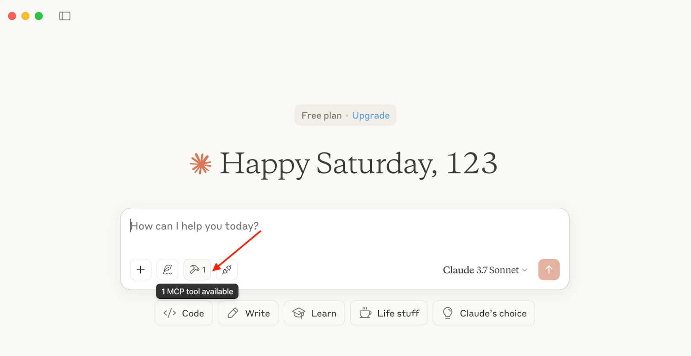
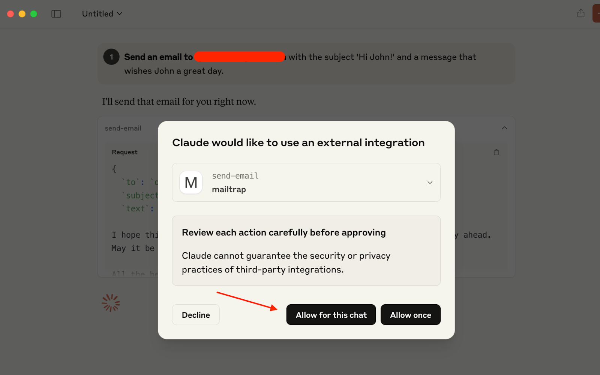
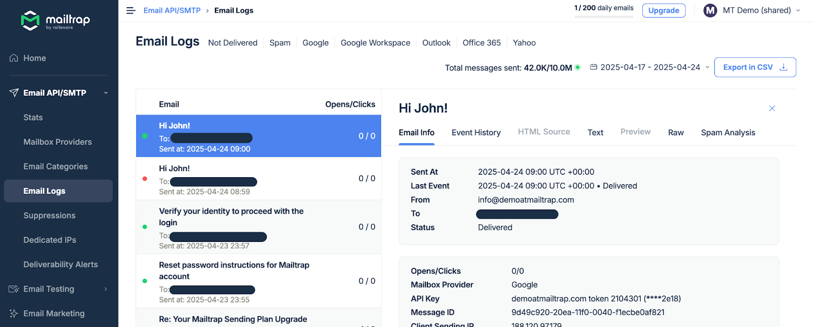

# Claude and Mailtrap

Mailtrap is an email-sending solution for developer and product teams. Focused on fast delivery and high inboxing rates for transactional and promo emails. Provides highly customizable API and 24/7 tech support.

## Overview

With the Claude and Mailtrap integration, you can now send emails from Claude AI using the Mailtrap MCP (Model Context Protocol) server. This enables seamless email sending through simple natural language prompts.

### Prerequisites

* If you haven't set up your sending domain already, you'll need to do it before we start—it takes \~5 minutes, and you can use our [step-by-step article](https://app.gitbook.com/s/S3xyr7ba7aGO19rc8dSK/email-api-smtp/setup/sending-domain-setup) as a guide.
* Install the [latest Node.js version](https://nodejs.org/en) since [Mailtrap MCP](https://www.npmjs.com/package/mcp-mailtrap) is implemented as a Node.js command line utility.
* If you haven't already done so, install the [Claude Desktop app](https://claude.ai/download). But if you have, make sure it's updated and uses the latest version.



**Add Mailtrap MCP to Claude**

In Claude settings, go to the Developer tab, click on Edit Config, and open the claude\_desktop\_config.json file.

<div align="left" data-with-frame="true"></div>

Tip: You can also open the claude\_desktop\_config.json file in the following locations:

* MacOS: \~/Library/Application Support/Claude/claude\_desktop\_config.json
* Windows: %APPDATA%\Claude\claude\_desktop\_config.json

Then, in the claude\_desktop\_config.json copy/paste the following configuration:


```json
{
  "mcpServers": {
    "mailtrap": {
      "command": "npx",
      "args": ["-y", "mcp-mailtrap"],
      "env": {
        "MAILTRAP_API_TOKEN": "your_mailtrap_api_token",
        "DEFAULT_FROM_EMAIL": "your_sender@example.com"
      }
    }
  }
}
```




**Add Mailtrap API credentials**

Open your Mailtrap account and navigate to Sending Domains → Integration → API.

Once in the Integration/API page, update the following values in your claude\_desktop\_config.json file with Mailtrap credentials:

* **MAILTRAP\_API\_TOKEN** – Used to authenticate API requests, which you can copy/paste from the credentials tab.
* **DEFAULT\_FROM\_EMAIL** – Make sure the email's domain matches your own domain from the Sending Domains tab in Mailtrap.

<div align="left" data-with-frame="true"></div>



**Send emails with a prompt**

Open a new chat and make sure the MCP tool is specified.

<div align="left" data-with-frame="true"></div>

This will allow Claude Desktop to perform actions for us, for instance, email sending using Mailtrap MCP and send-email.

<div align="left" data-with-frame="true"></div>

To send a plain-text email, you can use a prompt like the one below, but you can also experiment with your own prompts:

Send an email to john.doe@example.com with the subject 'Hi John!' and a message that wishes John a great day.

If Claude asks you to verify the usage of Mailtrap MCP, click Allow for this chat.

<div align="left" data-with-frame="true"></div>

Then, it should successfully send a new email and provide you with the properties the email was sent with in the response.

<div align="left" data-with-frame="true"></div>

And here it is in the [Email Logs](https://app.gitbook.com/s/S3xyr7ba7aGO19rc8dSK/email-api-smtp/statistics/email-logs) tab in the Mailtrap dashboard.

<div align="left" data-with-frame="true"></div>



## Next steps

You can now use Claude to compose and send various types of emails by adjusting your prompts. Explore more advanced features like HTML emails, attachments, and templated messages through Mailtrap's API documentation.
