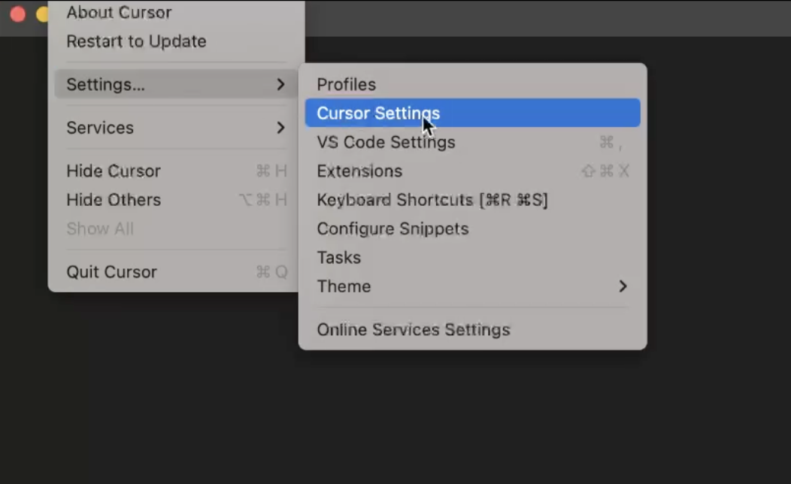
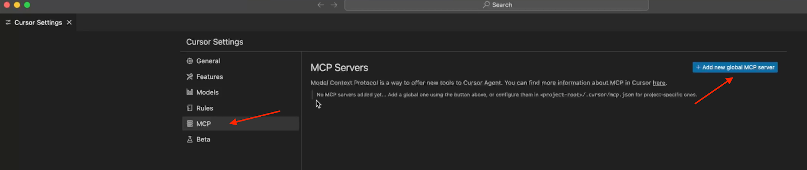
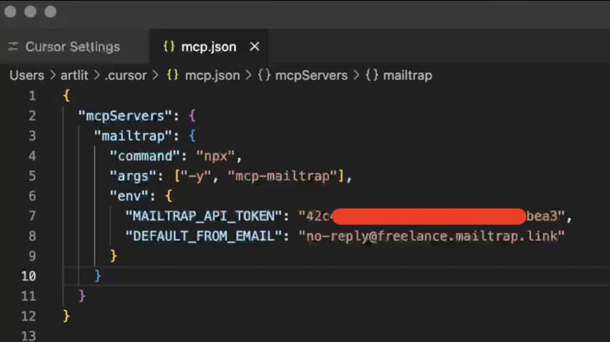
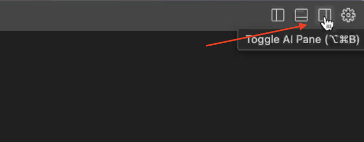
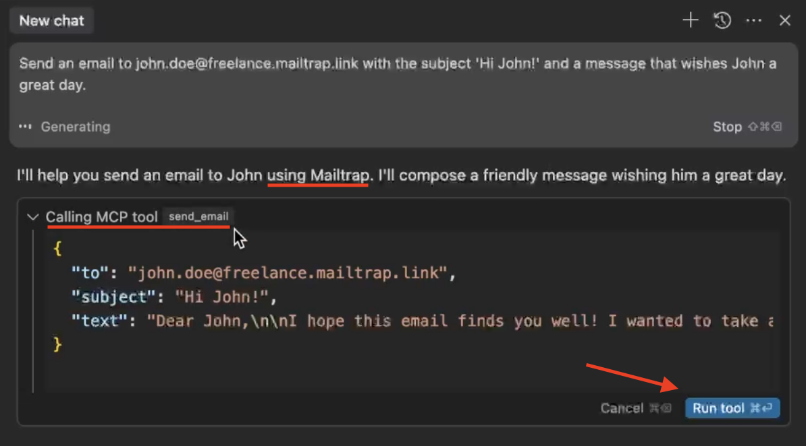
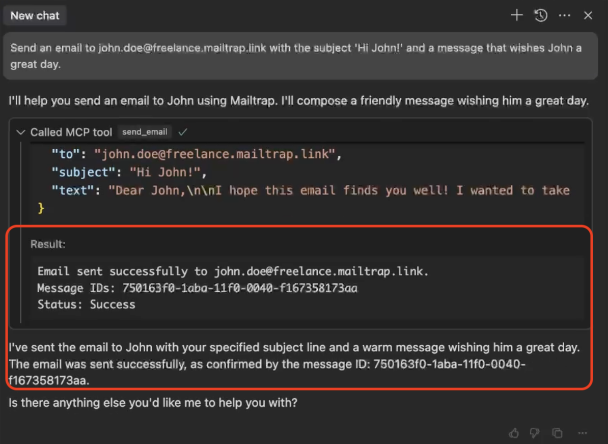
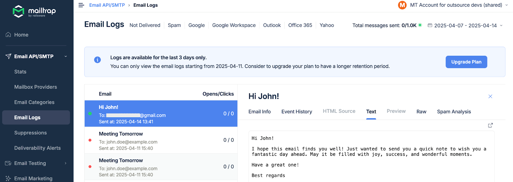

# Cursor and Mailtrap

Mailtrap is an email-sending solution for developer and product teams. Focused on fast delivery and high inboxing rates for transactional and promo emails. Provides highly customizable API and 24/7 tech support.

## Overview

With the Cursor and Mailtrap integration, you can now send emails from Cursor using Model Context Protocol. In this guide, you'll learn how to set it all up and start sending emails in three steps.

### Prerequisites

* If you haven't set up your sending domain already, you'll need to do it before we start—it takes \~5 minutes, and you can use our [step-by-step article](https://app.gitbook.com/s/S3xyr7ba7aGO19rc8dSK/email-api-smtp/setup/sending-domain-setup) as a guide.
* Install the [latest Node.js version](https://nodejs.org/en) since [Mailtrap MCP](https://www.npmjs.com/package/mcp-mailtrap) is implemented as a Node.js command line utility.
* If you haven't already done so, install the [Cursor app](https://cursor.com/). But if you have, make sure it's updated and uses the latest version.



**Add Mailtrap MCP to Cursor**

To add Mailtrap MCP to Cursor, you can use the [quick install link](https://cursor.com/en/install-mcp?name=mailtrap\&config=eyJjb21tYW5kIjoibnB4IC15IG1jcC1tYWlsdHJhcCIsImVudiI6eyJNQUlMVFJBUF9BUElfVE9LRU4iOiJ5b3VyX21haWx0cmFwX2FwaV90b2tlbiIsIkRFRkFVTFRfRlJPTV9FTUFJTCI6InlvdXJfc2VuZGVyQGV4YW1wbGUuY29tIiwiTUFJTFRSQVBfQUNDT1VOVF9JRCI6InlvdXJfYWNjb3VudF9pZCJ9fQ%3D%3D) or in your Cursor editor, navigate to Settings → Cursor Settings.

<div align="left" data-with-frame="true"></div>

Go to the MCP tab and click on Add new global MCP server.

<div align="left" data-with-frame="true"></div>

The Add new global MCP server should open a new mcp.json config file, where we'll store the Mailtrap MCP configuration.

Tip: You can also open the mcp.json file in the following locations:

* MacOS: \~/.cursor/mcp.json
* Windows: %USERPROFILE%.cursor\mcp.json

Once you open the mcp.json file, copy/paste the following configuration inside it:


```json
{
  "mcpServers": {
    "mailtrap": {
      "command": "npx",
      "args": ["-y", "mcp-mailtrap"],
      "env": {
        "MAILTRAP_API_TOKEN": "your_mailtrap_api_token",
        "DEFAULT_FROM_EMAIL": "your_sender@example.com"
      }
    }
  }
}
```


Note: In case you're using asdf to manage Node.js, you must use an absolute path to the executable. Here's an example for Mac:


```json
{
  "mcpServers": {
    "mailtrap": {
      "command": "/Users/<username>/.asdf/shims/npx",
      "args": ["-y", "mcp-mailtrap"],
      "env": {
        "PATH": "/Users/<username>/.asdf/shims:/usr/bin:/bin",
        "ASDF_DIR": "/opt/homebrew/opt/asdf/libexec",
        "ASDF_DATA_DIR": "/Users/<username>/.asdf",
        "ASDF_NODEJS_VERSION": "20.6.1",
        "MAILTRAP_API_TOKEN": "your_mailtrap_api_token",
        "DEFAULT_FROM_EMAIL": "your_sender@example.com"
      }
    }
  }
}
```




**Add Mailtrap API credentials**

Open your Mailtrap account and navigate to Sending Domains → Integration → API.

Once in the Integration/API page, update the following values in your mcp.json file with Mailtrap credentials:

* **MAILTRAP\_API\_TOKEN** – Used to authenticate API requests, which you can copy/paste from the credentials tab.
* **DEFAULT\_FROM\_EMAIL** – Make sure the email's domain matches your own domain from the Sending Domains tab in Mailtrap.

<div align="left" data-with-frame="true"></div>

For example, here's what your mcp.json file should ultimately look like:

<div align="left" data-with-frame="true"></div>

And that's it! Hit save, reload, and you can start sending emails via Cursor with simple prompts.



**Send emails with a prompt**

First, toggle the AI Pane, located in the upper-right corner of the Cursor editor.

<div align="left" data-with-frame="true"></div>

In the opened pane, make sure that the Agent mode is configured since it allows Cursor to perform actions for us.

<div align="left" data-with-frame="true"></div>

To send a plain-text email, you can use a prompt like this one (although we encourage you to use your own prompts and experiment with them since the possibilities are endless):

Send an email to john.doe@example.com with the subject 'Hi John!' and a message that wishes John a great day.

Cursor will then identify the Mailtrap MCP server for your request, suggest running the right tool, in this case, send\_email, and generate the email with all the parameters and values for you. As soon as you're ready to send, click Run tool.

<div align="left" data-with-frame="true"></div>

Lastly, Cursor AI will notify you when it successfully delivers the email.

<div align="left" data-with-frame="true"></div>

And here is the generated message in the Mailtrap [Email Logs](https://app.gitbook.com/s/S3xyr7ba7aGO19rc8dSK/email-api-smtp/statistics/email-logs).

<div align="left" data-with-frame="true"></div>



## Next steps

You can now use Cursor to compose and send various types of emails by adjusting your prompts. Experiment with different email templates, formatting options, and automation scenarios to maximize your productivity.
