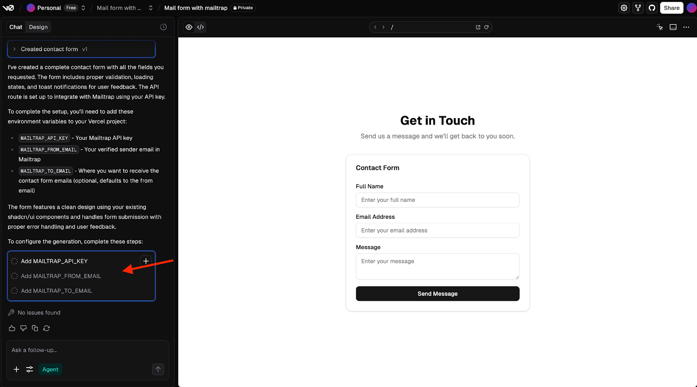
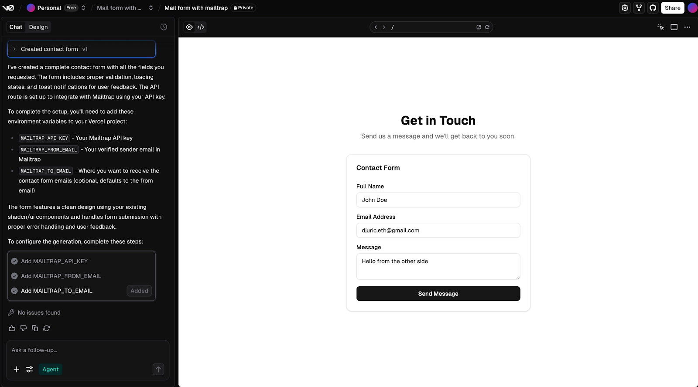
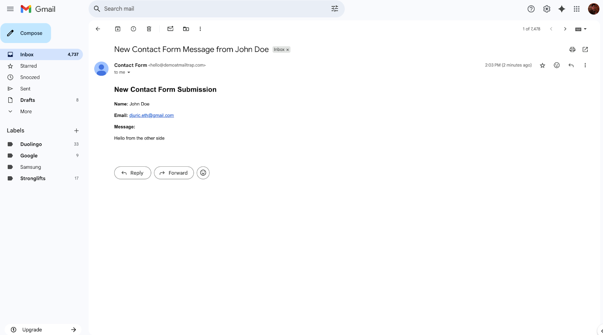
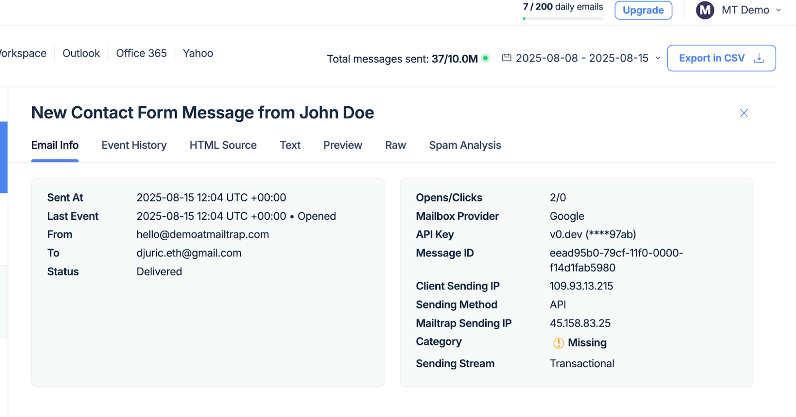

# V0 and Mailtrap

## Overview

Mailtrap is an email-sending solution for developer and product teams focused on fast delivery and high inboxing rates for transactional and promo emails. It provides a highly customizable API and 24/7 technical support.

In this guide, you'll learn how to connect V0 with Mailtrap and start sending emails through an AI-generated contact form in three simple steps.


Your prompts must be adjusted to your needs. These prompts are created based on our experience in August 2025 with V0 and GPT-4/5. Results may vary as V0 and LLM models constantly evolve.


### Prerequisites

Before you start, ensure the following:

* Add and [verify your email sending domain](https://app.gitbook.com/s/S3xyr7ba7aGO19rc8dSK/email-api-smtp/setup/sending-domain-setup) — Mailtrap allows you to send emails only from a verified domain
* Make sure your [API Token](https://mailtrap.io/api-tokens) has admin access level to that domain and contacts



**Create a landing page/contact form**

Log in to your v0 account and use a prompt like the following one to create a simple project with basic fields: | create a basic contact form with 'full name' and 'email address' 'message' fields as well as a 'send message' button. keep in mind that i'll connect it with mailtrap so i can send emails. to connect mailtrap and send emails, I'll use my mailtrap email and mailtrap API key |



**Add your Mailtrap credentials**

After a minute or two, V0 will generate your project. You'll need to insert your Mailtrap credentials:

* Mailtrap API key
* Mailtrap from email
* To email (optional for notifications)




**Start sending emails**

Once you add your credentials, try filling out the form and clicking the Send Message button.

**Verify in Gmail**

Here is the email received in Gmail:

**Check Mailtrap Email Logs**

You can view the email in the [Mailtrap Email Logs](https://app.gitbook.com/s/S3xyr7ba7aGO19rc8dSK/email-api-smtp/statistics/email-logs):

**Review Email Analytics**

You can also view important statistics about your sent emails such as opens, clicks, bounces, and more:

For more information on Mailtrap analytics, [view the analytics guide](https://app.gitbook.com/s/S3xyr7ba7aGO19rc8dSK/email-api-smtp/statistics/stats-dashboard).



## Next steps

* Use [Mailtrap Templates](https://app.gitbook.com/s/S3xyr7ba7aGO19rc8dSK/email-api-smtp/email-templates) to send branded emails with variables
* Configure [Mailtrap Contacts](https://mailtrap.io/mailtrap-contacts/) to push user information to your Mailtrap dashboard for campaigns and automations
* [Add automation triggers](https://app.gitbook.com/s/S3xyr7ba7aGO19rc8dSK/email-marketing/automations) in Mailtrap to send follow-ups to new contacts
* Track open and click rates with Mailtrap Email Tracking
