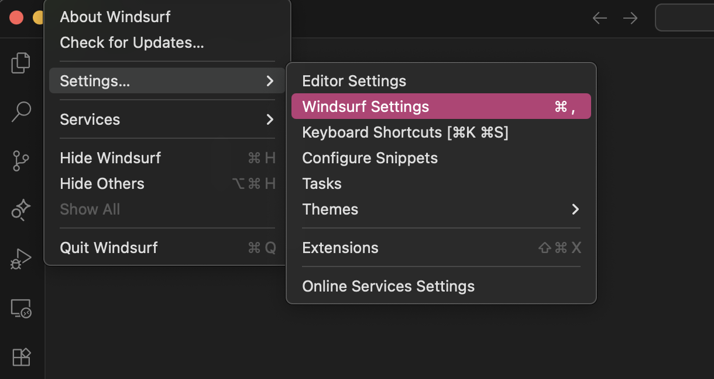
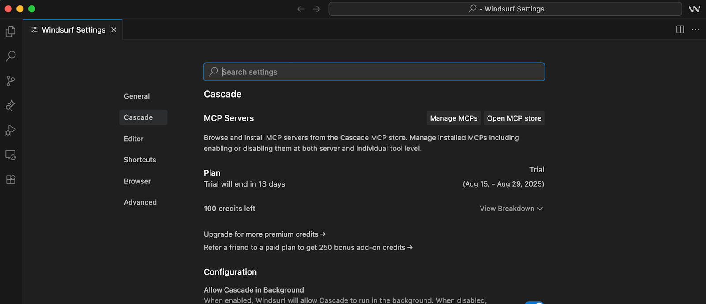
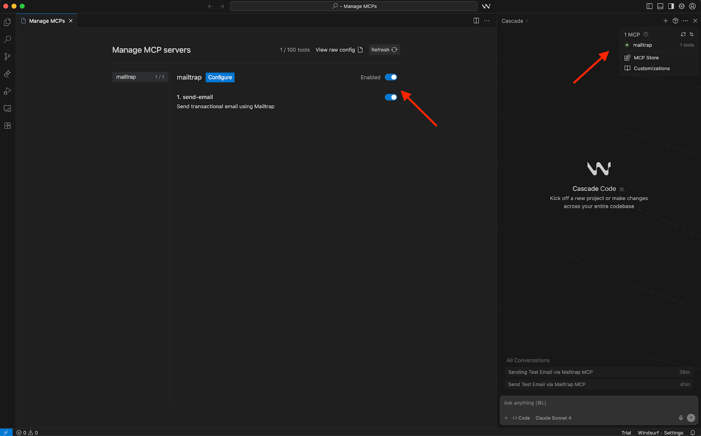
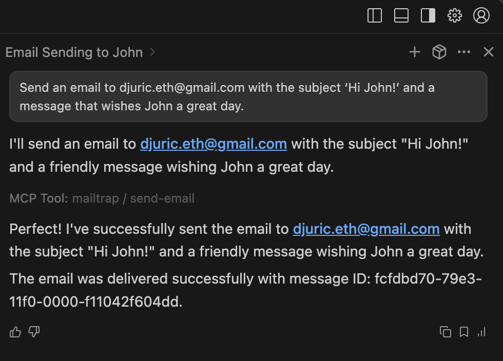
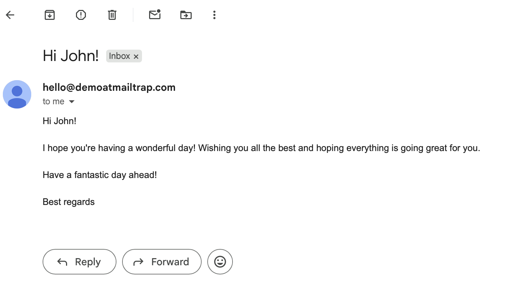
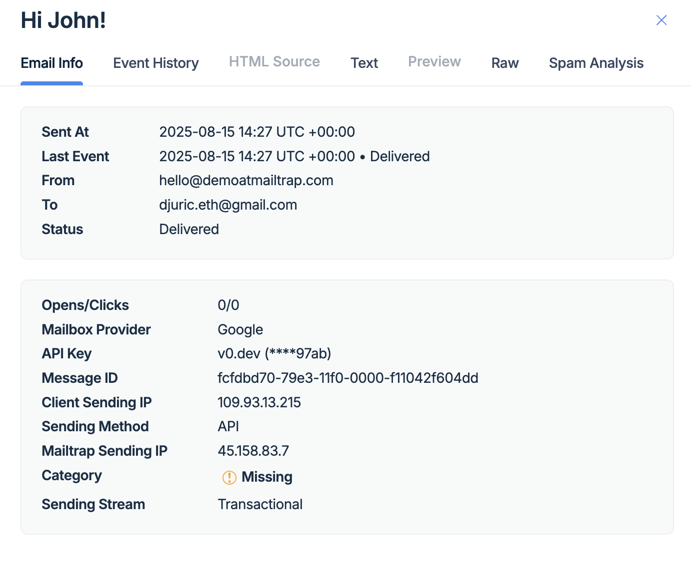

# Overview

<i class="fa-wind">:wind:</i>

With the Windsurf Mailtrap integration, you can send emails directly from Windsurf using the Cascade AI assistant and simple prompts.

Mailtrap is an email-sending solution for developer and product teams focused on fast delivery and high inboxing rates for transactional and promo emails. It provides a highly customizable API and 24/7 technical support.

In this guide, you'll set up the integration and send emails in three steps.

## Prerequisites

Before you start, ensure the following:

- [Set up your sending domain](https://help.mailtrap.io/article/69-sending-domain-setup) — this takes approximately 5 minutes
- Install the [latest Node.js version](https://nodejs.org/en) since [Mailtrap MCP](https://www.npmjs.com/package/mcp-mailtrap) is implemented as a Node.js command line utility
- Install or update [Windsurf](https://windsurf.com/) to the latest version
## Step 1. Add Mailtrap MCP to Windsurf

To add the Mailtrap MCP server to Windsurf:

1. Open Windsurf
2. Navigate to **Settings → Windsurf Settings**



3. On the Windsurf Settings page, click the **Manage MCPs** button



This will open the mcp.config.json file. Add the following code snippet:


```json
{
  "mcpServers": {
    "mailtrap": {
      "command": "npx",
      "args": ["-y", "mcp-mailtrap"],
      "env": {
        "MAILTRAP_API_TOKEN": "your_mailtrap_api_token",
        "DEFAULT_FROM_EMAIL": "your_sender@example.com"
      }
    }
  }
}
```


## Step 2. Add Mailtrap API credentials

Replace the following values in your mcp.config.json file:

- **MAILTRAP_API_TOKEN** — Authentication token for API requests. You can copy this from the **Credentials** tab in your Mailtrap account
- **DEFAULT_FROM_EMAIL** — Must match your verified domain in Mailtrap's **Sending Domains** tab

Find these credentials in your Mailtrap account by navigating to **Sending Domains → Integration → API**.



Although you shouldn't face any issues, reload Windsurf to ensure everything is set up correctly.


## Step 3. Send emails with a prompt

To send an email:

1. Open the **Cascade** sidebar in the upper-right corner
2. Make sure the **Mailtrap MCP server** is enabled under **Customizations**



3. Use this prompt (or create your own):

```
Send an email to john.doe@example.com with the subject 'Hi John!' and a message that wishes John a great day.
```

Cascade will process your request and confirm the email was sent:



### Verify in Gmail

The email will arrive in your inbox:



### Check Mailtrap Email Logs

You can also verify the email in the [Email Logs](https://help.mailtrap.io/article/71-email-logs) tab of your Mailtrap dashboard:

