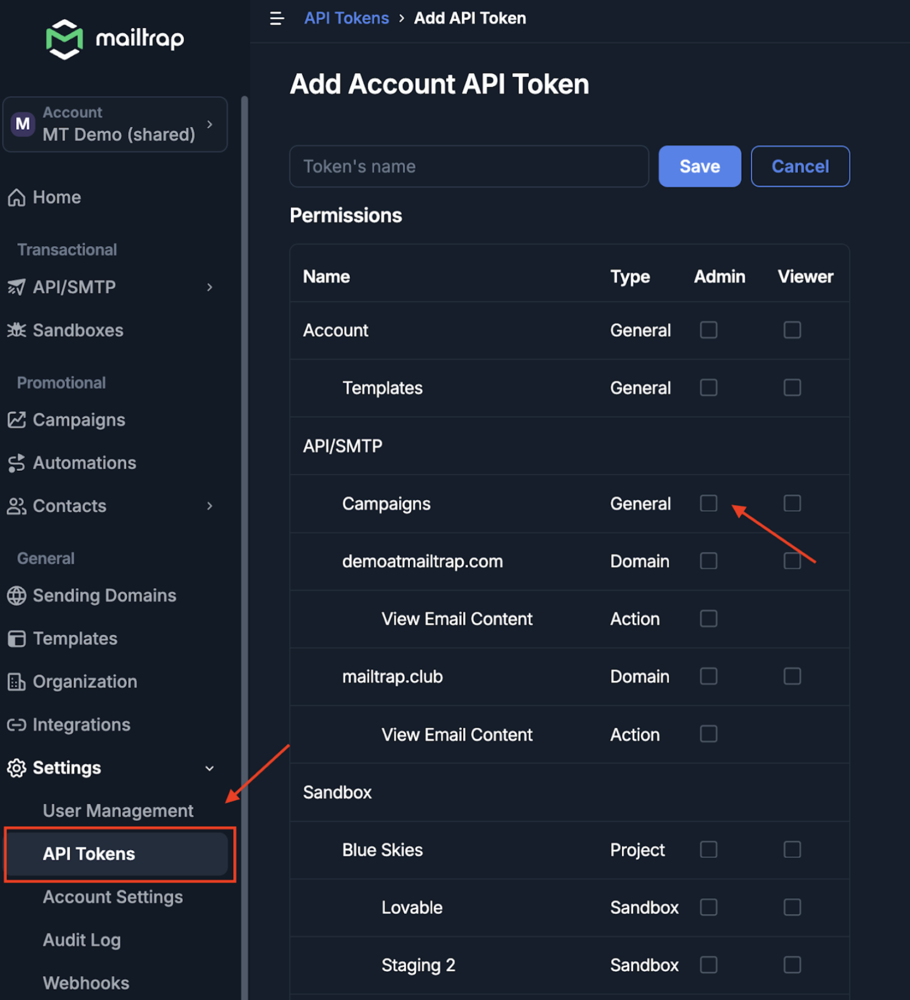
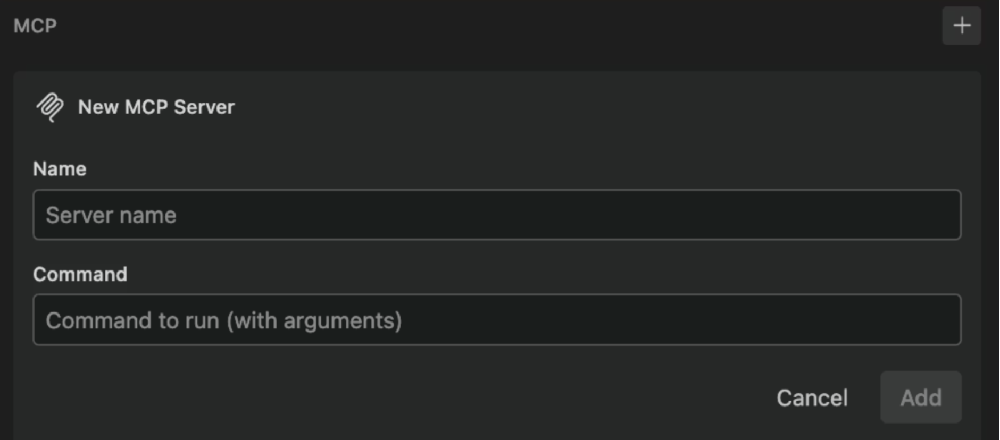
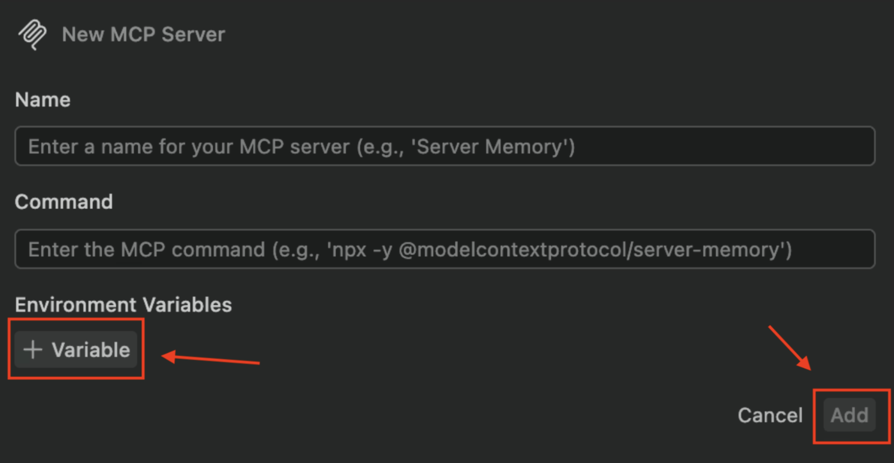
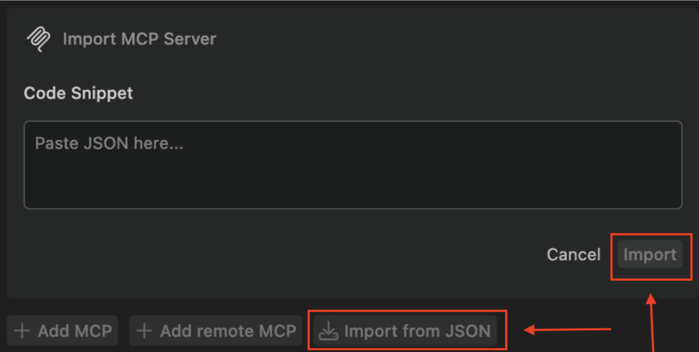
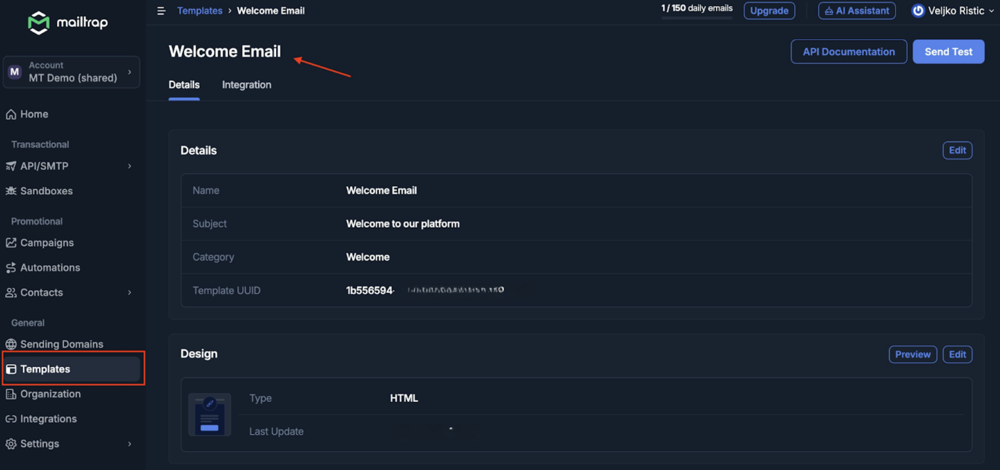

# Augment Code

[Augment Code](https://www.augmentcode.com/) is an AI coding assistant that runs as an extension on top of your existing editor  including VS Code and JetBrains IDEs. It enhances the editors with an intelligent Agent that can understand your codebase, run tasks autonomously, and integrate external tools via Model Context Protocol (MCP).

With Mailtrap's MCP server connected to Augment Code, you can create and test email templates in sandbox. And the assistant can help you set up Mailtrap sending. All actions run directly from your editor using Augment Agent and simple prompts; no manual API calls, no switching context.

In this guide, you'll learn how to set up the integration and create a template in three steps.

#### Prerequisites

Before you begin, make sure you have the following in place:

* A Mailtrap account with at least one sending domain set up and verified. This ensures your from address is authorized for delivery. If you haven't done this yet, refer to the [Mailtrap Sending Domains setup guide](https://docs.mailtrap.io/email-api-smtp/setup/sending-domain).
* [Node.js](https://nodejs.org/en) installed and up to date. The [Mailtrap MCP server](https://www.npmjs.com/package/mcp-mailtrap) is distributed as a Node-based CLI (`mcp-mailtrap`) and runs via npx.
* The latest version of Augment Code installed in your editor. MCP support is available in both the VS Code and JetBrains extensions. And we tested it on VS Code.&#x20;

### Step 1. Fetch Mailtrap API Credentials

To authenticate with Mailtrap, you need four values. You’ll need an API token and a verified From address, as well as account ID for templates and inbox ID, if you’d like to use Sandbox. Here's the flow:

* Log into your Mailtrap account.
* Click the **Settings** drop-down, select **API Tokens**, click **Add Token**, give it a name and make sure to tick the Admin permissions for email-sending.

<figure><figcaption></figcaption></figure>

* Copy your API token – this is your `MAILTRAP_API_TOKEN` value.
* Your `DEFAULT_FROM_EMAIL` must be an address on the same domain you verified in Sending Domains (e.g. [hello@yourdomain.com](mailto:hello@yourdomain.com)).
* To have full MCP functionality, you’ll also need `MAILTRAP_ACCOUNT_ID` to manage templates, and `MAILTRAP_TEST_INBOX_ID` for Sandbox tests (see step 6 below to locate the variables).


Replace the placeholder values in your MCP configuration (whether added via GUI or JSON) with the credentials on your account.


### Step 2. Add Mailtrap MCP to Augment Code

Mailtrap MCP is not in the Easy MCP catalog, so you'll configure it manually. Augment Code offers two ways to do this; use whichever suits your workflow.

<details>

<summary>Option A: Settings Panel (GUI)</summary>

* Open the Augment panel in your editor.
* Click the options menu (gear icon) in the upper-right corner of the panel and select Settings.
* In the **Settings** panel, scroll to the **MCP section**.

<figure><figcaption></figcaption></figure>

* Click the **+** button next to the MCP header to add a new server.​
* Fill in the fields as follows:
  * **Name**: `mailtrap`
  * **Command & Args**: `npx -y` `mcp-mailtrap`
* In the Environment Variables section, click ‘**+ Variable**’, and add the following entries:
  * `MAILTRAP_API_TOKEN` → (your Mailtrap API token — see Step 2)
  * `DEFAULT_FROM_EMAIL` → (your verified sending domain address, e.g. [hello@yourdomain.com](mailto:hello@yourdomain.com))
  * `MAILTRAP_ACCOUNT_ID` → (click **Settings**, then **Account Settings** to reveal the ID)
  * `MAILTRAP_TEST_INBOX_ID` → (find the ID in the inbox URL- for example: https://mailtrap.io/your\_inbox\_ID/messages)

<figure><figcaption></figcaption></figure>

* Click ‘**Add**’ to confirm.

</details>

<details>

<summary>Option B: Import from JSON</summary>

* Open the **Augment panel** and navigate to **Settings** via the gear icon.
* In the MCP section, click **Import from JSON**.

<figure><figcaption></figcaption></figure>

* Paste the following configuration and click **Save**:

```
{
  "mcp": {
    "servers": {
      "mailtrap": {
        "command": "npx",
        "args": ["-y", "mcp-mailtrap"],
        "env": {
          "MAILTRAP_API_TOKEN": "your_mailtrap_api_token",
          "DEFAULT_FROM_EMAIL": "your_sender@example.com",
          "MAILTRAP_ACCOUNT_ID": "your_account_id",
          "MAILTRAP_TEST_INBOX_ID": "your_test_inbox_id"
        }
      }
    }
  }
}
```

​Make sure to replace the placeholders with your variables prior to importing. If you've already saved the configuration with the placeholders, go back to **Settings** → **MCP**, click the more menu (...) next to the mailtrap server, and edit the environment variable values.


If Augment Code doesn't immediately reflect the new server, try reloading your editor.


</details>

### Step 3. Create an email template with a prompt

With the MCP server configured, you're ready to send emails directly from Augment Agent.

* Open the Augment panel in your editor and switch to the Agent tab.
* Confirm that the Mailtrap MCP server appears as an active tool; you can check this in the Agent's tool list or MCP status area within the Settings panel.
* In the Agent input field, type a natural-language prompt. For example:
  * "Create a new email template called 'Welcome Email' with subject 'Welcome to our platform!'"
* Augment Agent will use the Mailtrap MCP server to execute the action and confirm the result in the conversation.

#### Check Mailtrap Templates

Go back to Mailtrap, click **Templates** under **General**, then click the Welcome Email template name to confirm the action and inspect the template.

<figure><figcaption></figcaption></figure>
