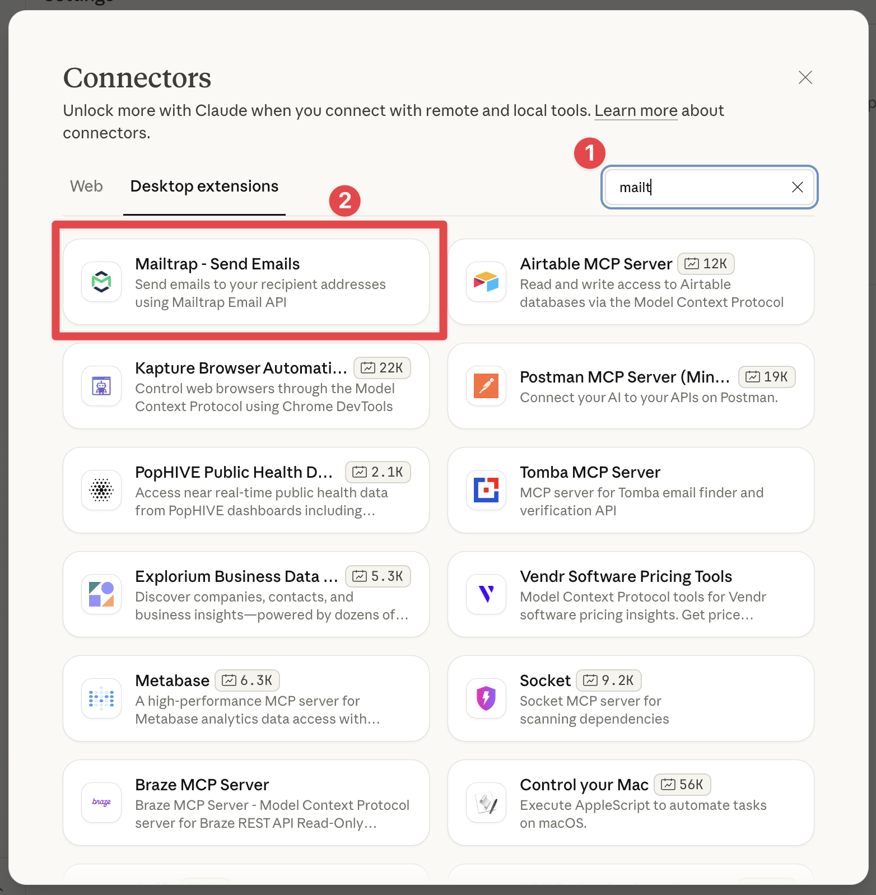

# Mailtrap MCP Server

Mailtrap MCP Server lets you automate email workflows from your AI IDE (e.g., VS Code, Cursor) or send emails with simple prompts from AI assistants like Claude Desktop.

The MCP server provides tools for:

* **Sending emails** – Send transactional emails through Mailtrap Email API.
* **Sandbox testing** – Send test emails to your sandbox, retrieve and view messages.
* **Template management** – Create, list, update, and delete email templates.




Mailtrap MCP server is implemented as a Node.js command line utility, so please install the [latest Node.js version](https://nodejs.org/en) before getting started.


## Quick install

<a href="https://cursor.com/en-US/install-mcp?name=mailtrap&#x26;config=eyJlbnYiOnsiTUFJTFRSQVBfQVBJX1RPS0VOIjoieW91cl9tYWlsdHJhcF9hcGlfdG9rZW4iLCJERUZBVUxUX0ZST01fRU1BSUwiOiJ5b3VyX3NlbmRlckBleGFtcGxlLmNvbSIsIk1BSUxUUkFQX0FDQ09VTlRfSUQiOiJ5b3VyX2FjY291bnRfaWQiLCJNQUlMVFJBUF9URVNUX0lOQk9YX0lEIjoieW91cl90ZXN0X2luYm94X2lkIn0sImNvbW1hbmQiOiJucHggLXkgbWNwLW1haWx0cmFwIn0%3D" class="button primary">Install in Cursor</a> <a href="https://insiders.vscode.dev/redirect/mcp/install?name=mailtrap&#x26;config=%7B%22command%22%3A%22npx%22%2C%22args%22%3A%5B%22-y%22%2C%22mcp-mailtrap%22%5D%2C%22env%22%3A%7B%22MAILTRAP_API_TOKEN%22%3A%22%24%7Binput%3AmailtrapApiToken%7D%22%2C%22DEFAULT_FROM_EMAIL%22%3A%22%24%7Binput%3AsenderEmail%7D%22%2C%22MAILTRAP_ACCOUNT_ID%22%3A%22%24%7Binput%3AmailtrapAccountId%7D%22%2C%22MAILTRAP_TEST_INBOX_ID%22%3A%22%24%7Binput%3AmailtrapTestInboxId%7D%22%7D%7D&#x26;inputs=%5B%7B%22type%22%3A%22promptString%22%2C%22id%22%3A%22mailtrapApiToken%22%2C%22description%22%3A%22Mailtrap+API+Token%22%2C%22password%22%3Atrue%7D%2C%7B%22type%22%3A%22promptString%22%2C%22id%22%3A%22senderEmail%22%2C%22description%22%3A%22Sender+Email+Address%22%7D%2C%7B%22type%22%3A%22promptString%22%2C%22id%22%3A%22mailtrapAccountId%22%2C%22description%22%3A%22Mailtrap+Account+ID%22%7D%2C%7B%22type%22%3A%22promptString%22%2C%22id%22%3A%22mailtrapTestInboxId%22%2C%22description%22%3A%22Mailtrap+Test+Inbox+ID+%28optional%29%22%7D%5D" class="button primary">Install in VS Code</a>

For Claude Desktop, Mailtrap is available as a Desktop extension in the Connectors catalog. Open Claude Desktop settings, go to **Connectors**, select **Desktop extensions**, and search for "Mailtrap".

<figure><figcaption></figcaption></figure>

For manual configuration and available tools documentation, visit the official GitHub repository.

<a href="https://github.com/mailtrap/mailtrap-mcp" class="button primary">View on GitHub</a>

## Where to find your credentials

During installation, you'll need to provide your Mailtrap credentials:

**API Token** **and** **From email**– Navigate to **Sending Domains** > **Integration** > **API** in your Mailtrap account.

<figure><figcaption></figcaption></figure>

**Account ID** (for template management) – Go to **Settings** > **Account Settings**.

**Sandbox ID** (for sandbox testing) – Find it in your Email Sandbox inbox URL.

## Use cases

Once configured, you can prompt the AI/agent to perform various email operations:

* "Send an email to john.doe@example.com with the subject 'Meeting Tomorrow' and a friendly reminder about our upcoming meeting."
* "Send a test email to my sandbox inbox with a sample welcome message"
* "Show me the last 5 emails in my sandbox inbox"
* "Create a new email template called 'Welcome Email' with a friendly onboarding message"
* "List all my email templates"


You can combine Mailtrap MCP with other MCP servers for advanced functionality. For example, send a report email via Mailtrap MCP, and use the [Slack MCP](https://mcp.so/server/slack) to post a message in the team's channel.

