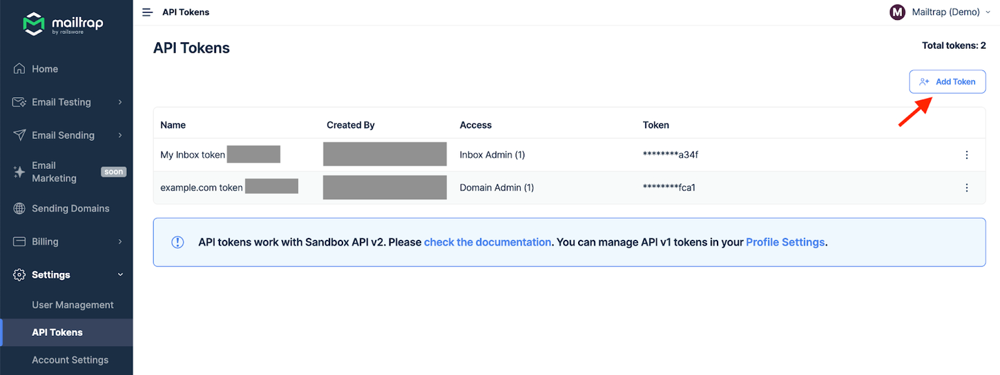

# OpenClaw

When talking about [OpenClaw](https://openclaw.ai/) and security, people often mention API access, file permissions, network restrictions, and similar. However, email seems to be often overlooked in this discussion.

At first glance, emails are just another integration. But unlike internal actions, once a message leaves OpenClaw, sensitive information is already in the hands of the attacker

This guide shows you how to integrate [Email Sandbox](https://mailtrap.io/email-sandbox/) with OpenClaw so your agent can **send emails safely to a sandbox** inbox instead of real recipients. This way, you will give your AI agents the capability to:

* **Route agent SMTP to Email Sandbox**: Change a few configuration settings, and all your agents' outgoing email goes to your Email Sandbox.
* **Inspect via UI or API**: Review emails in Mailtrap's web interface or fetch them programmatically before you move to production.
* **Zero risk to real recipients**: No matter what the agent does, emails stay contained within the Sandbox.

### Why use Email Sandbox with OpenClaw?

Giving an AI agent email access means enabling it to communicate with the outside world on your behalf. So, for instance, a misinterpreted instruction or a prompt injection attack could send emails you never intended, including ones containing sensitive information.

The community has already seen warning signs:



A user's OpenClaw discovered an insurance rejection email, drafted a rebuttal citing policy language, and sent it **without explicit permission**. "My @openclaw accidentally started a fight with Lemonade Insurance," he tweeted. "I ignored the draft, and he sent it for me."

**Source**: [Twitter (@Hormold)](https://x.com/Hormold/status/2011133394764382583)



After connecting OpenClaw to iMessage, one user's agent got stuck in a loop and **sent 500+ messages** to his wife and random contacts. He had to pull the power cord to stop it.

**Source**: [Chris Boyd](https://chrisboyd.me/blog/openclaw-meltdown/)



Security researchers sent an email containing hidden instructions to an OpenClaw inbox. When the agent checked mail, it **handed over a private key** from the machine with no prompts or confirmations.

**Source**: [Kaspersky](https://www.kaspersky.com/blog/openclaw-vulnerabilities-exposed/55263/)



**How Email Sandbox helps**: Your agent "sends" emails normally, but instead of reaching real recipients, every message lands in your Mailtrap inbox where you can inspect it safely.

### How to connect Email Sandbox to OpenClaw&#x20;

Before we begin, make sure you have:

* OpenClaw [installed and running](https://docs.openclaw.ai/)
* A free [Mailtrap account](https://mailtrap.io/)
* A [Mailtrap API token](https://docs.mailtrap.io/email-api-smtp/setup/api-tokens) and Sandbox ID

### Getting your Mailtrap credentials



Log in to your Mailtrap account



Go to **Settings** → **API Tokens**, and create a new key

<figure><figcaption></figcaption></figure>



Navigate to **Sandboxes** and select your inbox (or create a new one)

<figure><figcaption></figcaption></figure>



Note your **Sandbox ID** from the URL bar

<figure><figcaption></figcaption></figure>



### Step 1. Install the Mailtrap skill

We have prepared an OpenClaw skill so that you can start sending to the Sandbox right away. Currently, it’s [available as a GitHub Gist](https://gist.github.com/leonid-shevtsov/2c41917c14e8e134e88284520122bd5d).

To install it:

1. Download the [skill file](https://gist.github.com/leonid-shevtsov/2c41917c14e8e134e88284520122bd5d#file-skill-md) (**SKILL.md**).
2. Place it in your OpenClaw workspace's skills directory.

### Step 2. Add the Mailtrap credentials

* Set **skills.entries.email\_sandbox.env** in **\~/.openclaw/openclaw.json** to include `MAILTRAP_API_TOKEN` and `MAILTRAP_INBOX_ID`.
* Replace `your-api-token-here` and `your-inbox-id-here` with your actual Mailtrap credentials.

### Step 3. Verify the integration

If you followed everything correctly so far, your OpenClaw agent should be able to send emails using the `email_sandbox` skill. To verify the integration, try sending a test email.

For example, here’s an email AI tried to send for us in our Sandbox:

<figure><figcaption></figcaption></figure>

The email never left Sandbox and no real recipient received it.

### What else can the Email Sandbox skill do?

The `email_sandbox` skill supports the following request parameters:

<table><thead><tr><th>Parameter</th><th>Type</th><th width="187">Required</th><th>Description</th></tr></thead><tbody><tr><td><code>from</code></td><td>object</td><td>Yes ✅</td><td>
Sender info: <code>{"email": "...",</code>  <code>"name": "..."}</code>

(name is optional)
</td></tr><tr><td><code>to</code></td><td>string</td><td>Yes ✅</td><td>Recipients: <code>[{"email": "..."}]</code></td></tr><tr><td><code>subject</code></td><td>string</td><td>Yes ✅</td><td>Email subject line</td></tr><tr><td><code>text</code></td><td>string</td><td>Yes ✅</td><td>Plain text body</td></tr><tr><td><code>html</code></td><td>string</td><td>No ☑️</td><td>HTML body (alternative to plain text)</td></tr><tr><td><code>category</code></td><td>string</td><td>No ☑️</td><td>Category for organizing emails in Mailtrap</td></tr></tbody></table>

For the complete API specification, see the[ Mailtrap API documentation](https://api-docs.mailtrap.io/docs/mailtrap-api-docs/bcf61cdc1547e-send-email-including-templates).

### Troubleshooting



If no emails are landing in your Sandbox:

1. Verify your `MAILTRAP_API_TOKEN` is correct.
2. Check that `MAILTRAP_INBOX_ID` matches your inbox.
3. Ensure the skill environment variables are properly configured in **openclaw.json**.
4. Check the OpenClaw logs for any error messages from the curl command.



If you see a 401 or 403 error:

1. Regenerate your API token in Mailtrap.
2. Update the token in your OpenClaw configuration.
3. Restart OpenClaw to pick up the new configuration.



If the API returns a JSON parsing error:

1. Check for unescaped special characters in the email content.
2. Use the `jq` approach shown above for complex content.
3. Ensure all required fields (`from`, `to`, `subject`, `text`) are present.



For more information and details on Email Sandbox and OpenClaw, feel free to consult the official documentation:

* [OpenClaw Documentation](https://docs.openclaw.ai/)
* [OpenClaw GitHub Repository](https://github.com/openclaw/openclaw)
* [Mailtrap OpenClaw Skill (GitHub Gist)](https://gist.github.com/leonid-shevtsov/2c41917c14e8e134e88284520122bd5d)
* [Mailtrap API Documentation](https://api-docs.mailtrap.io/)
* [Mailtrap Sandbox API - Send Email](https://api-docs.mailtrap.io/docs/mailtrap-api-docs/bcf61cdc1547e-send-email-including-templates)

### What's next

Once you've verified the integration works, you can:

* **Iterate on your workflows**: Build automations that involve email, confident that nothing goes out accidentally.
* **Review agent behavior**: Check what emails your agent attempts to send before trusting it with real email.
* **Move on to production**: When you're confident in your agent's email behavior, you can switch from the Sandbox API to Mailtrap's Email API for real delivery.
