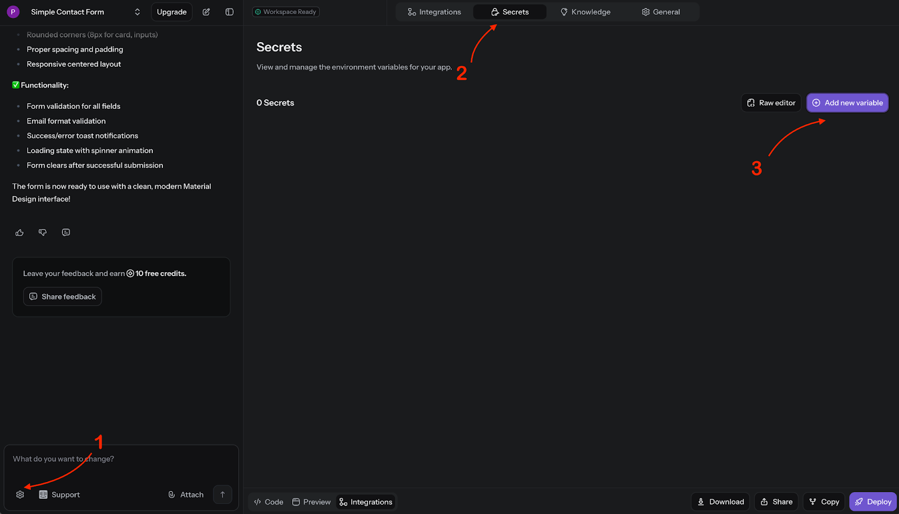
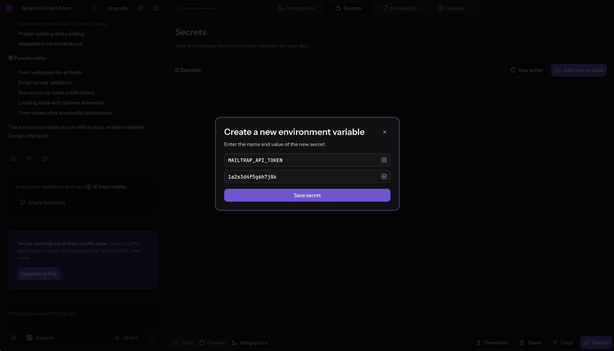
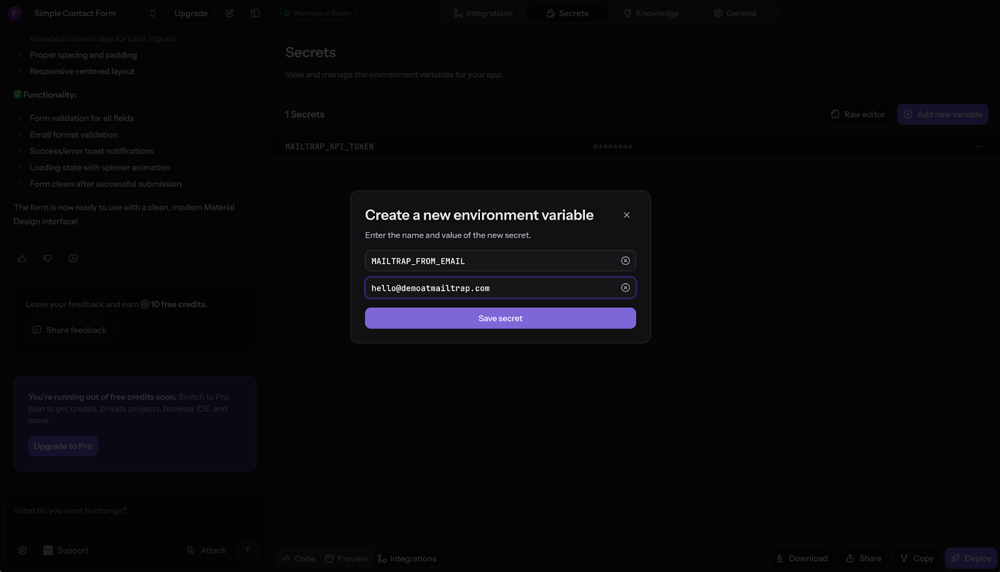
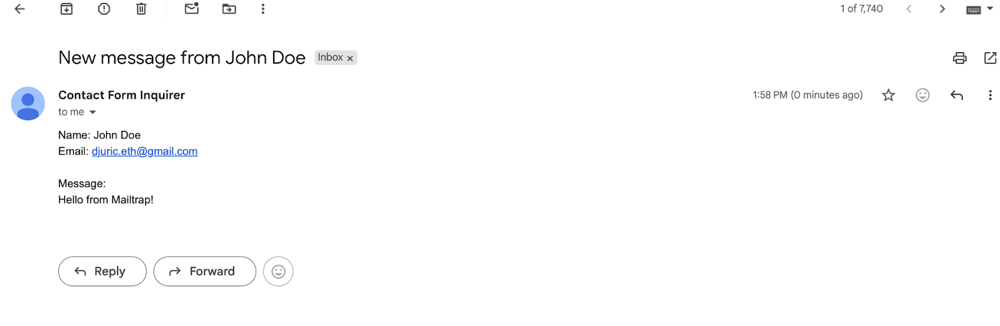

# Reflex Build and Mailtrap

This guide shows you how to integrate Mailtrap with your Reflex Build application to send emails.

Mailtrap is an email-sending solution for developer and product teams. Focused on fast delivery and high inboxing rates for transactional and promo emails. Provides highly customizable API and 24/7 tech support.

## Prerequisites

* A Reflex Build account and a project
* A Mailtrap account for sending emails



### Create a landing page/contact form

Log in to your Reflex Build account and use a prompt like the following one to create a simple project with basic fields:


create me a simple contact form with email, name, and message fields, and a send button




### Add your Mailtrap credentials

After a minute or two, Reflex Build will generate your project. Once it's done, you need to insert your Mailtrap credentials.

To do this, open **Settings** in the sidebar, navigate to **Secrets**, and click on the **Add new variable** button.

<figure><figcaption>
Reflex Build Secrets settings
</figcaption></figure>

You need to add the following two variables:

**MAILTRAP\_API\_TOKEN**

This is the [Mailtrap API token](https://app.gitbook.com/s/S3xyr7ba7aGO19rc8dSK/account-and-organization/privacy-and-security/api-tokens), which you can create at any time in your account dashboard.

<figure><figcaption>
API Token secret
</figcaption></figure>

**MAILTRAP\_FROM\_EMAIL**

This is the email address with the verified Mailtrap sending domain you've added after creating an account.

<figure><figcaption>
From Email secret
</figcaption></figure>

Once you're done adding the variables, simply tell the Reflex Build AI that you're done with a prompt like this one:


I've added the MAILTRAP\_API\_TOKEN and MAILTRAP\_FROM\_EMAIL variables


The AI will then go over Mailtrap Email API documentation, connect it to your project, and confirm once it's done.


If you haven't already, make sure to let AI know you want the messages to be sent to the address inputted in the email field. For this, you can use a prompt such as:

"I want the message to be sent to the address inputted in the email field, meaning the to field should use the email from the form data"




### Start sending emails

Finally, to test your configuration, fill out the form and hit the **Send** button. If you followed everything thus far, you should receive the email in your inbox in a few seconds.

<figure><figcaption>
Email received in Gmail
</figcaption></figure>

You can also view the email in the [Email Logs](https://app.gitbook.com/s/S3xyr7ba7aGO19rc8dSK/email-api-smtp/statistics/email-logs) tab in the Mailtrap dashboard.


