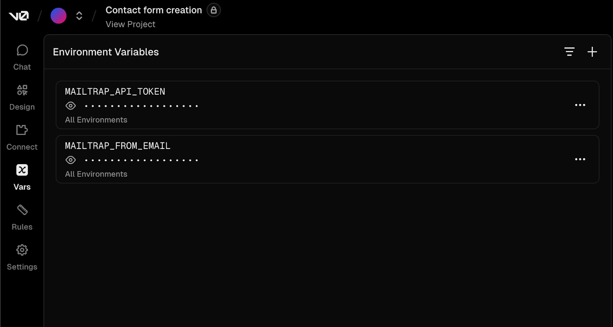
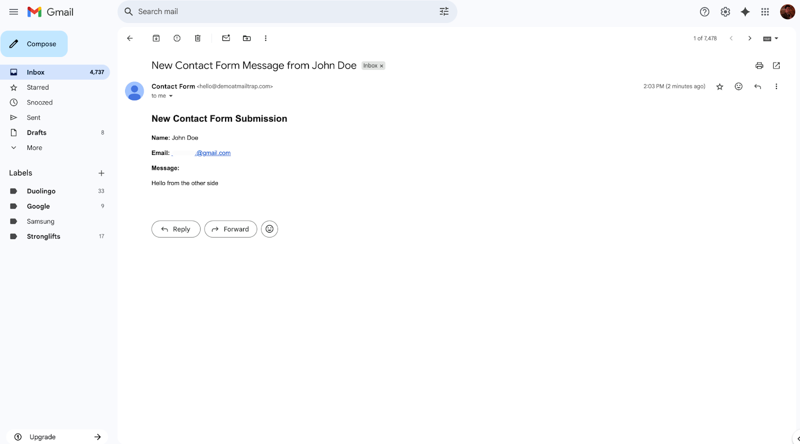
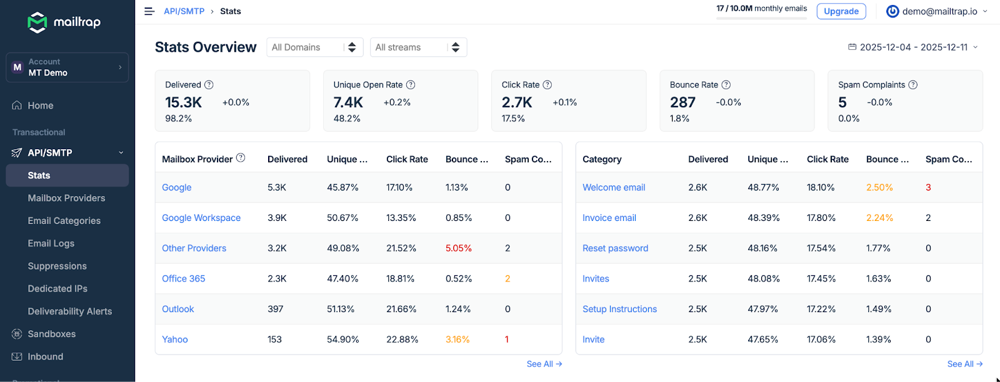

# V0

[v0](https://v0.app/) is Vercel’s AI-powered builder that lets you generate apps, forms, pages, and more through simple prompts. In this article, you’ll learn how to connect it to Mailtrap and add email-sending functionality to your projects.

**Before we start**:

* Add and [verify your email sending domain](https://docs.mailtrap.io/email-api-smtp/setup/sending-domain) since Mailtrap allows you to send emails only from a verified domain.
* Make sure your [API Token](https://docs.mailtrap.io/email-api-smtp/setup/api-tokens) has `admin` access level to that domain.

### Step 1. Add your Mailtrap credentials

Open your v0 project and add your:

* Mailtrap API key
* Mailtrap `from` email

To do this, click on **Vars** in the left-side menu and add the following two variables:

<figure><figcaption></figcaption></figure>

Next, let the AI know that you’ve added the required environment variables it needs to start sending emails via Mailtrap email API.

> Please use Mailtrap email api for sending, I've added the required environment variables

The AI will then go over Mailtrap Email API documentation, connect it to your project, and confirm once it’s done.

### Step 2. Start sending emails

Once you add your credentials, try sending an email from your project. If you followed everything thus far, you should receive the email in your inbox in a few seconds.

Here is the email in a Gmail inbox I used as my `to` address:

<figure><figcaption></figcaption></figure>

And here it is in the [Mailtrap Email Logs](https://docs.mailtrap.io/email-api-smtp/analytics/logs):

<figure><figcaption></figcaption></figure>

Additionally, you’ll be able to see all the important stats regarding your sent emails, such as opens, clicks, bounces, etc.

<figure><figcaption></figcaption></figure>

For more information on Mailtrap Analytics, [click here](https://docs.mailtrap.io/email-api-smtp/analytics/dashboard).&#x20;

### Next steps

* Use [Mailtrap Templates](https://docs.mailtrap.io/email-api-smtp/email-templates) to send branded emails with variables (template guide).
* Configure [Mailtrap Contacts](https://docs.mailtrap.io/email-marketing/contacts/overview) to push user information to your Mailtrap Lists, so you can later send campaigns to them or use Automations.
* [Add automation triggers](https://docs.mailtrap.io/email-marketing/automations) in Mailtrap to send follow-ups to new contacts.
* Track open and click rates with Mailtrap Email Tracking.
* Read our in-depth [Vercel knowledge base](https://docs.mailtrap.io/guides/ai-powered-integrations/vercel) article or our detailed [Vercel blog guide](https://mailtrap.io/blog/vercel-send-email/).

\
\
\
 
