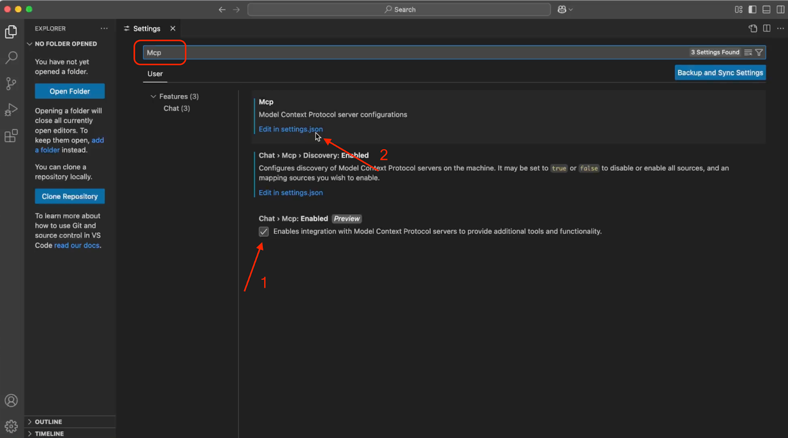
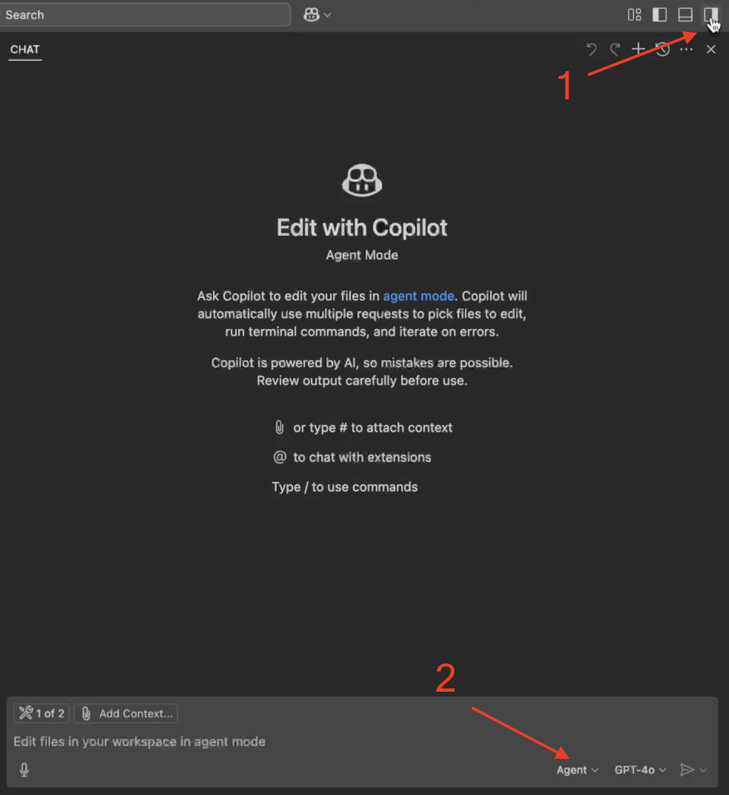
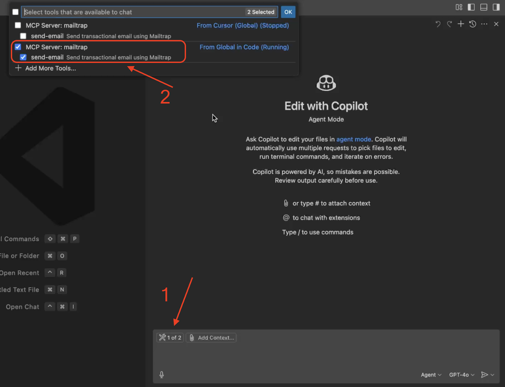
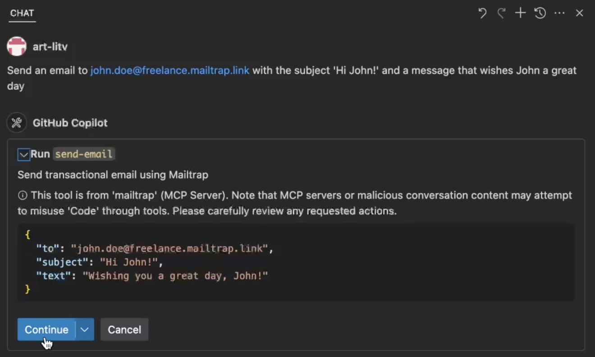
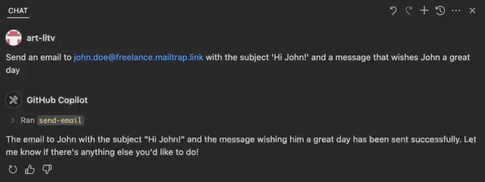
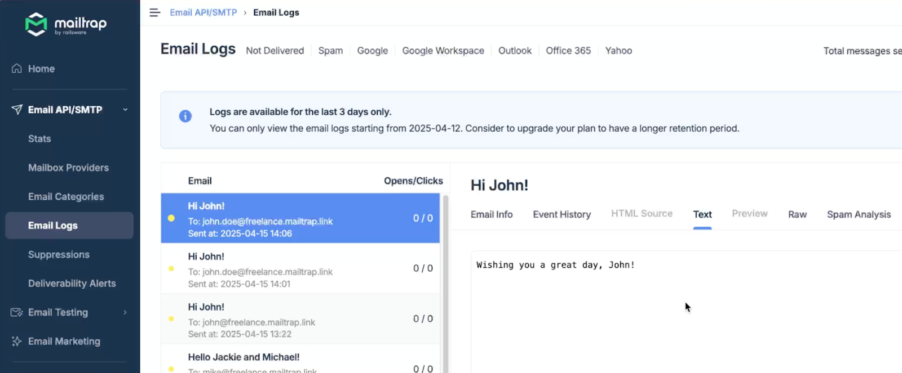

# VS Code

With the VS Code Mailtrap integration, you can send emails directly from Visual Studio Code using simple AI prompts powered by GitHub Copilot.

Mailtrap is an email-sending solution for developer and product teams focused on fast delivery and high inboxing rates for transactional and promo emails. It provides a highly customizable API and 24/7 technical support.

In this guide, you'll set up the integration and send emails in three steps.

## Prerequisites

Before you start, ensure the following:

* [Set up your sending domain](https://app.gitbook.com/s/S3xyr7ba7aGO19rc8dSK/email-api-smtp/setup/sending-domain) — this takes approximately 5 minutes
* Install the [latest Node.js version](https://nodejs.org/en) since [Mailtrap MCP](https://www.npmjs.com/package/mcp-mailtrap) is implemented as a Node.js command line utility
* Install or update [Visual Studio Code](https://code.visualstudio.com/) to the latest version



**Add Mailtrap MCP to VS Code**

To add Mailtrap MCP to VS Code, you can use the [quick install link](https://insiders.vscode.dev/redirect/mcp/install?name=mailtrap\&config=%7B%22command%22%3A%22npx%22%2C%22args%22%3A%5B%22-y%22%2C%22mcp-mailtrap%22%5D%2C%22env%22%3A%7B%22MAILTRAP_API_TOKEN%22%3A%22%24%7Binput%3AmailtrapApiToken%7D%22%2C%22DEFAULT_FROM_EMAIL%22%3A%22%24%7Binput%3AsenderEmail%7D%22%2C%22MAILTRAP_ACCOUNT_ID%22%3A%22%24%7Binput%3AmailtrapAccountId%7D%22%7D%7D\&inputs=%5B%7B%22type%22%3A%22promptString%22%2C%22id%22%3A%22mailtrapApiToken%22%2C%22description%22%3A%22Mailtrap+API+Token%22%2C%22password%22%3Atrue%7D%2C%7B%22type%22%3A%22promptString%22%2C%22id%22%3A%22senderEmail%22%2C%22description%22%3A%22Sender+Email+Address%22%7D%2C%7B%22type%22%3A%22promptString%22%2C%22id%22%3A%22mailtrapAccountId%22%2C%22description%22%3A%22Mailtrap+Account+ID%22%7D%5D) or follow these steps:

1. Open VS Code and navigate to **Settings**
2. Search for **MCP** in the settings search bar
3. Tick the **Chat > MCP: Enabled** option
4. Click **Edit in settings.json**

<div align="left" data-with-frame="true"></div>


You can also open the settings.json file by typing **Preferences: Open User Settings (JSON)** in the Command Palette.


In your settings.json file, add the following code snippet:


```json
{
  "mcp": {
    "servers": {
      "mailtrap": {
        "command": "npx",
        "args": ["-y", "mcp-mailtrap"],
        "env": {
          "MAILTRAP_API_TOKEN": "your_mailtrap_api_token",
          "DEFAULT_FROM_EMAIL": "your_sender@example.com"
        }
      }
    }
  }
}
```



Make sure to restart your MCP server after changing the "env" section.




**Add Mailtrap API credentials**

Replace the following values in your settings.json file:

* **MAILTRAP\_API\_TOKEN** — Authentication token for API requests. You can copy this from the **Credentials** tab in your Mailtrap account
* **DEFAULT\_FROM\_EMAIL** — Must match your verified domain in Mailtrap's **Sending Domains** tab

Find these credentials in your Mailtrap account by navigating to **Sending Domains → Integration → API**.

<div align="left" data-with-frame="true"></div>


Although you shouldn't face any issues, reload VS Code to ensure everything is set up correctly.




**Send emails with a prompt**

To send an email:

1. Open the **AI Pane** in the upper-right corner of VS Code
2. Make sure **Agent mode** is selected (this allows VS Code to perform actions)

<div align="left" data-with-frame="true"></div>

3. Open the list of available tools and select **Mailtrap**
4. If you see similar MCPs from other editors (like Cursor), uncheck them

<div align="left" data-with-frame="true"></div>

5. Use this prompt (or create your own):

```
Send an email to john.doe@example.com with the subject 'Hi John!' and a message that wishes John a great day.
```

VS Code will identify the correct MCP server and suggest running the send-email tool. Click **Continue** to proceed.

<div align="left" data-with-frame="true"></div>

The email will be sent successfully, and Copilot will confirm the action:

<div align="left" data-with-frame="true"></div>

Verify the email in your Mailtrap dashboard by checking the [Email Logs](https://app.gitbook.com/s/S3xyr7ba7aGO19rc8dSK/email-api-smtp/analytics/logs) tab:

<div align="left" data-with-frame="true"></div>


