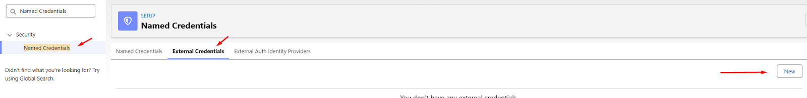
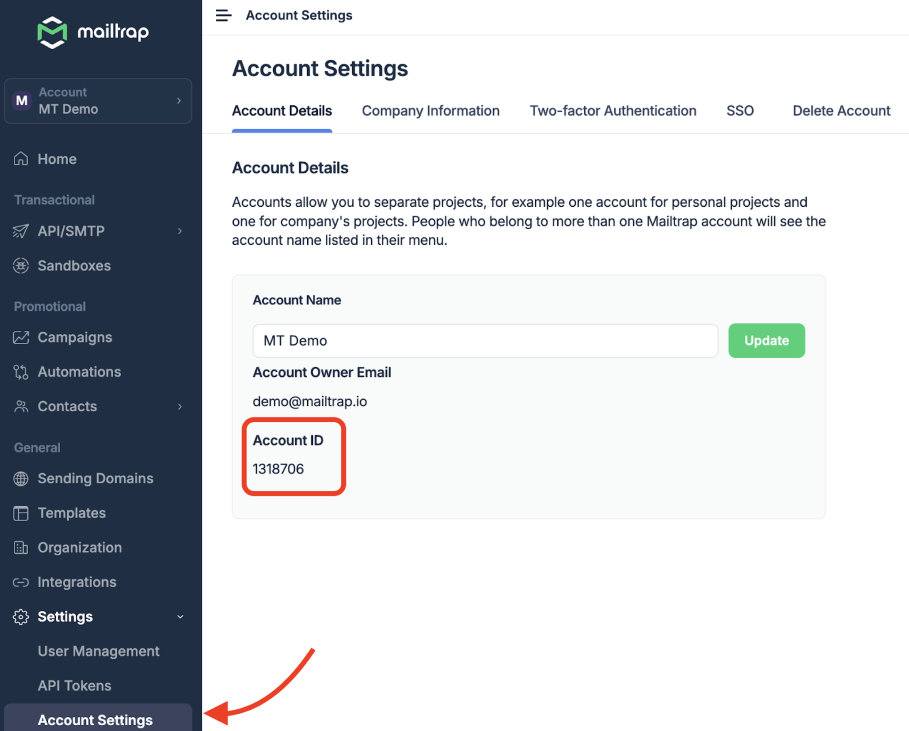
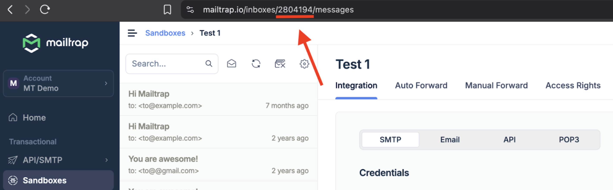
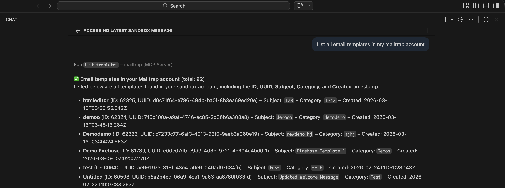
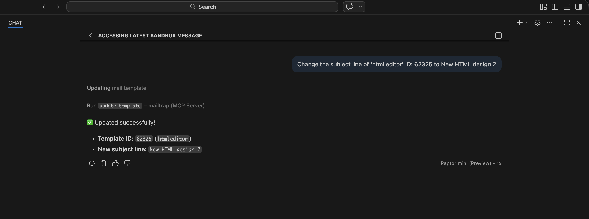

# Visual Studio Code (VS Code)

[Visual Studio Code](https://code.visualstudio.com/), most commonly known as VS Code, is a development environment powered by GitHub Copilot AI that lets you easily build and debug modern web and cloud applications.

In this guide, you’ll learn how to integrate it with with the Mailtrap MCP which allows you to, amongst other things, perform the following actions:

* [Connect Mailtrap to your project](vs-code.md#connect-mailtrap-to-your-project)
* [Perform Sandbox operations](vs-code.md#sandbox-operations-during)&#x20;
* [Validate email templates](vs-code.md#template-validation)
* [Forward email templates to your teammates](vs-code.md#sending-emails-to-your-teammate)

#### Prerequisites

Before you start, make sure to:

* Set up your [sending domain](https://docs.mailtrap.io/email-api-smtp/setup/sending-domain) (this takes approximately 5 minutes).
* Install the [latest Node.js version](https://nodejs.org/en) since [Mailtrap MCP](https://www.npmjs.com/package/mcp-mailtrap) is implemented as a Node.js command line utility.

### Step 1. Add Mailtrap MCP config to VSC

To add Mailtrap MCP to VS Code, you can use the [quick install link](https://insiders.vscode.dev/redirect/mcp/install?name=mailtrap\&config=%7B%22command%22%3A%22npx%22%2C%22args%22%3A%5B%22-y%22%2C%22mcp-mailtrap%22%5D%2C%22env%22%3A%7B%22MAILTRAP_API_TOKEN%22%3A%22%24%7Binput%3AmailtrapApiToken%7D%22%2C%22DEFAULT_FROM_EMAIL%22%3A%22%24%7Binput%3AsenderEmail%7D%22%2C%22MAILTRAP_ACCOUNT_ID%22%3A%22%24%7Binput%3AmailtrapAccountId%7D%22%7D%7D\&inputs=%5B%7B%22type%22%3A%22promptString%22%2C%22id%22%3A%22mailtrapApiToken%22%2C%22description%22%3A%22Mailtrap+API+Token%22%2C%22password%22%3Atrue%7D%2C%7B%22type%22%3A%22promptString%22%2C%22id%22%3A%22senderEmail%22%2C%22description%22%3A%22Sender+Email+Address%22%7D%2C%7B%22type%22%3A%22promptString%22%2C%22id%22%3A%22mailtrapAccountId%22%2C%22description%22%3A%22Mailtrap+Account+ID%22%7D%5D) or follow these steps:

* Open VS Code and navigate to **Settings**.
* Search for **MCP** in the settings search bar.
* Tick the **Chat > MCP: Enabled** option.
* Click **Edit in settings.json**.

<figure><figcaption></figcaption></figure>


You can also open the settings.json file by typing **Preferences: Open User Settings (JSON)** in the Command Palette.


Once you open **settings.json**, insert the following code snippet into the file:

```json
{
  "mcpServers": {
    "mailtrap": {
      "command": "npx",
      "args": ["-y", "mcp-mailtrap"],
      "env": {
        "MAILTRAP_API_TOKEN": "your_mailtrap_api_token",
        "DEFAULT_FROM_EMAIL": "your_sender@example.com",
        "MAILTRAP_ACCOUNT_ID": "your_account_id",
        "MAILTRAP_TEST_INBOX_ID": "your_test_inbox_id"
      }
    }
  }
}
```

### Step 2. Insert Mailtrap credentials

Next, all you need to do is replace the following values in the **settings.json** file:

* `MAILTRAP_API_TOKEN` – Required for all functionality, used to authenticate API requests, which you can copy/paste from the credentials tab.
* `DEFAULT_FROM_EMAIL` – Required for email sending. Make sure the email’s domain matches your own domain from the **Sending Domains** tab in Mailtrap.

You can find these credentials in your Mailtrap account by navigating to **Sending Domains** → **Integration** → **API**.

<figure><figcaption></figcaption></figure>

* `MAILTRAP_ACCOUNT_ID` – This is required for template management purposes. You can find the account ID under **Settings** → **Account Settings**.&#x20;

<figure><figcaption></figcaption></figure>

* `MAILTRAP_TEST_INBOX_ID` – If you need sandbox email functionality, you can find this ID in your Sandbox.

<figure><figcaption></figcaption></figure>

Once you insert your Mailtrap credentials, make sure to refresh the page or reopen VS Code.

### VS Code + Mailtrap MCP server use cases

#### Connect Mailtrap to your project

You can prompt the VS Code AI to integrate Mailtrap into your project with a prompt like this one:

> Integrate Mailtrap into my project, so that it can send emails through the Mailtrap email API. Additionally, safely store the Mailtrap credentials from the MCP configuration into an .env file

VS Code agent will then go through the Mailtrap documentation, integrate the email API, and safely store your credentials in a **.env** file. Then, you can proceed to test the configuration. For instance, here’s our contact form email in our Gmail inbox we used as our `to` address:

<figure><figcaption></figcaption></figure>

And here is the same email in the [Mailtrap Email Logs](https://docs.mailtrap.io/email-api-smtp/analytics/logs):

<figure><figcaption></figcaption></figure>

#### Sandbox operations during&#x20;

While you’re reviewing your email-sending code in VS Code and working in a staging environment using [Sandbox](https://mailtrap.io/email-sandbox/), you might want to try to trigger the logic to see if it works correctly or simply to verify the behavior, test emails, etc.

You can do all of this from VS Code, which you can prompt so you can:

* Verify what the code actually does without switching to the Mailtrap UI and back to the IDE
* Inspect basic message metadata
* Use the returned message ID to request full message details (content, headers, etc.), and more.

<figure><figcaption></figcaption></figure>

#### Template validation

Using a Mailtrap template ID in your code, but you’re not sure whether it’s the correct one? Just request the list of available templates in your Mailtrap account from the VS Code AI:

<figure><figcaption></figcaption></figure>

Not satisfied with the subject line of your template? Use a prompt such as this one to edit it:

<figure><figcaption></figcaption></figure>

#### Sending emails to your teammate

You can also ask your teammates’ opinion on an email design or a template you’re working in your Sandbox by prompting the VS Code, no need to leave the editor. For instance:

<figure><figcaption></figcaption></figure>
