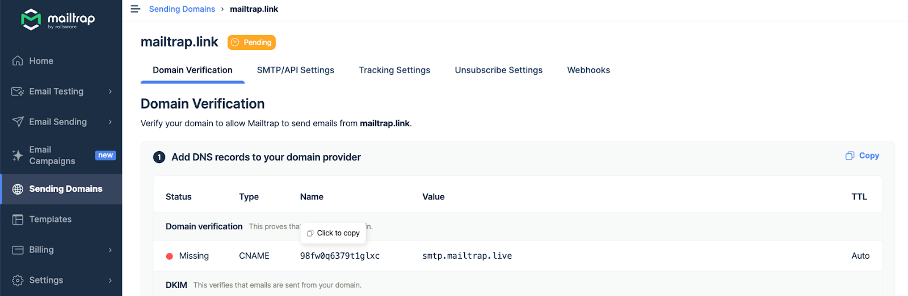
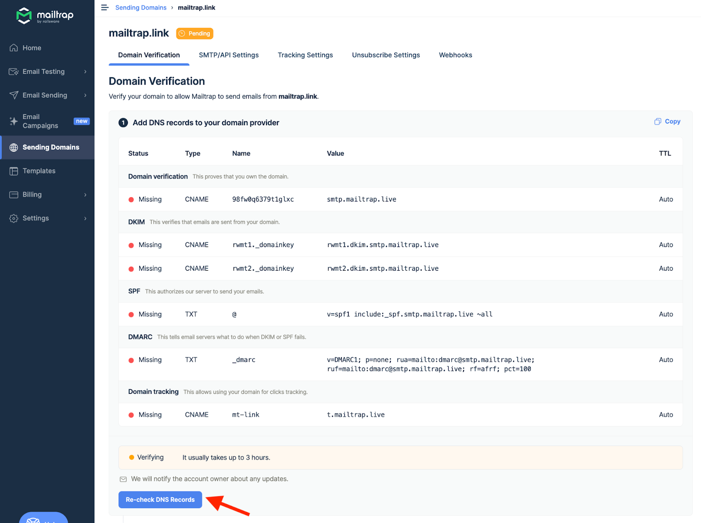
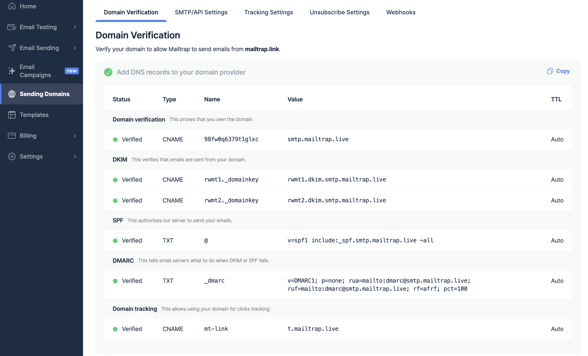

To add and verify a sending domain in Mailtrap, you need access to your domain's DNS records and your domain provider account.

<a href="./" class="button secondary">Sending Domain Setup</a> check it for more details on setting up your sending domain. Continue reading to learn how to add Mailtrap DNS records to AWS Route 53.


This guide assumes that your domain is either registered and managed with AWS Route 53 or registered elsewhere but points to AWS Route 53. It also assumes that you've already created and configured a Hosted Zone for your domain.




## Access AWS Route 53

Go to the AWS Management Console, type Route 53 in the search bar, and click on it.




## Navigate to Hosted Zones

Navigate to Hosted Zone settings for the domain you've added to Mailtrap.




## Select Your Domain

Click the domain you've added to Mailtrap.




## Create DNS Record

Click Create record button.




## Get DNS Records from Mailtrap

Return to Mailtrap. On the Domain Verification page, you'll see the DNS records you need to add to AWS Route 53. These are Domain Verification, DKIM, DMARC, and Domain Tracking. You'll need the values under Type, Name, and Value.

Make sure you check the type next to each record in Mailtrap and choose a relevant one in AWS Route 53. There are four CNAME type records (Domain Verification, DKIM (2), and Custom Tracking Domain) and one TXT type record (DMARC).

<figure><figcaption>
DNS Types and Categories in Mailtrap 
</figcaption></figure>


The SPF check for your mail is covered by the domain verification record. There is no need to add a separate SPF record on your sending domain.




## Copy DNS Record Values

Copy the Name and Value for each record one by one. You can do this by hovering and clicking each record.




## Paste Records into AWS Route 53

Paste the Name and Value into AWS Route 53. The namings of the records are the same in AWS Route 53 as in Mailtrap.

Use the default value for TTL as indicated in Mailtrap. Click Add another record after adding each record in AWS Route 53.



## Create All Records

Repeat the process of copying and pasting for each record until you've added all the Mailtrap DNS records to AWS Route 53. Click Create Records.




## Verify DNS Records in Mailtrap

Return to Mailtrap. Some records may be verified immediately, while some may take more time. Mailtrap will check the DNS records automatically every hour, but you can force a check by clicking the Re-check DNS Records button.




## Confirm Verification Complete

If you add all the required DNS records correctly, the Status of DNS records will change from Missing to Verified, and the red dots will turn green.





_If you have additional questions,_ [_consult AWS documentation_](https://docs.aws.amazon.com/Route53/latest/DeveloperGuide/resource-record-sets-creating.html) _or contact us at_ [_support@mailtrap.io_](mailto:support@mailtrap.io)

