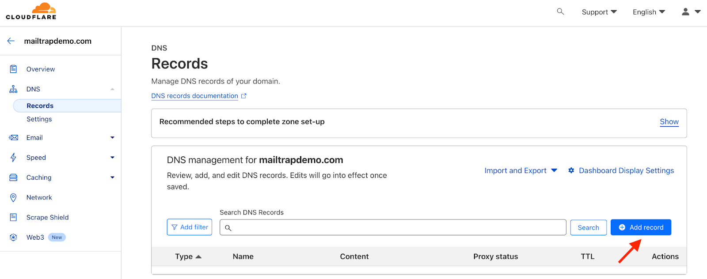
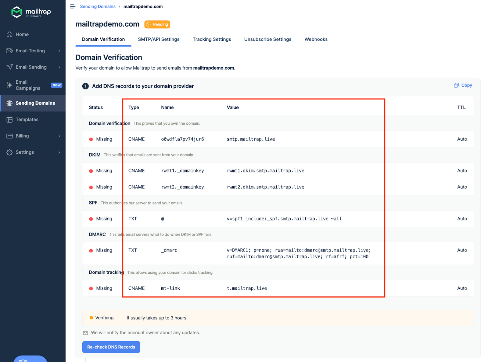
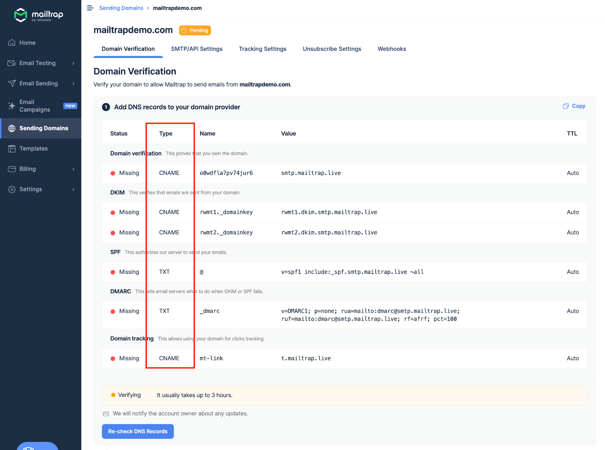
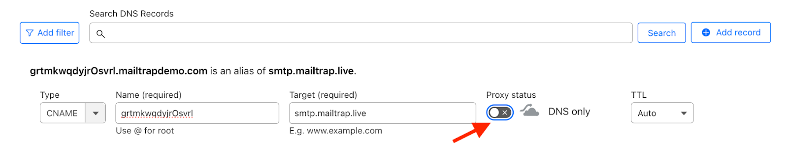
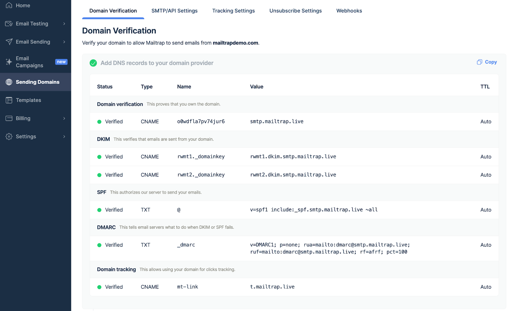

To add and verify a sending domain in Mailtrap, you need access to your domain's DNS records and your domain provider account.

<a href="./" class="button secondary">Sending Domain Setup</a> check it for more details on setting up your sending domain. Continue reading to learn how to add Mailtrap DNS records to Cloudflare.


This guide assumes that your domain is either registered with Cloudflare and uses its nameservers or isn't registered with Cloudflare but uses its nameservers.




## Open the Cloudflare dashboard

Open the Cloudflare dashboard and click the domain you've added to Mailtrap.




## Access DNS settings

Click DNS in the left navigation panel. This will open DNS records.




## Add a new DNS record

Click the Add Record button.




## View Mailtrap DNS records

Return to Mailtrap. On the Verification page, you'll see the DNS records you need to add to Cloudflare. These are Domain Verification, DKIM, DMARC, and Domain Tracking. You'll need the values under Type, Name, and Value.

Pay attention to the Type next to each record in Mailtrap and choose a relevant one in Cloudflare. There are four CNAME type records (Domain Verification, DKIM (2), and Custom Tracking Domain) and one TXT type record (DMARC).

<figure><figcaption>
DNS Types and Categories in Mailtrap 
</figcaption></figure>

<figure><figcaption>
DNS record types in Cloudflare 
</figcaption></figure>


The SPF check for your mail is covered by the domain verification record. There is no need to add a separate SPF record on your sending domain.




## Copy DNS record values from Mailtrap

Copy the Name and Value for each record one by one. You can do this by hovering and clicking each record.




## Paste values into Cloudflare

And paste them into Cloudflare. Remember that Cloudflare refers to the Value field as Target for CNAME records and Content for TXT records.




## Disable proxy if not needed

If you're not using proxy, make sure you disable it. By default, it will be enabled.




## Set TTL and save

Use the default value for TTL.

Click Save and repeat the process for all the remaining DNS records.



## Verify DNS records in Mailtrap

Then, return to Mailtrap. Some records may be verified immediately, while some may take more time. Mailtrap will check the DNS records automatically every hour, but you can force a check by clicking the Re-check DNS Records button.




## Confirm verification status

If you add all the required DNS records correctly, the Status of DNS records will change from Missing to Verified, and the red dots will turn green.





If you have additional questions, [consult Cloudflare documentation](https://developers.cloudflare.com/dns/manage-dns-records/how-to/create-dns-records/) or contact us at [support@mailtrap.io](mailto:support@mailtrap.io)

