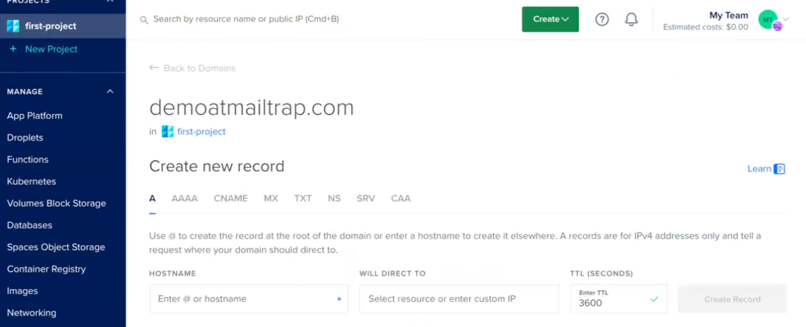
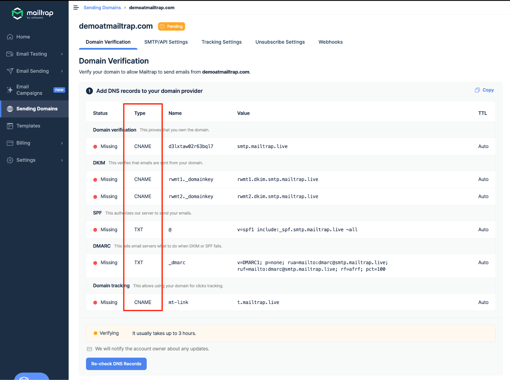
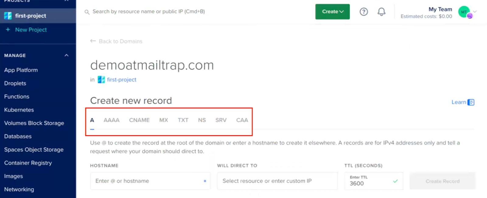
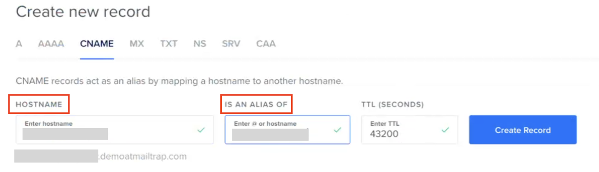

# DigitalOcean

To add and verify a sending domain in Mailtrap, you need access to your domain's DNS records and your domain provider account.

<a href="https://app.gitbook.com/s/S3xyr7ba7aGO19rc8dSK/email-api-smtp/setup/sending-domain" class="button secondary">Sending Domain Setup</a> check it for more details on setting up your sending domain. Continue reading to learn how to add Mailtrap DNS records to DigitalOcean.


This guide assumes that your domain is either registered and managed with DigitalOcean or registered elsewhere but points to DigitalOcean.




**Access Networking and select domain**

Choose Networking in the main menu of the control panel and click the domain you've added to Mailtrap.

You'll see the Create new record heading.




**View Mailtrap DNS records**

Return to Mailtrap. On the Domain Verification page, you'll see the DNS records you need to add to DigitalOcean. These are Domain Verification, DKIM, DMARC, and Domain Tracking. You'll need the values under Type, Name, and Value.




**Select DNS record type**

Check the type next to each record in Mailtrap and choose a relevant one in DigitalOcean (CNAME or TXT). Mailtrap has four CNAME type records (Domain Verification, DKIM (2), and Custom Tracking Domain) and one TXT type record (DMARC).

<figure><figcaption>
DNS Types and Categories in Mailtrap
</figcaption></figure>

<figure><figcaption>
DNS record types in DigitalOcean
</figcaption></figure>


The SPF check for your mail is covered by the domain verification record. There is no need to add a separate SPF record on your sending domain.




**Copy DNS record values from Mailtrap**

Copy the Name and Value for each record one by one. You can do this by hovering and clicking each record.




**Paste values into DigitalOcean**

And paste them into DigitalOcean. Remember that DigitalOcean refers to the Name field as Hostname for all record types. For CNAME type records, it refers to the Value field as Is an Alias of.

<figure><figcaption>
Naming of TXT-type records in DigitalOcean
</figcaption></figure>

<figure><figcaption>
Naming of CNAME-type records in DigitalOcean
</figcaption></figure>




**Set TTL and create record**

Use the default value for TTL.

Click Create Record after adding each record in DigitalOcean.



**Add all DNS records**

Repeat the process of copying and pasting for each record until you've added all the Mailtrap DNS records to DigitalOcean.




**Verify DNS records in Mailtrap**

Then, return to Mailtrap. Some records may be verified immediately, while some may take more time. Mailtrap will check the DNS records automatically every hour, but you can force a check by clicking the Re-check DNS Records button.




**Confirm verification status**

If you add all the required DNS records correctly, the Status of DNS records will change from Missing to Verified, and the red dots will turn green.





If you have additional questions, [consult DigitalOcean documentation](https://docs.digitalocean.com/products/networking/dns/how-to/manage-records/) or contact us at [support@mailtrap.io](mailto:support@mailtrap.io).

