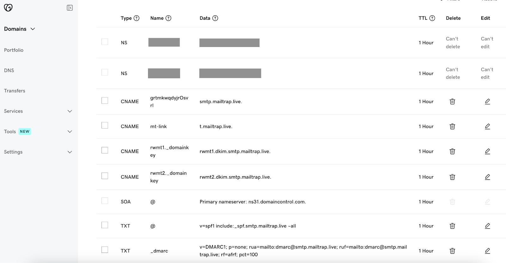

# GoDaddy

To add and verify a sending domain in Mailtrap, you need access to your domain's DNS records and your domain provider account.

<a href="./" class="button secondary">Sending Domain Setup</a> check it for more details on setting up your sending domain. Continue reading to learn how to add Mailtrap DNS records to GoDaddy.


This guide assumes that your domain is either registered with GoDaddy and uses its nameservers or isn't registered with GoDaddy but uses its nameservers.




**Locate your domain**

Go to GoDaddy and locate the domain you've added to Mailtrap.




**Open DNS settings**

Open the DNS settings and click Add New Record.




**View Mailtrap DNS records**

Return to Mailtrap. On the Domain Verification page, you'll see the DNS records you need to add to GoDaddy. These are Domain Verification, DKIM, DMARC, and Domain Tracking. You'll need the values under Type, Name, and Value. The namings of these records in Mailtrap are the same as in GoDaddy.

Make sure you check the type next to each record in Mailtrap and choose a relevant one in GoDaddy. There are four CNAME type records (Domain Verification, DKIM (2), and Custom Tracking Domain) and one TXT type record (DMARC).

<figure><figcaption>
DNS Types and Categories in Mailtrap
</figcaption></figure>

<figure><figcaption>
DNS record types in GoDaddy
</figcaption></figure>


The SPF check for your mail is covered by the domain verification record. There is no need to add a separate SPF record on your sending domain.




**Copy DNS record values from Mailtrap**

Copy the Name and Value for each record one by one. You can do this by hovering and clicking each record.




**Paste values into GoDaddy**

And paste them into GoDaddy.




**Set TTL and save**

Use the default value for TTL.

Click Save after adding each record in GoDaddy.



**Add all DNS records**

Repeat the process of copying and pasting for each record until you've added all the Mailtrap DNS records to GoDaddy.




**Verify DNS records in Mailtrap**

Then, return to Mailtrap. Some records may be verified immediately, while some may take more time. Mailtrap will check the DNS records automatically every hour, but you can force a check by clicking the Re-check DNS Records button.




**Confirm verification status**

If you add all the required DNS records correctly, the Status of DNS records will change from Missing to Verified, and the red dots will turn green.





If you have additional questions, [consult GoDaddy documentation](https://uk.godaddy.com/help/manage-dns-records-680) or contact us at [support@mailtrap.io](mailto:support@mailtrap.io).

