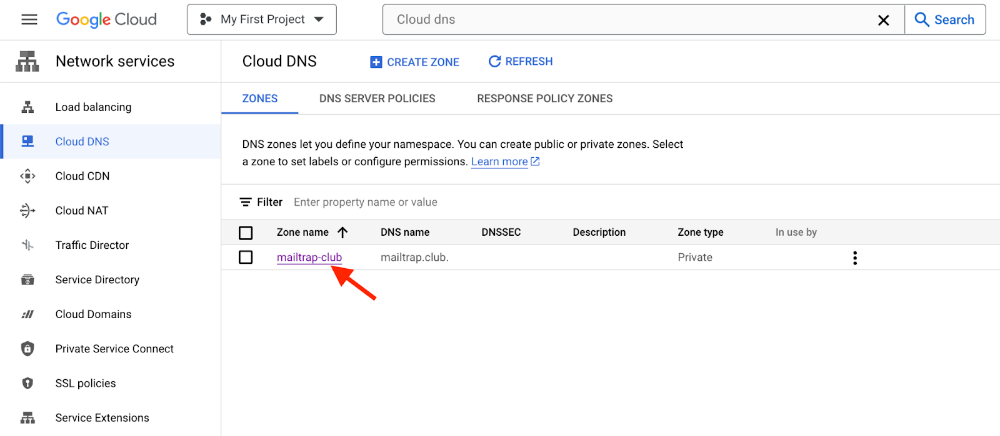
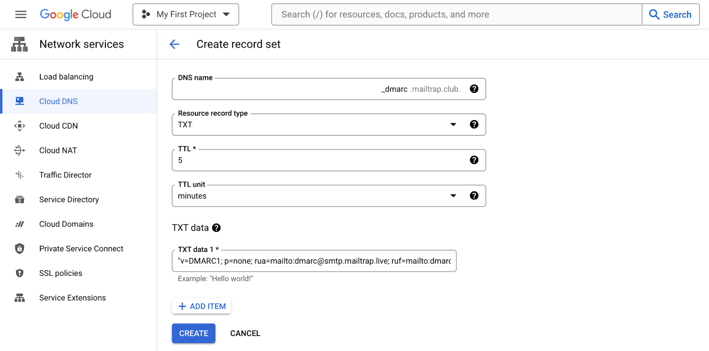
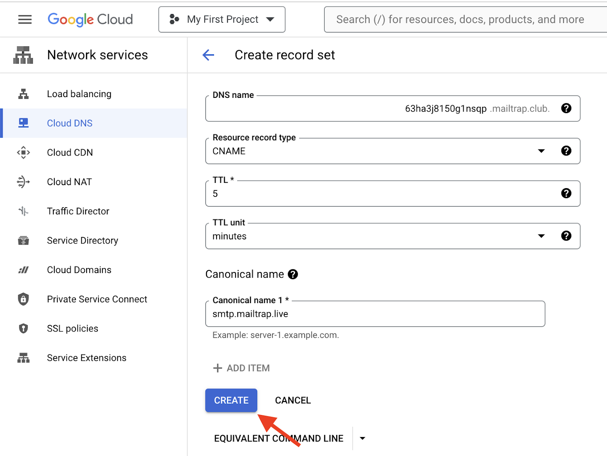

# Google Cloud DNS

To add and verify a sending domain in Mailtrap, you need access to your domain's DNS records and your domain provider account.

<a href="https://app.gitbook.com/s/S3xyr7ba7aGO19rc8dSK/email-api-smtp/setup/sending-domain-setup" class="button secondary">Sending Domain Setup</a> check it for more details on setting up your sending domain. Continue reading to learn how to add Mailtrap DNS records to Google Cloud DNS.


Note: This guide assumes that your domain is either registered and managed with Google Cloud DNS or registered elsewhere but points to Google Cloud DNS. It also assumes that you've already created and configured a managed zone for your domain.




**Access Cloud DNS**

Go to Google Cloud Console, type Cloud DNS in the search bar, and choose it from the results.




**Open Zone details**

You'll be taken to the Cloud DNS Zones page. Open the Zone details for the domain you've added to Mailtrap by clicking on the Zone name.




**Add Standard record**

Click Add Standard.




**View Mailtrap DNS records**

Return to Mailtrap. On the Domain Verification page, you'll see the DNS records you need to add to Google Cloud DNS. These are Domain Verification, DKIM, DMARC, and Domain Tracking. You'll need the values under Type, Name, and Value.

Make sure you check the type next to each record in Mailtrap and choose a relevant one in Google Cloud DNS. There are four CNAME type records (Domain Verification, DKIM (2), and Custom Tracking Domain) and one TXT type record (DMARC). Ignore Google's SPF type record; it's deprecated.

<figure><figcaption>
DNS Types and Categories in Mailtrap
</figcaption></figure>


The SPF check for your mail is covered by the domain verification record. There is no need to add a separate SPF record on your sending domain.




**Copy DNS record values from Mailtrap**

Copy the Name and Value for each record one by one. You can do this by hovering and clicking each record.




**Paste values into Google Cloud DNS**

And paste them into Google Cloud DNS. Remember that Google Cloud DNS refers to the Name field as DNS Name and the Value field as either Canonical name (for CNAME-type records) or TXT data (for TXT-type records).

<figure><figcaption>
CNAME-type record in Google Cloud DNS
</figcaption></figure>

<figure><figcaption>
TXT-type record in Google Cloud DNS
</figcaption></figure>

When adding TXT-type records, add double quotes in the beginning and the end of the record string in the TXT data field.



**Set TTL and create**

Use the default value for TTL.

Click Create after adding each record in Google Cloud DNS.




**Add all DNS records**

Repeat the process of copying and pasting for each record until you've added all the Mailtrap DNS records to Google Cloud DNS.




**Verify DNS records in Mailtrap**

Then, return to Mailtrap. Some records may be verified immediately, while some may take more time. Mailtrap will check the DNS records automatically every hour, but you can force a check by clicking the Re-check DNS Records button.




**Confirm verification status**

If you add all the required DNS records correctly, the Status of DNS records will change from Missing to Verified, and the red dots will turn green.





If you have additional questions, [consult Google Cloud DNS documentation](https://cloud.google.com/dns/docs/records) or contact us at [support@mailtrap.io](mailto:support@mailtrap.io).

