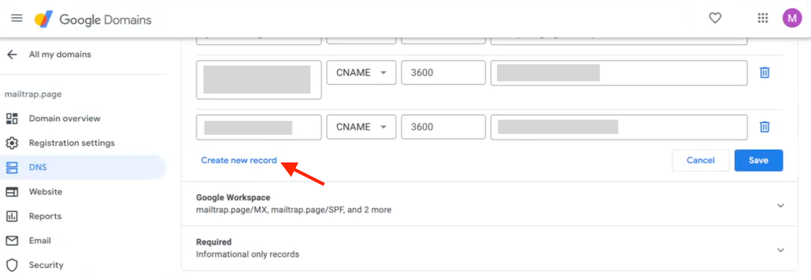
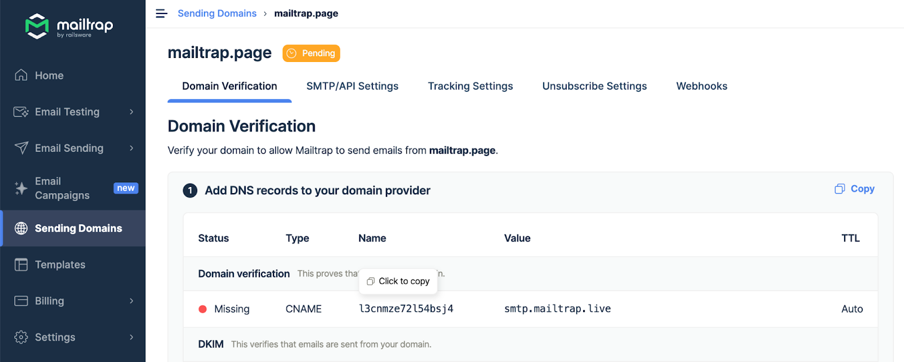
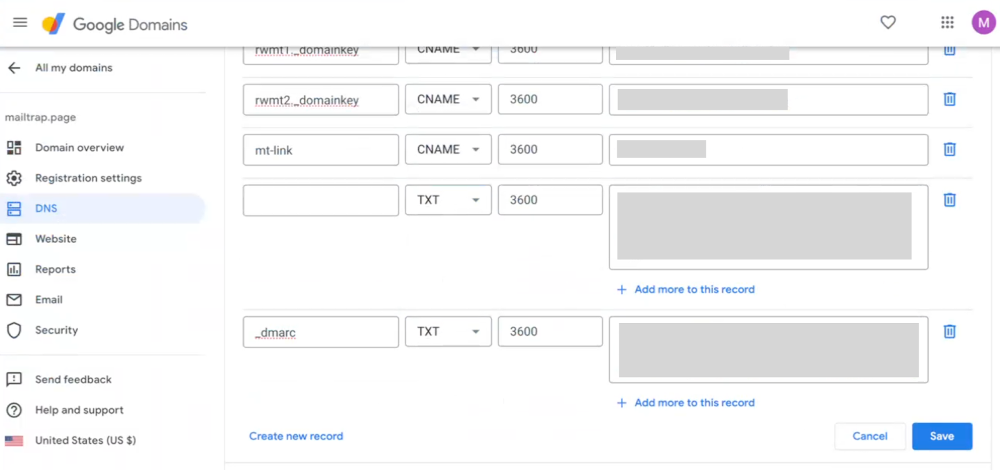
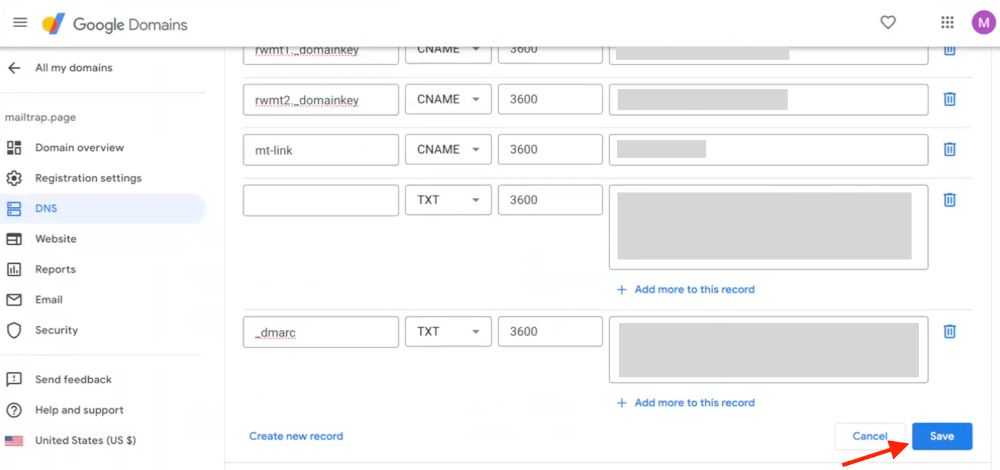
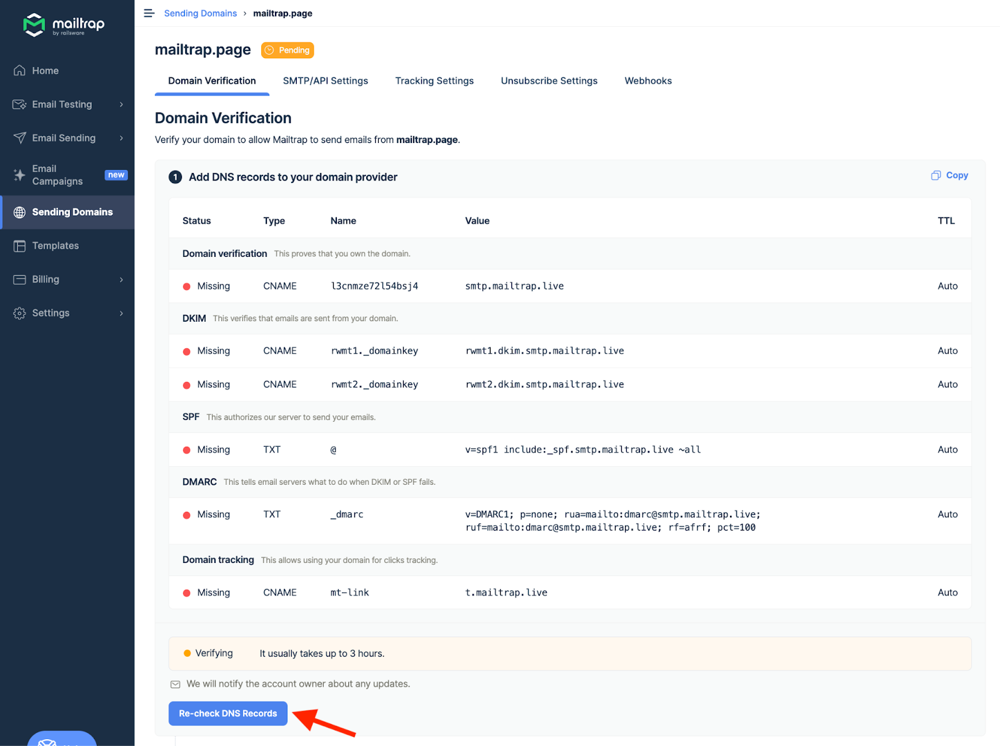

# Google Domains

To add and verify a sending domain in Mailtrap, you need access to your domain's DNS records and your domain provider account.

<a href="./" class="button secondary">Sending Domain Setup</a> check it for more details on setting up your sending domain. Continue reading to learn how to add Mailtrap DNS records to Google Domain.


Note: On September 7, 2023, Squarespace acquired all domain registrations and related customer accounts from Google Domains. This means that Google Domains is now in the process of migrating account and domain data to Squarespace. Until the migration is completed, you can still manage your domains in Google Domains. After the migration, you'll need to manage your domain in Squarespace.

This guide assumes that your domain is either registered with Google Domains and uses its nameservers or isn't registered with Google Domains but uses its nameservers.




#### Select your domain

Go to Google Domains and select the domain you've added to Mailtrap.




#### Access DNS settings

In the left navigation panel, click DNS.




#### Manage custom records

Under Custom records in the Resource records section, choose Manage custom records. In case you don't have any resource records, click Custom records directly.




#### Create new record

Scroll down at the bottom of the records and click Create new record.




#### View Mailtrap DNS records

Return to Mailtrap. On the Domain Verification page, you'll see the DNS records you need to add to Google Domains. These are Domain Verification, DKIM, DMARC, and Domain Tracking. You'll need the values under Type, Name, and Value.

Make sure you check the type next to each record in Mailtrap and choose a relevant one in Google Domains. There are four CNAME type records (Domain Verification, DKIM (2), and Custom Tracking Domain) and one TXT type record (DMARC).

<figure><figcaption>
DNS Types and Categories in Mailtrap
</figcaption></figure>


The SPF check for your mail is covered by the domain verification record. There is no need to add a separate SPF record on your sending domain.




#### Copy DNS record values from Mailtrap

Copy the Name and Value for each record one by one. You can do this by hovering and clicking each record.




#### Paste values into Google Domains

And paste them into Google Domains. Remember that Google Domains refers to the Name field as the Host name and the Value field as either the Domain name (for CNAME-type records) or Text (for TXT-type records).




#### Set TTL

Use the default value for TTL.




#### Add all DNS records

Repeat the process of copying, pasting, and clicking Create new record for each record until you've added all the Mailtrap DNS records to Google Domains. Click Save.




#### Verify DNS records in Mailtrap

Then, return to Mailtrap. Some records may be verified immediately, while some may take more time. Mailtrap will check the DNS records automatically every hour, but you can force a check by clicking the Re-check DNS Records button.




#### Confirm verification status

If you add all the required DNS records correctly, the Status of DNS records will change from Missing to Verified, and the red dots will turn green.





If you have additional questions, [consult Google Domains documentation](https://support.google.com/domains/answer/3290350?hl=en) or contact us at [support@mailtrap.io](mailto:support@mailtrap.io).

