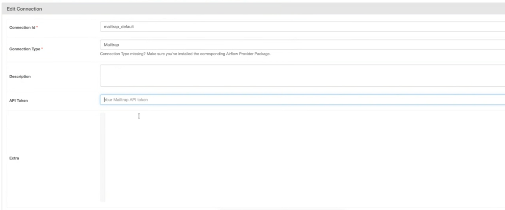

# Apache Airflow

[Apache Airflow](https://airflow.apache.org/) is an open-source platform that allows you to programmatically author, schedule, and monitor workflows. In this guide, you’ll learn how to connect it to Mailtrap, so you can send transactional emails (e.g., notifications, reports, alerts, and other workflow-triggered messages) directly from your Airflow DAGs.

**Requirements**:

* Python [3.9 or higher](https://www.python.org/downloads/)
* Apache Airflow [2.4 or higher](https://airflow.apache.org/docs/apache-airflow/stable/start.html)
* A[ verified email sending domain](https://docs.mailtrap.io/email-api-smtp/setup/sending-domain)
* A Mailtrap [API Token](https://docs.mailtrap.io/email-api-smtp/setup/api-tokens) with admin access level to that domain.

### How does Apache Airflow work?

Apache Airflow is a workflow automation platform. You define workflows as Python code, and Airflow executes them on a schedule or on demand.

In Airflow, a workflow is called a DAG (Directed Acyclic Graph). A DAG is a series of steps that run in sequence. Each step is a task, and tasks are created using operators. Think of an operator as a declaration of a step: you define what it should do, and Airflow runs it when the time comes.

For example, a practical DAG might fetch data from an API, process it, and then send an email with the results, all automated.

### Step 1. Install the provider package

In the environment that is hosting your Airflow instance, install the Mailtrap Airflow provider using pip:

```python
pip install airflow-provider-mailtrap
```

### Step 2. Create a Mailtrap connection

Connections let Airflow communicate with external services. You'll create a Mailtrap connection once, and then reuse it across all your workflows. Here’s how it works:

1. In the Airflow UI, navigate to **Admin** → **Connections**.
2. Click Add a new record (**+**).
3. Fill in the connection details:
4. Click **Save**.

<figure><figcaption></figcaption></figure>


The **Extra** field is optional. You can use it to set a default sender address.


### Step 3. Add an operator to your DAG

Now, you need to add a Mailtrap operator to your DAG. An operator is like a function call that declares a step: you define what it should do, and Airflow executes it when the workflow runs.

Mailtrap uses the `MailtrapSendEmailOperator` operator.&#x20;

Then, in your DAG source code, copy/paste the Mailtrap operator with the parameters based on your use case:



```python
from mailtrap_provider.operators.send_email import MailtrapSendEmailOperator

send_email = MailtrapSendEmailOperator(
    task_id="send_welcome_email",
    to="user@example.com",
    subject="Welcome!",
    html="<h1>Welcome to our service!</h1>",
    sender="noreply@yourdomain.com",
    sender_name="My App",
)
```



```python
from mailtrap_provider.operators.send_email import MailtrapSendEmailOperator

send_notification = MailtrapSendEmailOperator(
    task_id="send_notification",
    to="user@example.com",
    subject="Task Completed",
    text="Your workflow has completed successfully.",
    sender="notifications@yourdomain.com",
)
```



```python
send_report = MailtrapSendEmailOperator(
    task_id="send_report",
    to="team@example.com",
    subject="Daily Report",
    html="""
    <html>
        <body>
            <h1>Daily Report</h1>
            <p>Here is your daily summary...</p>
        </body>
    </html>
    """,
    sender="reports@yourdomain.com",
    sender_name="Report Bot",
    category="daily-reports",  # For Mailtrap analytics
)
```



```python
send_to_team = MailtrapSendEmailOperator(
    task_id="notify_team",
    to=["alice@example.com", "bob@example.com"],
    subject="Team Update",
    text="Important update for the team.",
    sender="noreply@yourdomain.com",
)
```



All operator parameters support Jinja templating. You can use Airflow variables, XCom values, and macros to insert dynamic content:

```python
send_dynamic_email = MailtrapSendEmailOperator(
    task_id="send_dynamic_email",
    to="{{ var.value.recipient_email }}",
    subject="Report for {{ ds }}",
    text="Data processed: {{ ti.xcom_pull(task_ids='process_data') }}",
    sender="{{ var.value.sender_email }}",
)
```



Once you save the file, Airflow will automatically detect and load the DAG, and you’ll be able to see it in your UI. For instance:

<figure><figcaption></figcaption></figure>


Once setup is complete, you can use the Mailtrap operator in any workflow since the connection configuration is a one-time step.


### Step 4. Run your DAG

Finally, try triggering your DAG manually to test the automation. If you followed everything correctly, the operator will send the email via the Mailtrap API and log the result.

<figure><figcaption></figcaption></figure>

And here is the email in the `to` address:

<figure><figcaption></figcaption></figure>

Additionally, you’ll be able to see the email in the [Mailtrap Email Logs](https://docs.mailtrap.io/email-api-smtp/analytics/logs).

For more use cases, code examples, and extras, please visit the official [GitHub repository](https://github.com/mailtrap/airflow-provider-mailtrap).

### Use cases

* Workflow notifications and alerts
* Scheduled reports and data exports
* Any transactional or automated emails triggered from Airflow

### Next steps

* Use [Mailtrap Templates](https://docs.mailtrap.io/email-marketing/campaigns/email-templates) to send branded emails with variables.
* Track open and click rates with [Mailtrap Analytics](https://mailtrap.io/actionable-analytics/).


<br>


