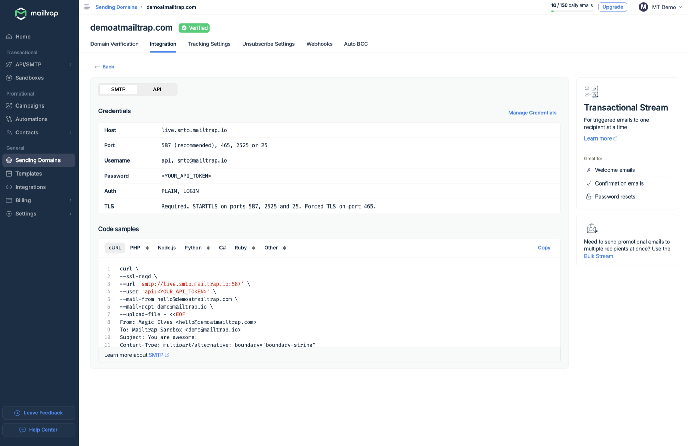
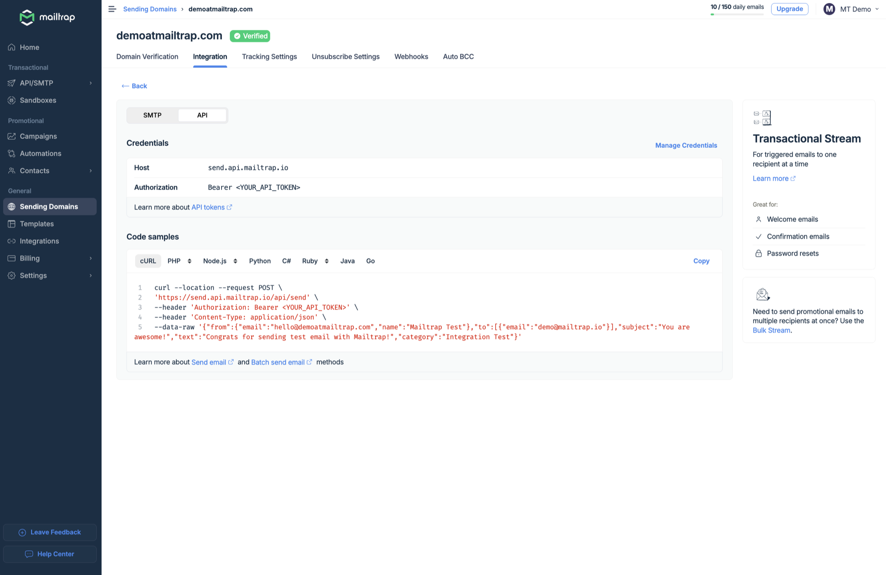

# cURL

## Overview

Mailtrap can be integrated with cURL for email sending via SMTP or email API.

Before we start, you'll need to:

* [Verify your sending domain](https://app.gitbook.com/s/S3xyr7ba7aGO19rc8dSK/email-api-smtp/setup/sending-domain)
* [Create and save an API key](https://app.gitbook.com/s/S3xyr7ba7aGO19rc8dSK/email-api-smtp/setup/api-tokens)

### Send emails using cURL and Mailtrap

#### SMTP integration

To integrate Mailtrap via SMTP, go to the **Integration** tab and copy/paste either the credentials or the pre-made code snippets into your configuration.

You can get more information on SMTP integration [here](https://app.gitbook.com/s/S3xyr7ba7aGO19rc8dSK/email-api-smtp/setup/smtp-integration).

#### API integration

To integrate Mailtrap and send emails via cURL, use the configuration available among **Code samples** under the API section.

Once you copy the script, make sure to insert your Mailtrap API token in the `Authorization` field as `Bearer` and enter your and your recipient's emails in the `--mail-from` and `--mail-rcpt` fields.

**Note**: To learn more about API integration, [click here](https://app.gitbook.com/s/S3xyr7ba7aGO19rc8dSK/email-api-smtp/setup/api-integration).

## Next steps

After setting up cURL integration, you can send test emails and monitor delivery through your Mailtrap dashboard to ensure proper configuration.
