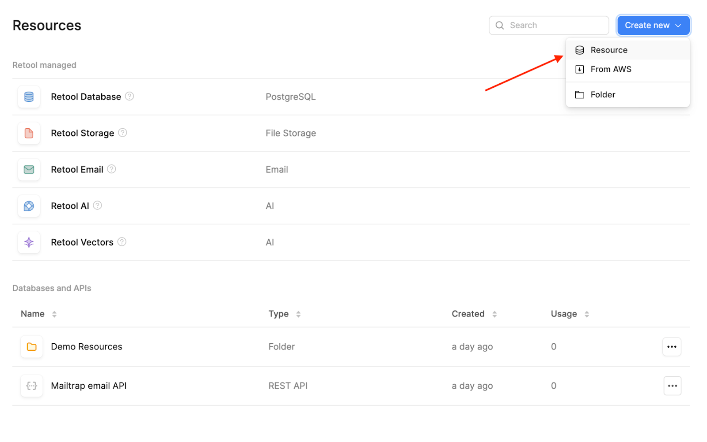
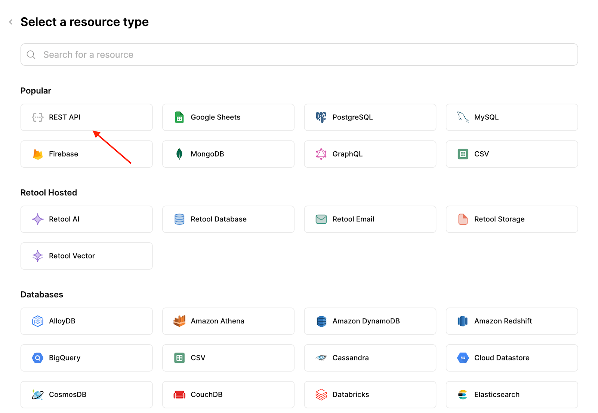
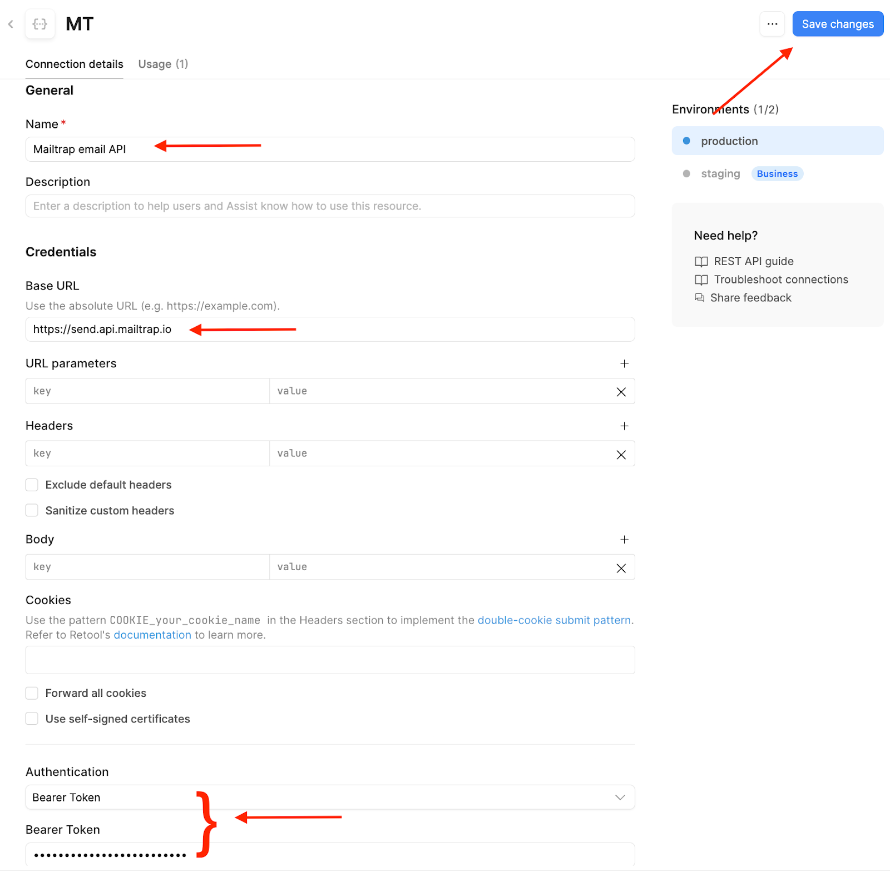
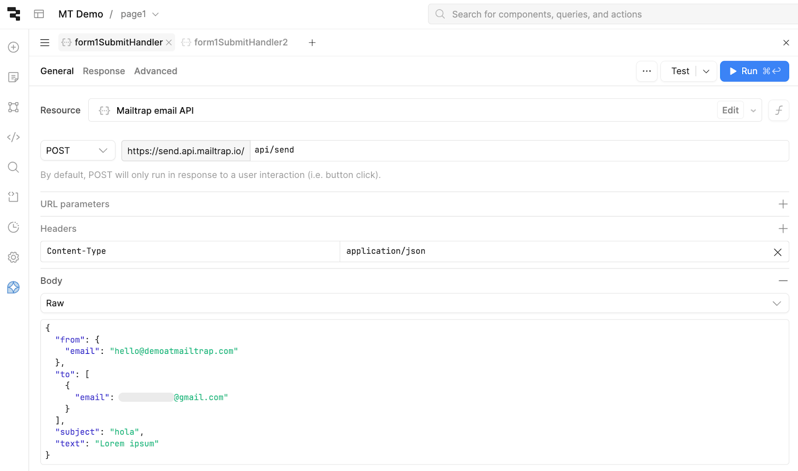
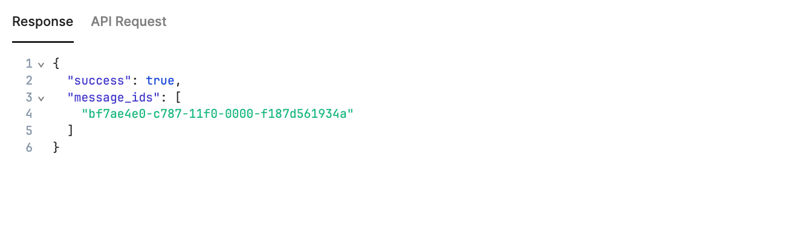
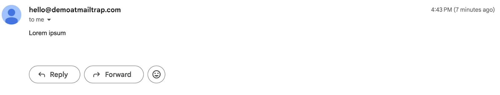
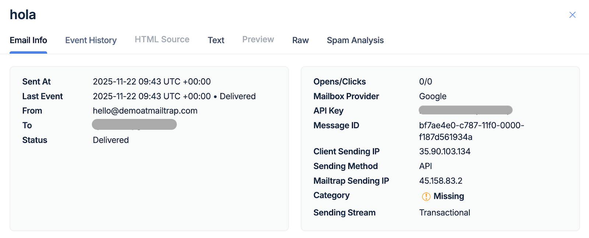

# Overview

This guide shows you how to integrate Mailtrap with your Retool application to send emails.

Mailtrap is an email-sending solution for developer and product teams. Focused on fast delivery and high inboxing rates for transactional and promo emails. Provides highly customizable API and 24/7 tech support.

## Prerequisites

- A Retool account and a project
- A Mailtrap account for sending emails

## Step 1: Create a REST API resource (Mailtrap)

Open Retool and go to the **Resources** tab. Once there, click on **Create new** > **Resource**.

<div align="left" data-with-frame="true"><figure><figcaption><p>Create new Resource in Retool</p></figcaption></figure></div>

On the next page, select **REST API**.

<div align="left" data-with-frame="true"><figure><figcaption><p>Select REST API</p></figcaption></figure></div>

Then, configure the resource:

- Enter your desired resource name
- Add the Mailtrap root URL: `https://send.api.mailtrap.io/`
- Choose **Bearer** for authentication and add your [Mailtrap API key](https://app.gitbook.com/s/S3xyr7ba7aGO19rc8dSK/account-and-organization/api-tokens)


This URL lets you use other endpoints later on depending on your use case (i.e., create contacts). If you plan on sending mass emails, the root URL should be `https://bulk.api.mailtrap.io/`


<div align="left" data-with-frame="true"><figure><figcaption><p>REST API resource configuration</p></figcaption></figure></div>

Once you insert the required details, click **Save changes** and go back to your project.

## Step 2: Configure a query

As the next step, add a query to the Query Library. Queries stored here can be reused across any of your Retool apps.

In this example, we'll create a query that sends an email with fixed content defined in the query settings. However, you can use any Mailtrap endpoint with Retool such as managing contacts, updating email templates, or sending messages to a sandbox. For more information, check the official [Mailtrap API documentation](https://api-docs.mailtrap.io/docs/mailtrap-api-docs/5tjdeg9545058-mailtrap-api).

Create a new **Query** and:

- Select the resource you created that connects the Mailtrap email API
- Choose **POST** and add the API endpoint: `api/send`
- Add a **Content-Type** header with `application/json` as value
- Choose **RAW** as the Body type and use the following code snippet:


```json
{
  "from": {
    "email": "hello@yourdomain.com"
  },
  "to": [
    {
      "email": "recipient@example.com"
    }
  ],
  "subject": "Hello from Retool",
  "text": "Lorem ipsum"
}
```



This is just an example body for sending emails from a simple form. Feel free to adjust it according to your needs. Make sure to use your 'from' address with a verified sending domain.


Here's what your new query should look like:

<div align="left" data-with-frame="true"><figure><figcaption><p>Query configuration</p></figcaption></figure></div>

## Step 3: Test the integration

Finally, to test your configuration, click on the **Test** button in the upper-right corner of the Query editor. You should see the following response:

<div align="left" data-with-frame="true"><figure><figcaption><p>Successful test response</p></figcaption></figure></div>

Here it is in the Gmail inbox:

<div align="left" data-with-frame="true"><figure><figcaption><p>Email received in Gmail</p></figcaption></figure></div>

And here it is in the [Email Logs](https://app.gitbook.com/s/S3xyr7ba7aGO19rc8dSK/email-api-smtp/statistics/email-logs) tab in the Mailtrap dashboard:

<div align="left" data-with-frame="true"><figure><figcaption><p>Email in Mailtrap Email Logs</p></figcaption></figure></div>


If you plan on collecting email addresses for a list, you can connect your Retool project with [Mailtrap Contacts](https://mailtrap.io/mailtrap-contacts/) and store your addresses in the Mailtrap dashboard automatically. For reference, check out the official [Mailtrap Contacts API documentation](https://api-docs.mailtrap.io/docs/mailtrap-api-docs/0a35b03ff78c5-contacts-api).

