# N8N

<a href="https://n8n.io/integrations/mailtrap/" class="button primary">View on N8N Marketplace</a>

## Overview

Mailtrap can be integrated into N8N workflows to automate email sending and contact management.&#x20;

In this article, you'll learn how to:

* Install Mailtrap node and set up N8N
* Obtain Mailtrap API credentials
* Integrate N8N with Mailtrap

### N8N Cloud

If you are a user of n8n Cloud, you can have access to Mailtrap integration out of the box.

Just search for "Mailtrap" in the nodes.

### Local N8N setup

To install Mailtrap node, you can simply type in `n8n-nodes-mailtrap` under 'Enter npm package name' in Community Nodes, just like so:

<div align="left" data-with-frame="true">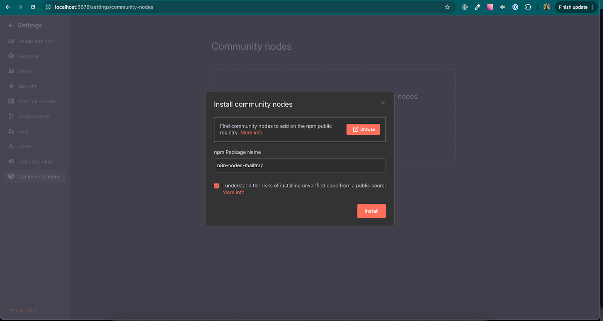</div>

Or, you can run use npm to install the node manually:

```
npm install n8n-nodes-mailtrap
```

Next, simply [create a free N8N account](https://app.n8n.cloud/register):

<div align="left" data-with-frame="true">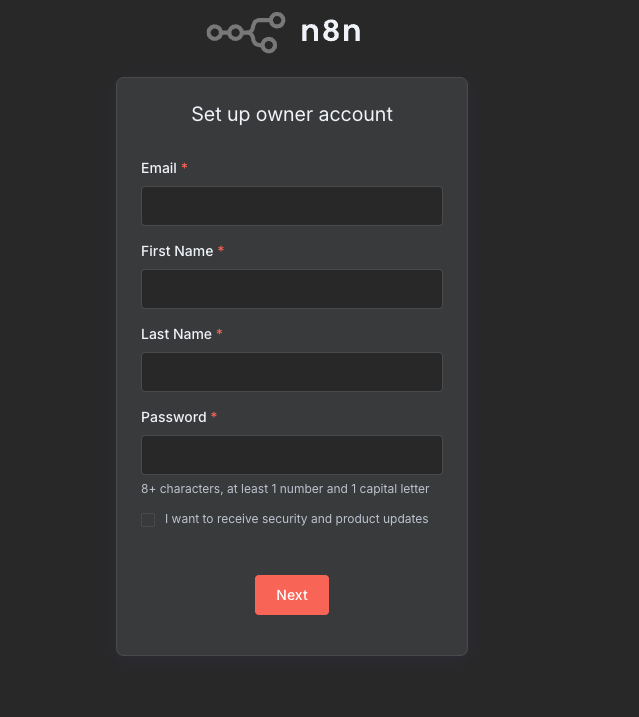</div>

### Obtain Mailtrap API credentials

Whether you want to only create contacts or send/test emails via Mailtrap and N8N, you'll first need a Mailtrap API token and Mailtrap Account ID. To obtain one, follow these steps:



Go to **Settings** on the left side-bar menu, navigate to **API Tokens**, and click on **Add Token**.

<div align="left" data-with-frame="true">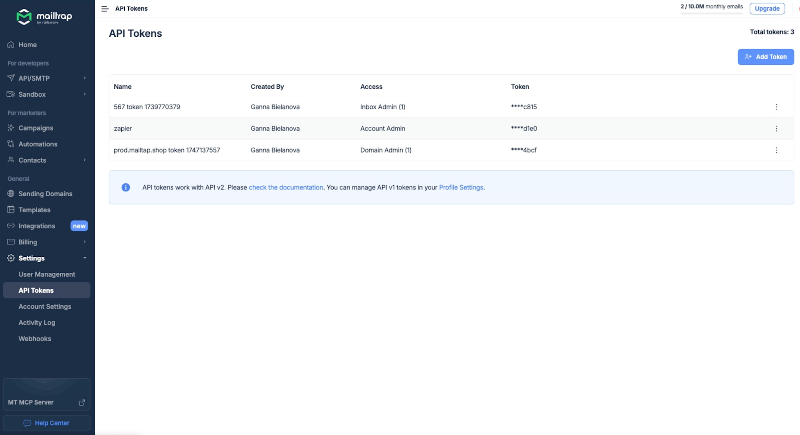</div>



Enter the desired name, click on **Add Token**, tick the desired permission checkboxes, and hit **Save**.

<div align="left" data-with-frame="true">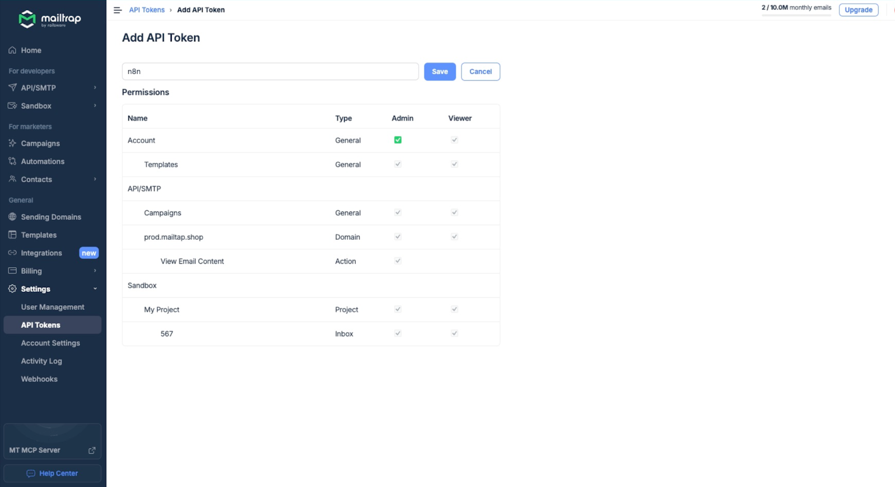</div>



Copy the token and save it in a secure place.

<div align="left" data-with-frame="true">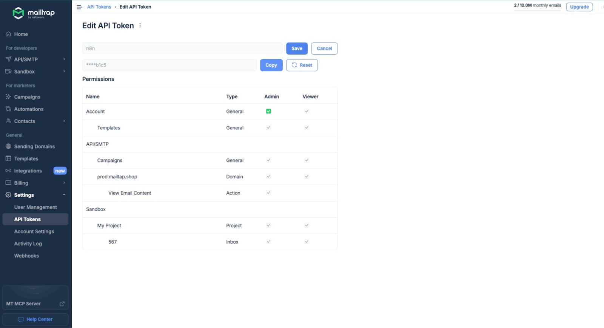</div>



To obtain the **Account ID**, go to **Settings** → **Account Settings** → **Account Details**.

<div align="left" data-with-frame="true">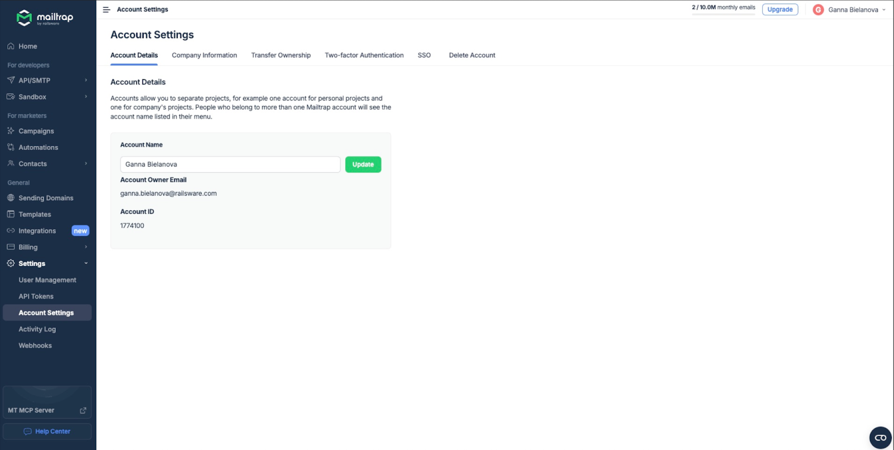</div>



### Integrate N8N with Mailtrap



**Select Mailtrap**

When you open your N8N dashboard, click on the left card 'Start from scratch'.

<div align="left" data-with-frame="true"></div>

Then, click on the 'Add first step…'.

<div align="left" data-with-frame="true">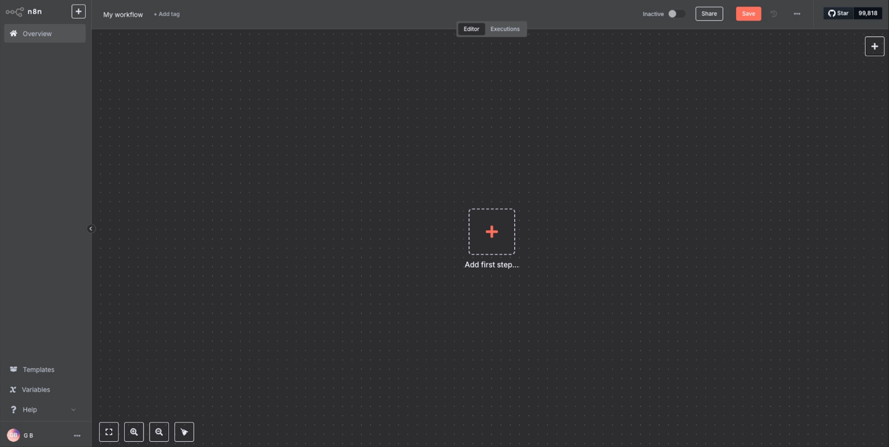</div>

On the right-side menu, type 'Mailtrap' in the search bar, click on it, and select which actions you want to automate (e.g., sending an email, creating/updating contacts, etc.).

<div align="left" data-with-frame="true">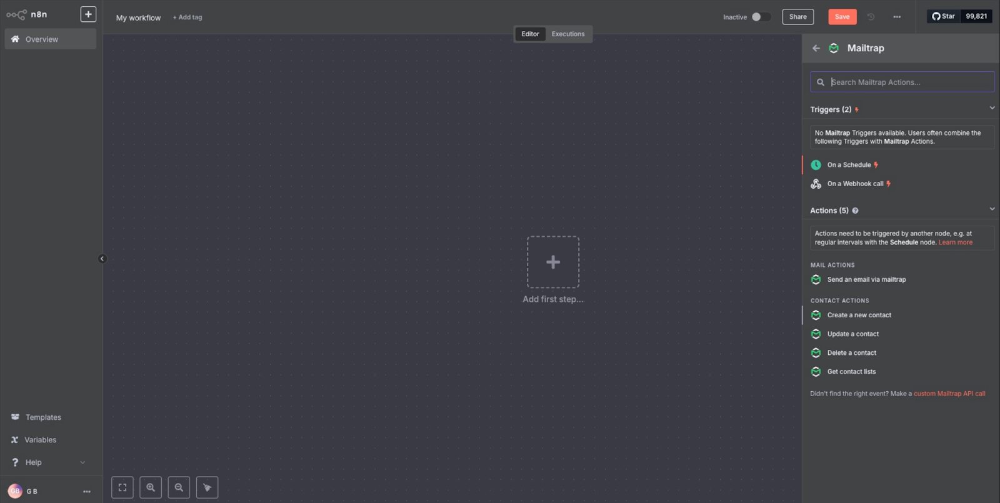</div>

Here's an example workflow I created for the purposes of this demo:

<div align="left" data-with-frame="true">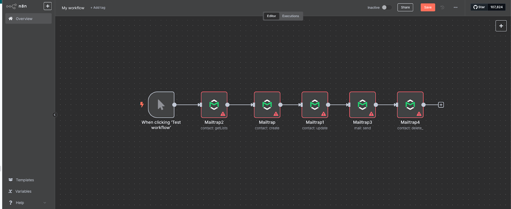</div>



**Enter your Mailtrap credentials**

In the parameters window, click on 'Select Credential' and '+ Create new credential' to add the credentials we obtained in the previous chapter.

<div align="left" data-with-frame="true">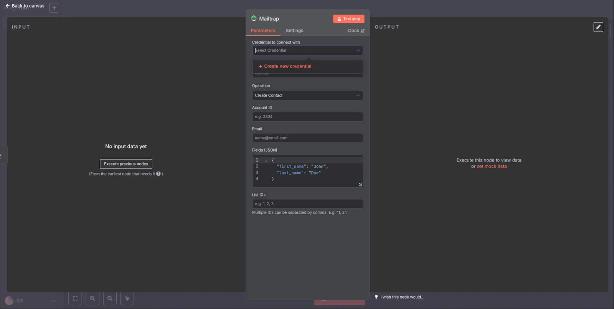</div>

In the credentials setting, simply add the API Token and Mailtrap Host.

<div align="left" data-with-frame="true">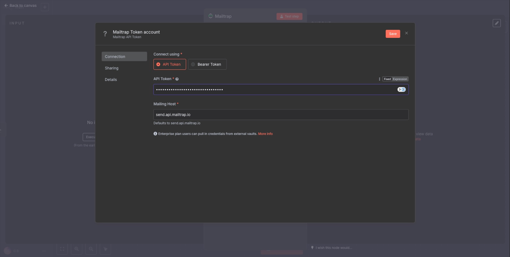</div>

**Important**: Keep in mind that I've added my Sending credentials (send.api.mailtrap.io).

Then, back in the Parameters window, add the account ID.

<div align="left" data-with-frame="true">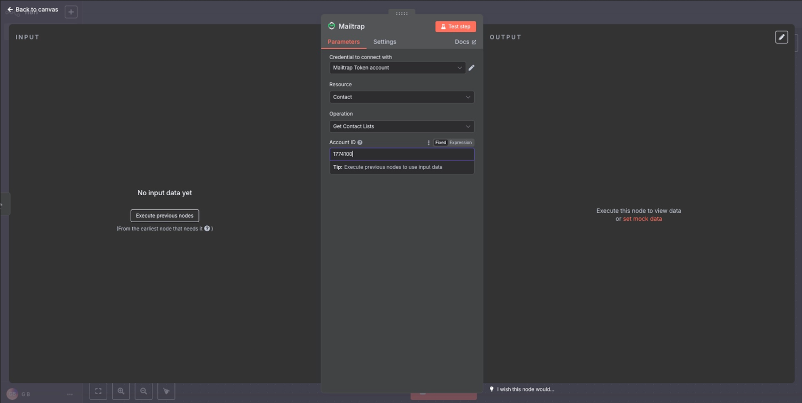</div>



**Test the integration**

Lastly, simply click on 'Test step' to test the integration:

<div align="left" data-with-frame="true">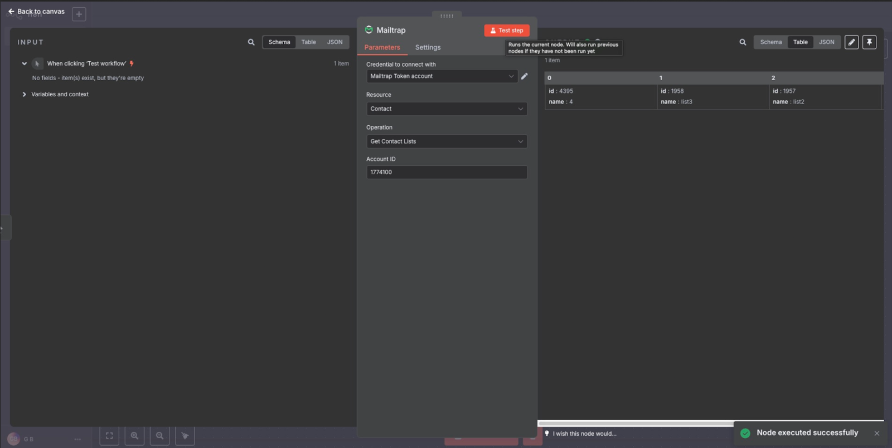</div>

Now, every time a new user logs in and updates their name, they will get a confirmation email via Mailtrap and their information will be logged in my Mailtrap Contacts page. There, I can group them into lists, segment them accordingly, and use Fields to personalize my email campaigns further.



## Next steps

Once your N8N and Mailtrap integration is complete, you can leverage the full power of workflow automation to send targeted emails, manage contacts, and track engagement across your applications.
