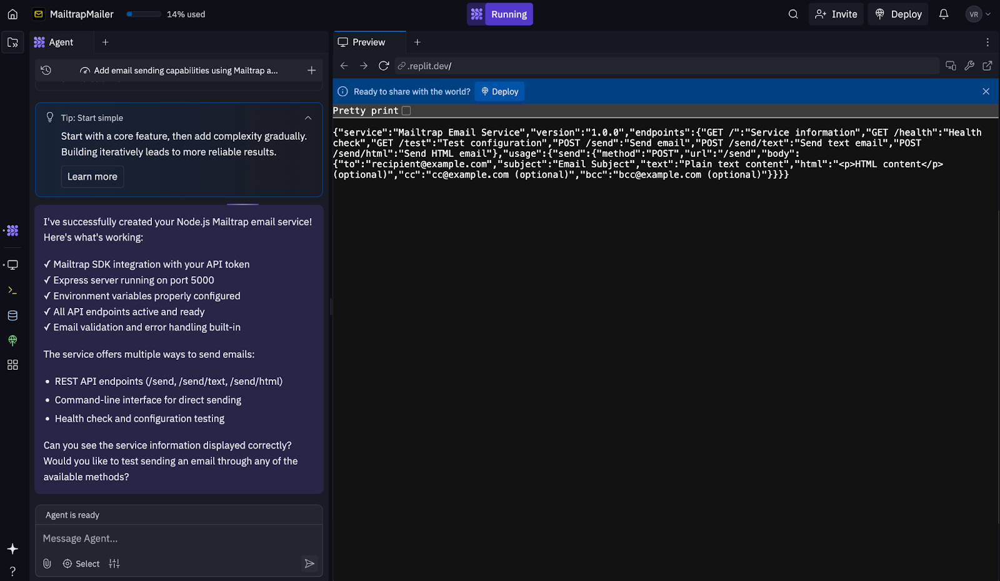
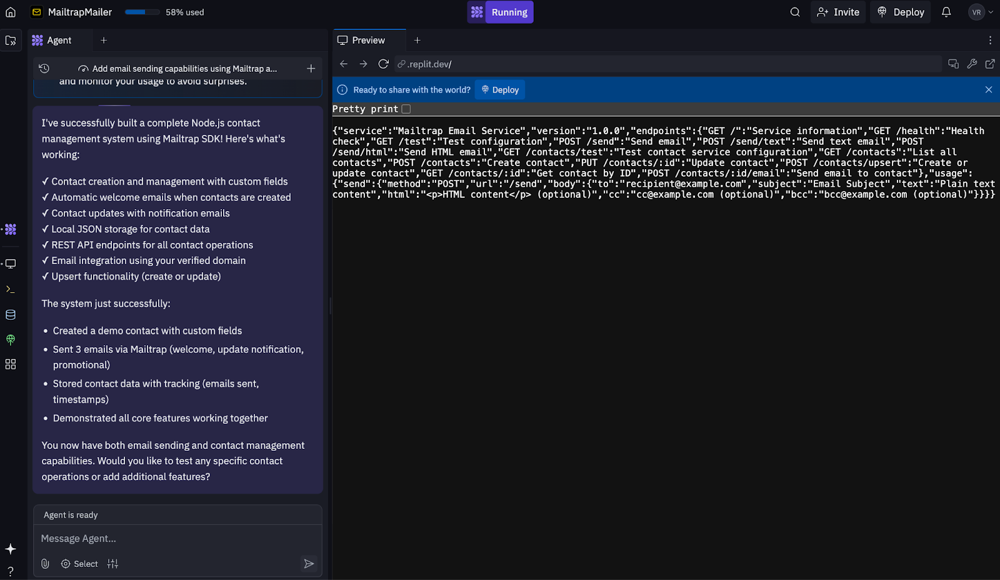

# Replit

In this guide, you'll set up production email sending in a Replit project using the Mailtrap Email API with official SDKs (Node.js or Python), and learn how to create or update contacts in Mailtrap directly from your app.

You'll:

* Send emails from your verified domain via the Mailtrap Email API
* Store contacts for campaigns and automations, with optional custom fields and list membership


This tutorial uses the Replit Agent product.


## Prerequisites

* Verified sending domain in Mailtrap (required for production) — [Setup guide](https://app.gitbook.com/s/S3xyr7ba7aGO19rc8dSK/email-api-smtp/sending-domain-setup)
* Admin API token with access to your verified domain and Contacts
* Account ID (needed for Contacts) — [find it here](https://mailtrap.io/account-management)
* Custom fields created in Mailtrap if you want to store extra structured data — [create here](https://mailtrap.io/contacts/fields)
* (Optional) List ID if you want to assign contacts to a list
* Replit account and project (Node.js or Python)

## Ready-made prompts (for Replit Agent)

### Sending only

| Prompt                                                                                                                                                                               |
| ------------------------------------------------------------------------------------------------------------------------------------------------------------------------------------ |
| Create a Node.js app that uses the Mailtrap SDK to send a production email via the Email API using a verified domain. Store the API token and from address in environment variables. |

<div align="left" data-with-frame="true"><figure><figcaption><p>Replit Agent sending prompt result</p></figcaption></figure></div>


To complete the project, Replit asks you to provide Mailtrap API token and the FROM\_ADDRESS. Make sure to add and verify a domain first.


### Contacts management only

| Prompt                                                                                                                                                                                                           |
| ---------------------------------------------------------------------------------------------------------------------------------------------------------------------------------------------------------------- |
| Write a Node.js script that uses the Mailtrap SDK to create or update a contact in Mailtrap. Include email, name, and custom fields. Store Account ID, API token, and optional List ID in environment variables. |

<div align="left" data-with-frame="true"><figure><figcaption><p>Replit Agent contacts prompt result</p></figcaption></figure></div>


To complete the project, Replit asks you to provide MAILTRAP\_ACCOUNT\_ID token and the MAILTRAP\_LIST\_ID.


## Step-by-step setup



### Set up Mailtrap

1. Verify your sending domain in Mailtrap.
2. Create an admin API token and keep it secure.
3. Note your FROM\_ADDRESS (must use the verified domain).



### Create/open your Replit project

**With Replit Agent** - Use one of the prompts above. Replit does it all, you just need to add the credentials.

**Manual setup:**

Install SDKs:



```bash
npm install mailtrap
```



```bash
pip install mailtrap
```



Add secrets in Replit (use the Secrets panel):

```
MAILTRAP_API_TOKEN = <your_admin_api_token>
```



### Send a production email



```javascript
import { MailtrapClient } from "mailtrap";

const client = new MailtrapClient({ token: process.env.MAILTRAP_API_TOKEN });

await client.send({
  from: { email: "no-reply@your-verified-domain.com", name: "Your App" },
  to: [{ email: "recipient@example.com", name: "Recipient" }],
  subject: "Welcome to Our App",
  text: "Hello from Mailtrap + Replit!"
});

console.log("Production email sent.");
```



```python
import mailtrap as mt
import os

mail = mt.Mail(
    sender=mt.Address(email="no-reply@your-verified-domain.com", name="Your App"),
    to=[mt.Address(email="recipient@example.com", name="Recipient")],
    subject="Welcome to Our App",
    text="Hello from Mailtrap + Replit!"
)

client = mt.MailtrapClient(token=os.environ["MAILTRAP_API_TOKEN"])
client.send(mail)
print("Production email sent.")
```





### Run and verify

1. Click **Run** in Replit. (Note: Most of the time, the AI IDE does it for you.)
2. Check the recipient's inbox.



## Troubleshooting

* **FROM\_ADDRESS rejected** - Use a verified domain.
* **401/403 errors** - Ensure API token is admin-level.

## Next steps

* Add [Mailtrap Templates](https://app.gitbook.com/s/S3xyr7ba7aGO19rc8dSK/email-api-smtp/email-templates) for branded messages.
* Implement [Contacts Management](https://app.gitbook.com/s/S3xyr7ba7aGO19rc8dSK/email-marketing/contacts-management/overview) to store new subscribers in Mailtrap.
