# Salesforce

[Salesforce](https://www.salesforce.com/ap/) is a cloud-based CRM platform used by businesses to manage customer relationships, sales, and marketing.

With the Mailtrap App for Salesforce, you can route your transactional and marketing emails through [Email Sandbox](https://mailtrap.io/email-sandbox/) to test and inspect them before they reach real recipients.&#x20;

In this guide, you'll learn how to:

* [Configure Named Credentials](https://docs.mailtrap.io/guides/integrations/salesforce#id-1-how-to-configure-named-credentials)
* [Configure Mailtrap App](https://docs.mailtrap.io/guides/integrations/salesforce#id-2-configure-mailtrap-app)
* [Enable the Sandbox mode](https://docs.mailtrap.io/guides/integrations/salesforce#id-3-enabling-the-sandbox-mode)

## 1) How to configure Named Credentials

The Mailtrap package requires a [Named Credential](https://help.salesforce.com/s/articleView?id=xcloud.named_credentials_about.htm\&type=5) called MailTrap\_To\_SF to communicate with your Salesforce org. To set it up, you need to:

* [Assign permission set](https://docs.mailtrap.io/guides/integrations/salesforce#assign-permission-set)
* [Create Named Credentials](https://docs.mailtrap.io/guides/integrations/salesforce#create-named-credentials)
* [Add access to the Named Credentials](https://docs.mailtrap.io/guides/integrations/salesforce#add-access-to-the-named-credentials)


**Useful link**: [What are Named Credentials?](https://help.salesforce.com/s/articleView?id=xcloud.nc_basics.htm\&type=5)


### Assign permission set

First, you need to assign Mailtrap Admin permission set to User who will configure the app.

* In **Setup** go to **Users** (under **Administration**) and open the **Users** settings.

<figure><figcaption></figcaption></figure>

* Under the **Permission Set Assignments** list, click on **Edit Assignments**.

<figure><figcaption></figcaption></figure>

* Select **MailTrap Admin** and hit the **Save** button.

<figure><figcaption></figcaption></figure>

### Create Named Credentials

#### Step 1. Connected App to Salesforce

* Navigate to **Setup** → **Apps** → **External Client Apps** → **External Client App Manager** and click on **New External Client App**.

<figure><figcaption></figcaption></figure>

* Then, enter the required **Basic Information**, such as **External Client App Name**, **API Name**, **Contact Email**, and **Distribution State**.

<figure><figcaption></figcaption></figure>

* Next, make sure to check the **Enable OAuth** box and configure it with the following settings:
  * **Callback URL** – For now, use `https://www.example.com` (we will change it later);
  * **OAuth Scopes**  – Select **Manage user data via APIs (api)** and Perform **requests at any time (refresh\_token, offline\_access)**.

<figure><figcaption></figcaption></figure>

* Under **Flow Enablement**, tick the **Client Credentials Flow** and hit the **Create** button.

<figure><figcaption></figcaption></figure>

* Under the **Policies** tab, click **Edit**. This will allow you to make the required changes to **OAuth Policies**.

<figure><figcaption></figcaption></figure>

* Enable **Client Credentials Flow** and enter the email address of the **Admin User** with **MailTrap Admin permission** set assigned.&#x20;
* Select **Refresh Token** is valid until revoked.&#x20;
* Hit the **Save** button.

<figure><figcaption></figcaption></figure>

* Go to the **Settings** tab, expand the **OAuth Settings**, and click on **Consumer Key and Secret**.

<figure><figcaption></figcaption></figure>

* You will be redirected to a page where you can see your **Consumer Key** and **Consumer Secret**, you should copy both of them.

<figure><figcaption></figcaption></figure>

#### Step 2. Create Auth.Provider


**Useful links**:

* [Configure a Salesforce Authentication Provider](https://help.salesforce.com/s/articleView?id=xcloud.sso_provider_sfdc.htm\&type=5)
* [My Domain (for finding your domain URL)](https://help.salesforce.com/s/articleView?id=xcloud.domain_name_overview.htm\&type=5)


* Navigate to **Setup** → **Identity** (Under **Settings**) → **Auth.Providers** and click on **New**.

<figure><figcaption></figcaption></figure>

* Then, enter the following settings for **Auth. Provider**:
  * For **Provider Type**, select **Salesforce**.
  * For **Consumer Key** and **Consumer Secret** you should paste from the **Connected App**.
  * Paste _**api refresh\_token offline\_access**_ in **Default Scopes**.
  * **Authorize Endpoint URL**: Your domain URL + `/services/oauth2/authorize`
  * **Token Endpoint URL**: Your domain URL + `/services/oauth2/token`


Domain URL can be found under Company Settings → My Domain.


<figure><figcaption></figcaption></figure>

* Copy **Callback URL** from **Auth.Providers**.

<figure><figcaption></figcaption></figure>

* Paste the **Callback URL** into the **Connected App** instead of `https://www.example.com`.

<figure><figcaption></figcaption></figure>

#### Step 3. Named Credentials to Salesforce


**Useful links**:

* [External Credentials](https://help.salesforce.com/s/articleView?language=en_US\&id=sf.nc_create_edit_external_credential.htm\&type=5)
* [Enable External Credentials Principals](https://help.salesforce.com/s/articleView?id=xcloud.nc_enable_ext_cred_principal.htm\&type=5)


* Navigate to **Setup** → **Named Credentials** (under **Security**)→ click on **External Credentials** and hit the **New** button.

<figure><figcaption></figcaption></figure>

* Then, fill in all necessary information:
  * **Name**: MailTrap\_To\_SF
  * **Authentication Protocol**: OAuth 2.0
  * **Authentication Flow Type**: Browser Flow
  * **Scope**: api refresh\_token offline\_access
  * **Identity Provider**: select the Auth.Provider you created – `ThisOrg`

Once you’re done, make sure to hit the **Save** button.

<figure><figcaption></figcaption></figure>

* Navigate to **Named Credentials**, click **New**.

<figure><figcaption></figcaption></figure>

* Fill in all necessary information:
  * **Label and Name**: MailTrap\_To\_SF&#x20;
  * **URL**: Your domain URL
  * **External Credential**: select External Credential you created before – MailTrap\_To\_SF
  * **Allowed Namespaces for Callouts**: RWMailtrap


Name should specifically be **MailTrap\_To\_SF**, no other can be used for MailTrap package.


<figure>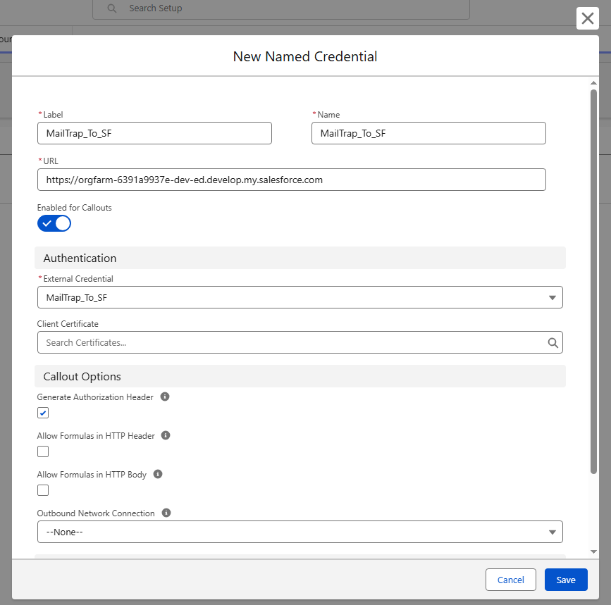<figcaption></figcaption></figure>

<figure>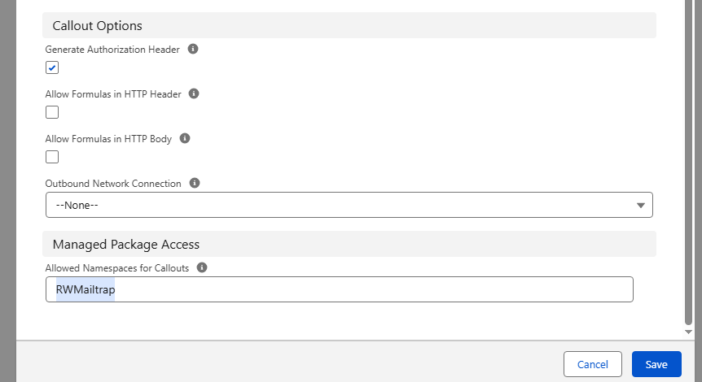<figcaption></figcaption></figure>

* Once you’re done, click **Save**, and go back to the **External Credentials** tab to open it.

<figure>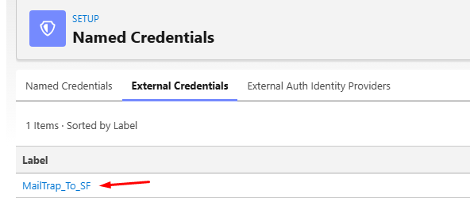<figcaption></figcaption></figure>

* In the **Principals** section click **New**.

<figure>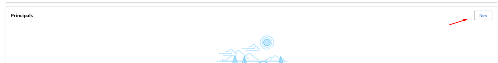<figcaption></figcaption></figure>

* Configure it as in the screenshot below, then click **Save**.

<figure>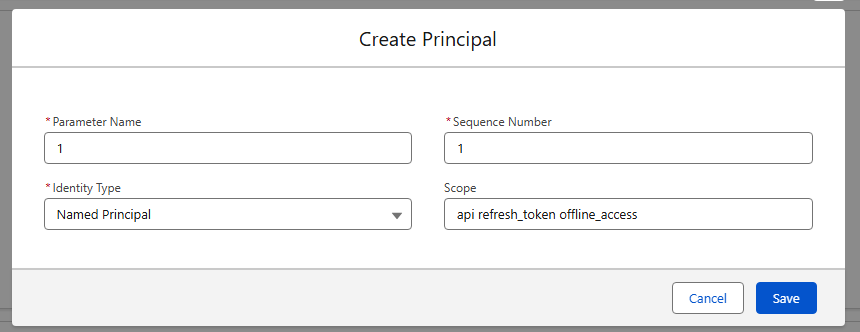<figcaption></figcaption></figure>

* In the **Principals** section click the menu button underneath **Actions**:

<figure>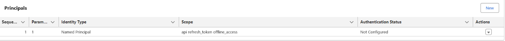<figcaption></figcaption></figure>

* Then, **Authenticate**:

<figure>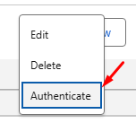<figcaption></figcaption></figure>

* Login to the Salesforce organization, **Allow** access, and confirm.

<figure>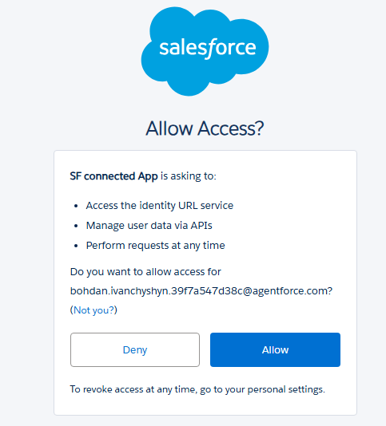<figcaption></figcaption></figure>

### Add access to the Named Credentials

* Go to the **Profiles** page and open the profile used for your use.

<figure><figcaption></figcaption></figure>

* At the **Enabled External Credential Principal** **Access** section click **Edit**.

<figure><figcaption></figcaption></figure>

* Select **MailTrap\_To\_SF – 1** and click **Save**.

<figure><figcaption></figcaption></figure>

And that’s it, your application is ready!

## 2) Configure Mailtrap App

To enable the Mailtrap app for Salesforce, you need to connect your Mailtrap account by adding a [Mailtrap API Token](https://docs.mailtrap.io/email-api-smtp/setup/api-tokens). To do this:

* First, navigate to the Mailtrap app via **App Launcher**.

<figure><figcaption></figcaption></figure>

* Then, click on **Connect Mailtrap account**.

<figure><figcaption></figcaption></figure>

**If you’re a free user**, create your Mailtrap API key (or copy it if you already have one) and paste it in the following bar.

<figure>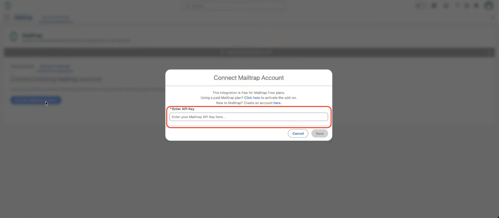<figcaption></figcaption></figure>


**Free account limitations**:

* Due to the rate limits on the free plan, if an email has multiple recipients (including CC and BCC), only the first one will receive it. Additionally, the free plan is limited to 50 testing emails per month.
* If you plan to upgrade later, we recommend following the Paid users flow in the next section, so the add-on will be added to your account and you'll be charged for it correctly when upgrading.


**If you’re a paid user** or **don’t have an account yet**, follow the follow the **Click here** link since the add-on is not added automatically and you need to create a Mailtrap API token.

<figure><figcaption></figcaption></figure>

You will also be redirected to the Mailtrap API Token page, where you’ll see instructions to contact customer support.

<figure>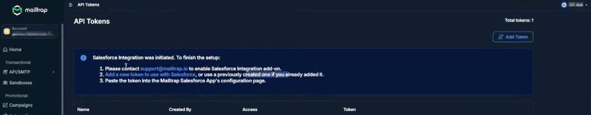<figcaption></figcaption></figure>

Once the support team enables the add-on, the charge will be applied automatically (prorated), and you can start using it.

## 3) Enabling the Sandbox mode

**Before we start**: The Mailtrap API token you intend to use for the Salesforce integration with Sandbox should have:

* At least **Viewer** permission for _the whole account_.
* **Admin** permission for _one or multiple sandboxes_.

If your API token doesn’t meet one of these requirements, you won’t be able to activate the add-on.

#### Step 1. Enable Sandbox mode

To enable the Sandbox mode, navigate to **Account Settings** again, and then:

* Paste your API key in the bar, hit **Save**.

<figure><figcaption></figcaption></figure>

* Select a sandbox to receive emails
* Activate the sandbox mode

<figure>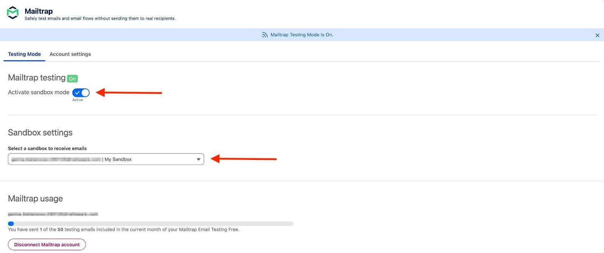<figcaption></figcaption></figure>

This will open a new window, where you simply have to click the **Turn on** button.

<figure><figcaption></figcaption></figure>

#### Step 2. Sending a test email

To verify the integration, go to the **Contacts** page and try to send an email to one of your contacts. For example:

<figure>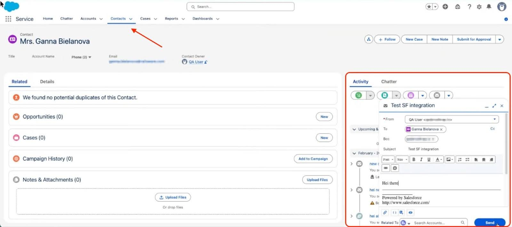<figcaption></figcaption></figure>

If you’ve followed everything correctly so far, once you click on **Send**, an email should arrive in your Sandbox, just like so:

<figure>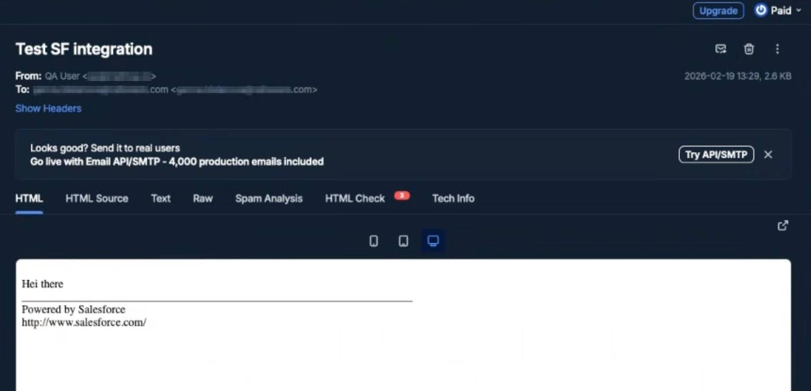<figcaption></figcaption></figure>

And that’s it, the integration is complete! 🎉
