# Salesforce

[Salesforce](https://www.salesforce.com/ap/) is a cloud-based CRM platform used by businesses to manage customer relationships, sales, and marketing.

With the [Email Sandbox for Salesforce](https://appexchange.salesforce.com/appxListingDetail?listingId=4f6cce1b-4943-4b23-94d7-d01df5249b03) add-on, you can route your Salesforce emails through [Email Sandbox](https://mailtrap.io/email-sandbox/) to test and inspect them before they reach real recipients.

In this guide, you'll learn how to:

* [Install the Email Sandbox add-on](https://docs.mailtrap.io/guides/integrations/salesforce#step-1.-install-the-email-sandbox-add-on)
* [Connect and authorize Salesforce](https://docs.mailtrap.io/guides/integrations/salesforce#step-2.-connect-and-authorize-salesforce)
* [Activate the Email Sandbox add-on](https://docs.mailtrap.io/guides/integrations/salesforce#step-3.-activate-email-sandbox-for-salesforce)

<strong>Pricing</strong>

The add-on is free to use with a free Mailtrap account. You get the standard Mailtrap Free plan limits: 50 test emails per month, 1 email per 10 seconds, 1 user and 1 sandbox.

To go beyond these limits, upgrade to a paid Mailtrap plan and add the Salesforce add-on, billed monthly per Salesforce user. A paid plan lets you:

* Test more emails each month, up to unlimited
* Send at higher speed
* Create more sandboxes
* Invite your team to your Mailtrap account
* Get priority support, plus SSO on the Enterprise plan

Additionally, there are available [discounts for non-profit organizations and open-source initiatives](https://docs.mailtrap.io/account-and-organization/billing/non-profit-and-open-source).


The add-on works with Sales Cloud, Service Cloud, Experience Cloud and platform email, including Flow, Apex, email alerts and templates. It doesn't work with Marketing Cloud.


## Step 1. Install the Email Sandbox add-on



* Open the official [Mailtrap Email Sandbox AgentExchange listing](https://appexchange.salesforce.com/appxListingDetail?listingId=4f6cce1b-4943-4b23-94d7-d01df5249b03), click **Get It Now**, and log in via Trailblazer.

<figure><figcaption></figcaption></figure>

* Choose where to install the package&#x20;

<figure><figcaption></figcaption></figure>

* Confirm the installation details and make sure to accept the terms and conditions

<figure><figcaption></figcaption></figure>

* Choose a Salesforce username (i.e., **user123456@agentforce.com**)&#x20;

<figure><figcaption></figcaption></figure>

* Select whether to install the app for admins only, all users, or specific profiles.

<figure><figcaption></figcaption></figure>

* Approve third-party access and click **Continue**.&#x20;

<figure><figcaption></figcaption></figure>

If the installation takes longer, Salesforce will email you a confirmation.&#x20;

<figure><figcaption></figcaption></figure>

You can also check for the Mailtrap App under Installed Packages.

<figure><figcaption></figcaption></figure>

## Step 2. Connect and authorize Salesforce

Email Sandbox for Salesforce requires a [Named Credential](https://help.salesforce.com/s/articleView?id=xcloud.named_credentials_about.htm\&type=5) called **MailTrap\_To\_SF** to communicate with your Salesforce org. To set it up, you need to:

* [Assign permission set](https://docs.mailtrap.io/guides/integrations/salesforce#assign-permission-set)
* [Create Named Credentials](https://docs.mailtrap.io/guides/integrations/salesforce#create-named-credentials)
* [Add access to the Named Credentials](https://docs.mailtrap.io/guides/integrations/salesforce#add-access-to-the-named-credentials)


**Useful link**: [What are Named Credentials?](https://help.salesforce.com/s/articleView?id=xcloud.nc_basics.htm\&type=5)


### Assign permission set



First, you need to assign Mailtrap Admin permission set to User who will configure the app.

* In **Setup** go to **Users** (under **Administration**) and open the **Users** settings. Then, select the user you want running this whole configuration, or the system administrator.

<figure><figcaption></figcaption></figure>

* Under the **Permission Set Assignments** list, click on **Edit Assignments**.

<figure><figcaption></figcaption></figure>

* Select **MailTrap Admin** and hit the **Save** button.

<figure><figcaption></figcaption></figure>

### Create Named Credentials

#### Step 1. Create an External Client App



* Navigate to **Setup** → **Apps** → **External Client Apps** → **External Client App Manager** and click on **New External Client App**.

<figure><figcaption></figcaption></figure>

* Then, enter the required **Basic Information**, such as **External Client App Name**, **API Name**, **Contact Email**, and **Distribution State**.

<figure><figcaption></figcaption></figure>

* Next, make sure to check the **Enable OAuth** box and configure it with the following settings:
  * **Callback URL** – For now, use `https://www.example.com` (we will change it later);
  * **OAuth Scopes** – Select **Manage user data via APIs (api)** and Perform **requests at any time (refresh\_token, offline\_access)**.

<figure><figcaption></figcaption></figure>

* Under **Flow Enablement**, tick the **Client Credentials Flow** and hit the **Create** button.

<figure><figcaption></figcaption></figure>

* Under the **Policies** tab, click **Edit**. This will allow you to make the required changes to **OAuth Policies**.

<figure><figcaption></figcaption></figure>

* Enable **Client Credentials Flow** and enter the email address of the **Admin User** with **MailTrap Admin permission** set assigned.
* Select **Refresh Token** is valid until revoked.
* Hit the **Save** button.

<figure><figcaption></figcaption></figure>

* Go to the **Settings** tab, expand the **OAuth Settings**, and click on **Consumer Key and Secret**.

<figure><figcaption></figcaption></figure>

* You will be redirected to a page where you can see your **Consumer Key** and **Consumer Secret**, you should copy both of them.

<figure><figcaption></figcaption></figure>

#### Step 2. Create Auth.Provider




**Useful links**:

* [Configure a Salesforce Authentication Provider](https://help.salesforce.com/s/articleView?id=xcloud.sso_provider_sfdc.htm\&type=5)
* [My Domain (for finding your domain URL)](https://help.salesforce.com/s/articleView?id=xcloud.domain_name_overview.htm\&type=5)


* Navigate to **Setup** → **Identity** (Under **Settings**) → **Auth.Providers** and click on **New**.

<figure><figcaption></figcaption></figure>

* Then, enter the following settings for **Auth. Provider**:
  * For **Provider Type**, select **Salesforce**.
  * For **Consumer Key** and **Consumer Secret** you should paste from the **Connected App**.
  * Paste _**api refresh\_token offline\_access**_ in **Default Scopes**.
  * **Authorize Endpoint URL**: Your domain URL + `/services/oauth2/authorize`
  * **Token Endpoint URL**: Your domain URL + `/services/oauth2/token`


Domain URL can be found under Company Settings → My Domain.


<figure><figcaption></figcaption></figure>

* Copy **Callback URL** from **Auth.Providers**.

<figure><figcaption></figcaption></figure>

* Paste the **Callback URL** into the **Connected App** instead of `https://www.example.com`.

<figure><figcaption></figcaption></figure>

#### Step 3. Named Credentials to Salesforce




**Useful links**:

* [External Credentials](https://help.salesforce.com/s/articleView?language=en_US\&id=sf.nc_create_edit_external_credential.htm\&type=5)
* [Enable External Credentials Principals](https://help.salesforce.com/s/articleView?id=xcloud.nc_enable_ext_cred_principal.htm\&type=5)


* Navigate to **Setup** → **Named Credentials** (under **Security**)→ click on **External Credentials** and hit the **New** button.

<figure><figcaption></figcaption></figure>

* Then, fill in all necessary information:
  * **Name**: MailTrap\_To\_SF
  * **Authentication Protocol**: OAuth 2.0
  * **Authentication Flow Type**: Browser Flow
  * **Scope**: api refresh\_token offline\_access
  * **Identity Provider**: select the Auth.Provider you created – `ThisOrg`

Once you’re done, make sure to hit the **Save** button.

<figure><figcaption></figcaption></figure>

* Navigate to **Named Credentials**, click **New**.

<figure><figcaption></figcaption></figure>

* Fill in all necessary information:
  * **Label and Name**: MailTrap\_To\_SF
  * **URL**: Your domain URL
  * **External Credential**: select External Credential you created before – MailTrap\_To\_SF
  * **Allowed Namespaces for Callouts**: RWMailtrap


Name should specifically be **MailTrap\_To\_SF**, no other can be used for MailTrap package.


<figure>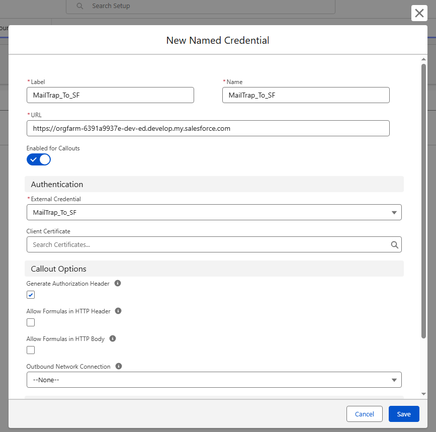<figcaption></figcaption></figure>

<figure>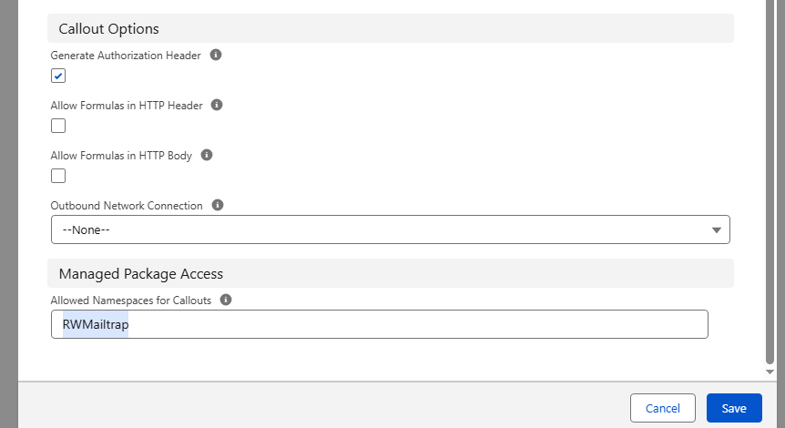<figcaption></figcaption></figure>

* Once you’re done, click **Save**, and go back to the **External Credentials** tab to open it.

<figure>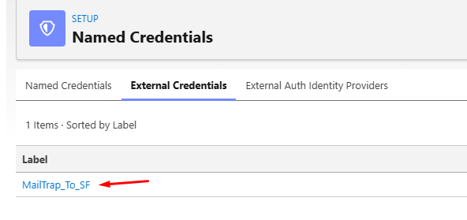<figcaption></figcaption></figure>

* In the **Principals** section click **New**.

<figure>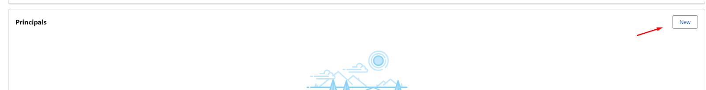<figcaption></figcaption></figure>

* Configure it as in the screenshot below, then click **Save**.

<figure>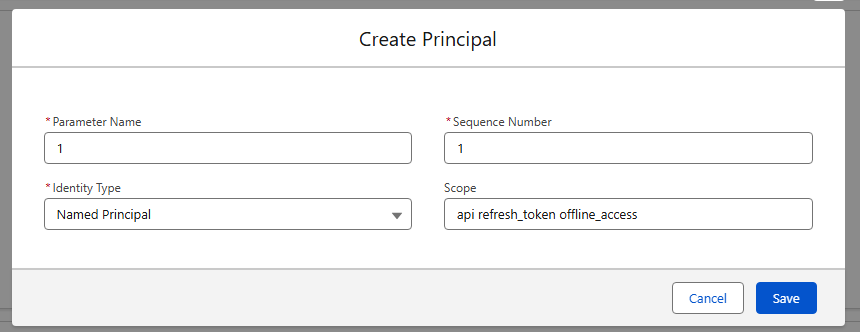<figcaption></figcaption></figure>

* In the **Principals** section click the menu button underneath **Actions**:

<figure>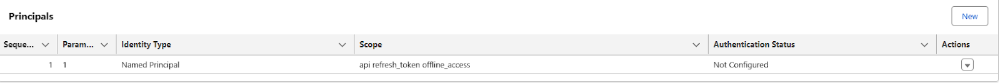<figcaption></figcaption></figure>

* Then, **Authenticate**:

<figure>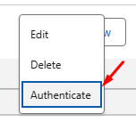<figcaption></figcaption></figure>

* Login to the Salesforce organization, **Allow** access, and confirm.

<figure>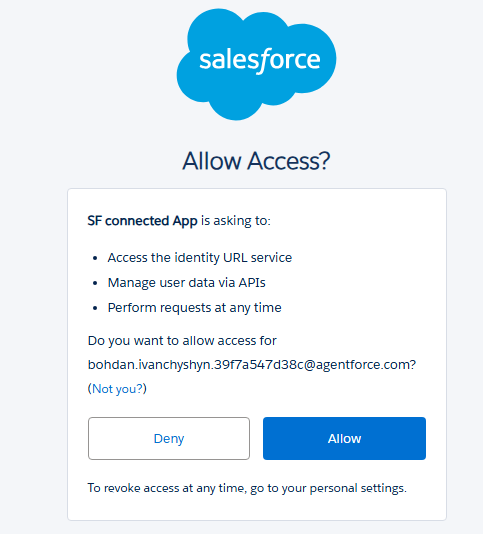<figcaption></figcaption></figure>

### Add access to the Named Credentials

* Go to the **Profiles** page and find the profile you want to give permissions to..

<figure>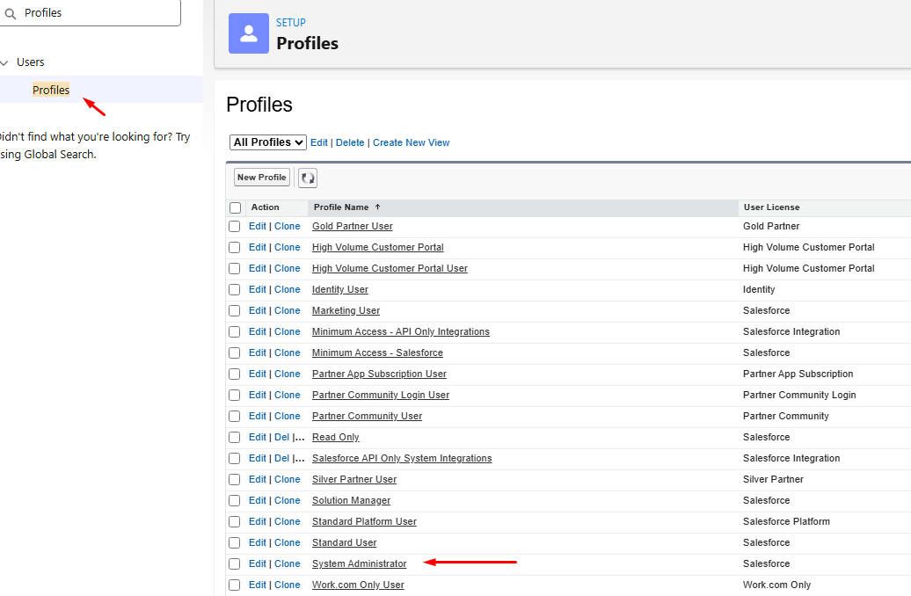<figcaption></figcaption></figure>

* At the **Enabled External Credential Principal** **Access** section click **Edit**.

<figure>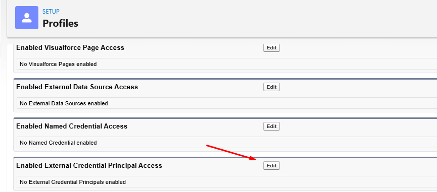<figcaption></figcaption></figure>

* Select **MailTrap\_To\_SF – 1** and click **Save**.

<figure>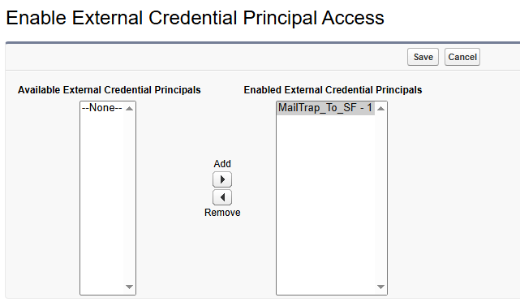<figcaption></figcaption></figure>

And that’s it, your application is ready!

## Step 3. Activate Email Sandbox for Salesforce



To enable the Email Sandbox for Salesforce, you need to connect your Mailtrap account by adding a [Mailtrap API Token](https://docs.mailtrap.io/email-api-smtp/setup/api-tokens). To do this:

* First, navigate to the Mailtrap app via **App Launcher**.

<figure><figcaption></figcaption></figure>

* Then, click on **Connect Mailtrap account**.

<figure><figcaption></figcaption></figure>

To activate the Sandbox mode, navigate to **Account Settings**, and then:

* Paste your API token in the bar, hit **Save**.

<figure><figcaption></figcaption></figure>


**Important**: The Mailtrap API token you intend to use for the Salesforce integration with Sandbox should have:

* At least **Viewer** permission for _the whole account_.
* **Admin** permission for _one or multiple sandboxes_.

If your API token doesn’t meet one of these requirements, you won’t be able to activate the add-on.


* Select a sandbox to receive emails
* Activate the sandbox mode

<figure>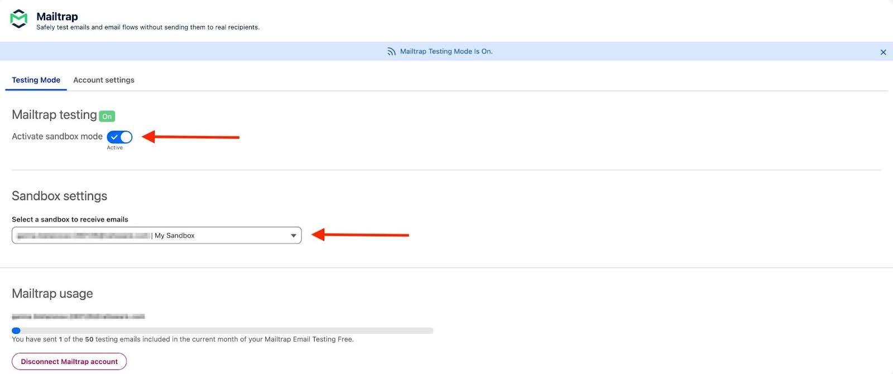<figcaption></figcaption></figure>

This will open a new window, where you simply have to click the **Turn on** button.

<figure><figcaption></figcaption></figure>

The integration is complete! 🎉

## Sending a test email

To verify the integration, go to the **Contacts** page and try to send an email to one of your contacts. For example:

<figure><figcaption></figcaption></figure>

If you’ve followed everything correctly so far, once you click on **Send**, an email should arrive in your Sandbox, just like so:

<figure>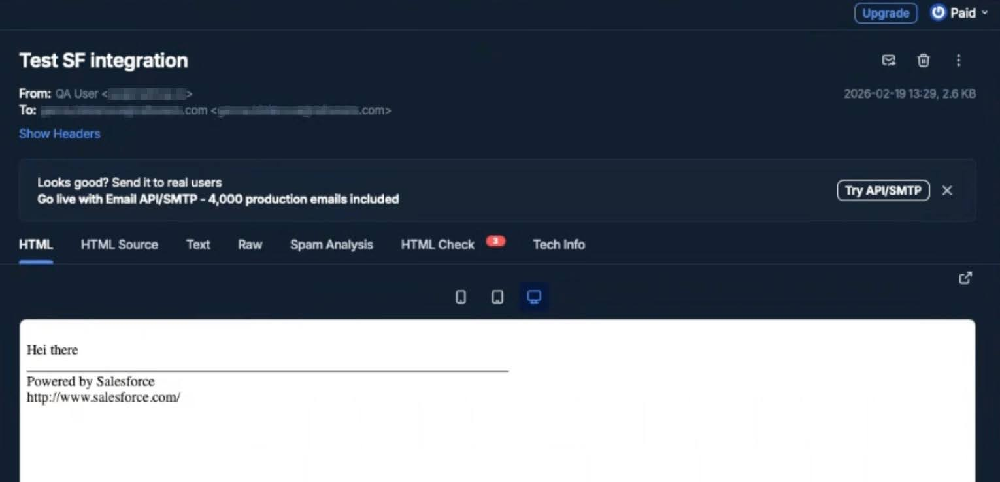<figcaption></figcaption></figure>
