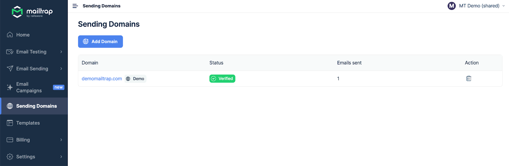
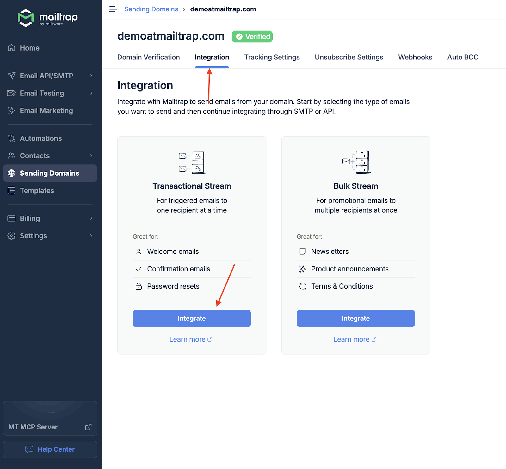
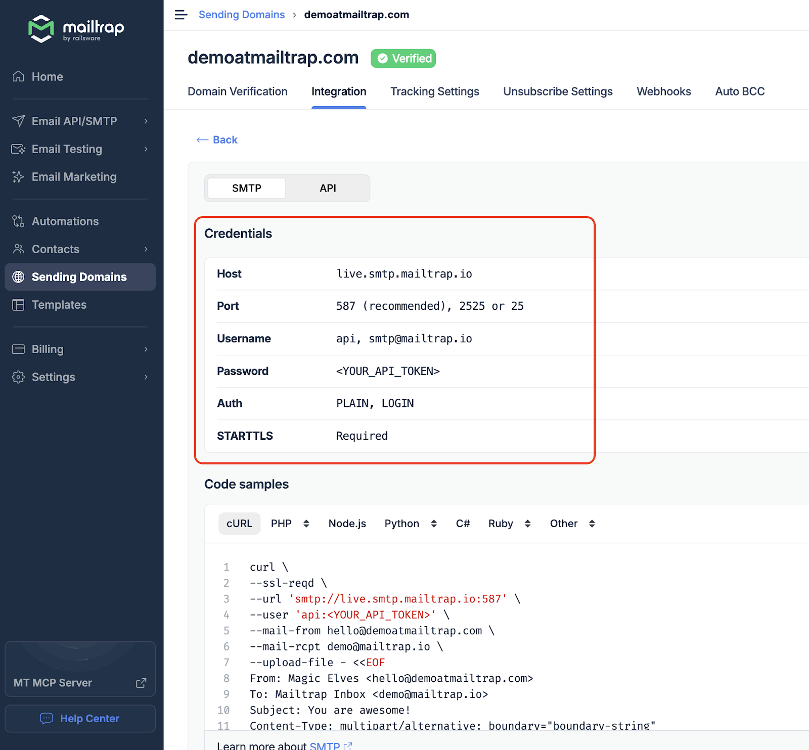
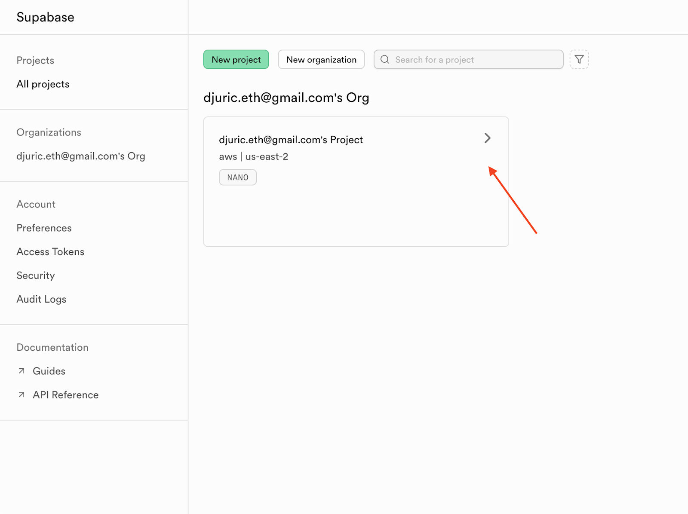
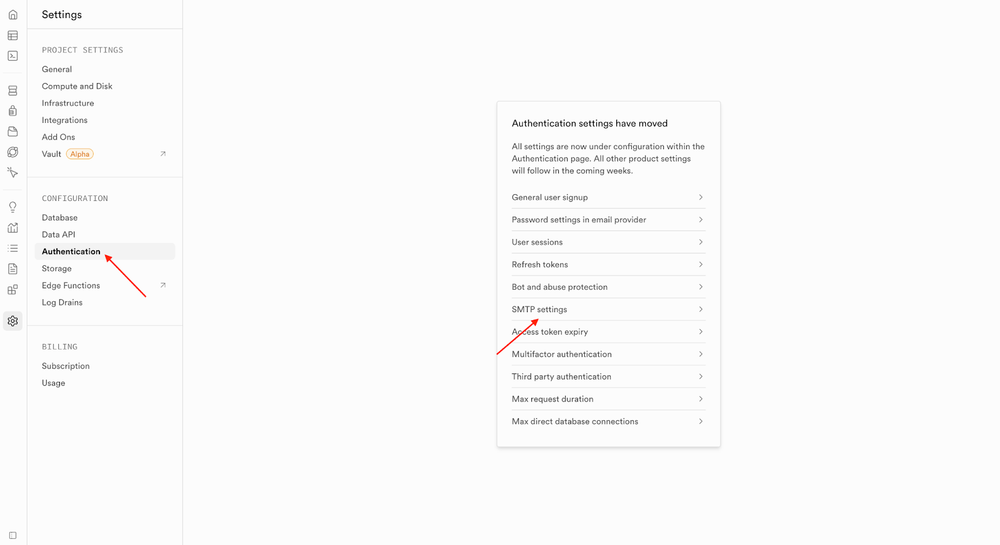
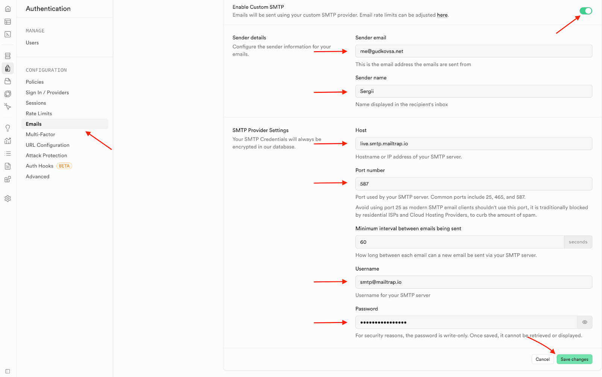
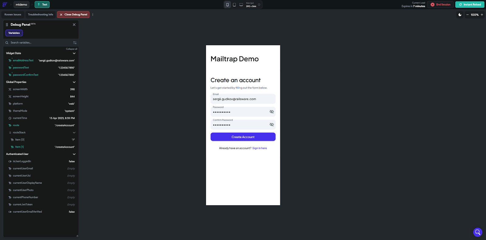
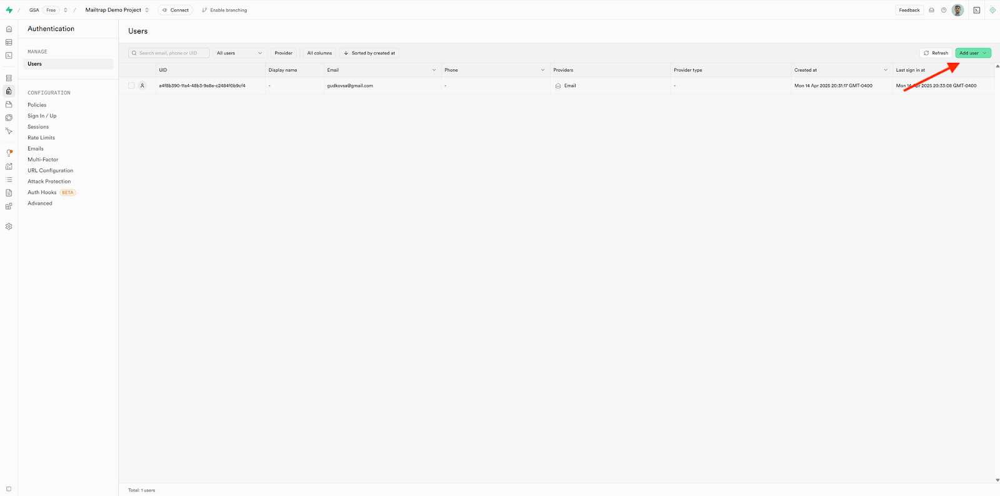
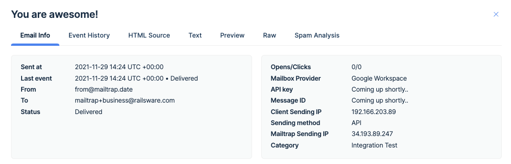

# Supabase Transactional Emails Integration

With Mailtrap SMTP, you can move beyond Supabase's limit of [2 emails per hour](https://supabase.com/docs/guides/auth/rate-limits) to a production-ready [email-sending solution](https://mailtrap.io/email-sending/) with comprehensive [analytics](https://mailtrap.io/actionable-analytics/).

In this guide, I'll show you how to obtain the Mailtrap SMTP credentials and update them in Supabase.



**Obtain your sending credentials**

If you haven't already, you'll need to verify your domain before we start. You can use our [step-by-step article](https://app.gitbook.com/s/S3xyr7ba7aGO19rc8dSK/email-api-smtp/setup/sending-domain-setup) as a guide.

With a verified domain in place:

Go to **Sending Domains** and select your domain.

Click on **Integration**, select **Transactional Stream**, and click **Integrate**.

Under the **SMTP** tab, you can find your sending credentials, which include **Host**, **Port**, **Username**, and **Password**.




**Update the SMTP server in Supabase**

Open your Supabase [project dashboard](https://supabase.com/dashboard/projects) and select your project.

Click on **Authentication** → **SMTP settings**.

Click on **Emails** → **SMTP Settings** and enable the **Enable Custom SMTP** toggle. Update **Host**, **Port**, **Username**, and **Password** with your Mailtrap credentials, then click **Save changes**.




**Create a new account in your app**

Open your app/project and try to create an account.

Alternatively, you can simulate new user registration by clicking **Add user** in Supabase.




**Monitor your email performance**

Once you send emails from your Supabase project, they should arrive in both your recipient's inbox and your **Mailtrap Email Logs**. There, you can see useful information such as delivery time, opens/clicks, email HTML source, [spam analysis](https://app.gitbook.com/s/S3xyr7ba7aGO19rc8dSK/email-sandbox/deliverability-tests), and more.

You can read more about **Mailtrap Email Logs** in our [dedicated article](https://app.gitbook.com/s/S3xyr7ba7aGO19rc8dSK/email-api-smtp/statistics/email-logs).

Additionally, you'll be able to see all important stats regarding your sent emails, such as opens, clicks, bounces, and more.

For more information on **Mailtrap Analytics**, [click here](https://app.gitbook.com/s/S3xyr7ba7aGO19rc8dSK/email-api-smtp/statistics/stats-dashboard).


