# Sync Contacts with Supabase

You can seamlessly sync your Supabase user base with Mailtrap, which allows you to:

* Seamlessly update your email list
* Create segments based on user data
* Launch personalized email campaigns
* Measure campaign effectiveness

In this guide, you'll learn how to:

* Generate a Mailtrap API token
* Create contacts in Supabase and Mailtrap
* Update contacts in Supabase and Mailtrap
* Demo and test the integration


You can read more about Contacts in our [dedicated article](https://app.gitbook.com/s/S3xyr7ba7aGO19rc8dSK/email-marketing/contacts).


## Generate a Mailtrap API token

Whether you want to only create contacts or update them via Mailtrap x Supabase, you'll first need a Mailtrap API token.



### Access API Tokens

Go to **Settings** on the left side-bar menu, navigate to **API Tokens**, and click on **Add Token**.

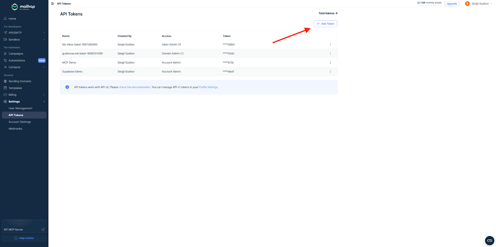



### Configure Token Permissions

Enter the desired name, click on **Add Token**, tick the desired permission checkboxes, and hit **Save**.





### Copy and Store Token

Copy the token and save it in a secure place.

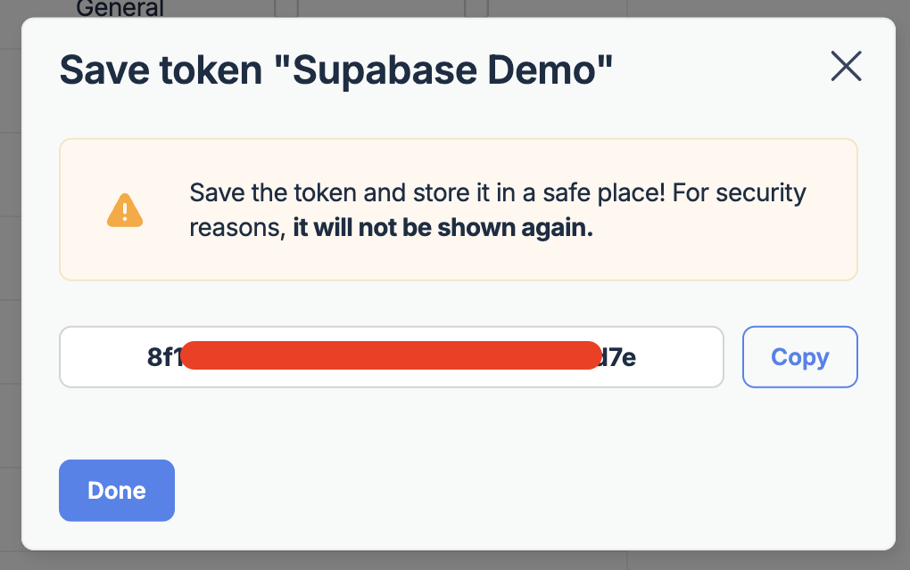



## Creating contacts

Before we start, let me briefly explain the workflow:

* A user registers in your app
* Their email appears not only in Supabase but also in the Contacts page
* Then, you can easily group the new contact into different lists, segments, etc.

### Step 1. Create an Edge Function in Supabase

First, let's create an Edge Function containing our Mailtrap API token.



### Open Edge Functions

Open your Supabase [project dashboard](https://supabase.com/dashboard/projects) and go to **Edge Functions**.





### Deploy New Function

Click on **Deploy a new Function** in the upper-right corner and select **Via Editor**.





### Add Function Code

Inside the function editor, you should see the default serverless function template.


Replace it with the following code snippet that will send user data to Contacts:


```javascript
const MAILTRAP_API_TOKEN = Deno.env.get("MAILTRAP_TOKEN") || "";
const MAILTRAP_ACCOUNT_ID = Deno.env.get("MAILTRAP_ACCOUNT_ID") || "";

const handler = async (req) => {
  const requestData = await req.json();
  const { email } = requestData.record;
  const options = {
    method: "POST",
    headers: {
      "Content-Type": "application/json",
      "Accept": "application/json",
      "Authorization": `Bearer ${MAILTRAP_API_TOKEN}`
    },
    body: JSON.stringify({
      contact: {
        email: email,
        list_ids: [
          4292 // List for New Users
        ]
      }
    })
  };
  return await fetch(`https://mailtrap.io/api/accounts/${MAILTRAP_ACCOUNT_ID}/contacts`, options);
};

Deno.serve(handler);
```


Replace the variable `list_ids:` value (4292 in this example) with the ID of the list where you want to add the contact.

Then, click on **Deploy Function**.

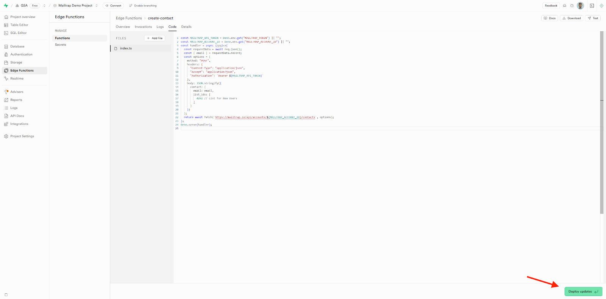



### Verify Deployment

Supabase will build and deploy the Edge Function.

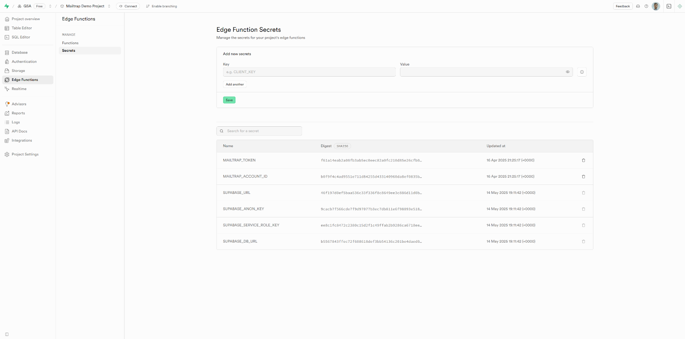



### Step 2. Set up webhooks for contact creation

Next, we will create a [Supabase Webhook](https://supabase.com/docs/guides/database/webhooks) to trigger the Edge Function we just created.



### Navigate to Database Webhooks

Open your Supabase Dashboard, go to **Database Webhooks**, and click on **Create a new hook**.

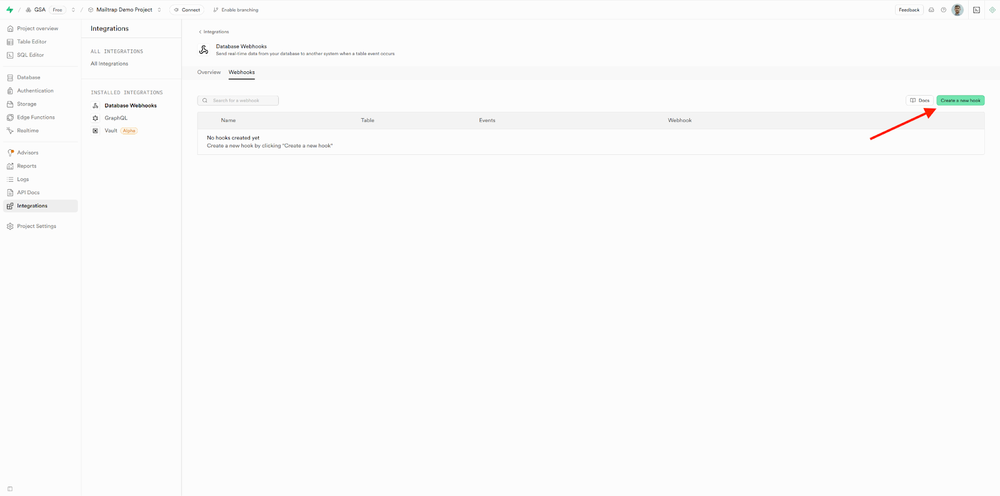



### Configure Basic Settings

Configure the following:

* **Name**: create\_contact
* **Table**: users
* **Events**: ✅ Insert

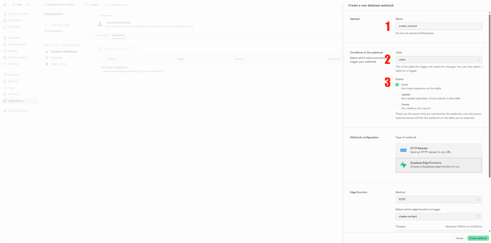



### Configure Webhook Type

Configure the following:

* Choose **Supabase Edge Functions** under 'Webhook configuration'
* Go for **POST** under 'Method'
* Select the previously created function **create-contact**
* Set the desired timeout (e.g., 5000)

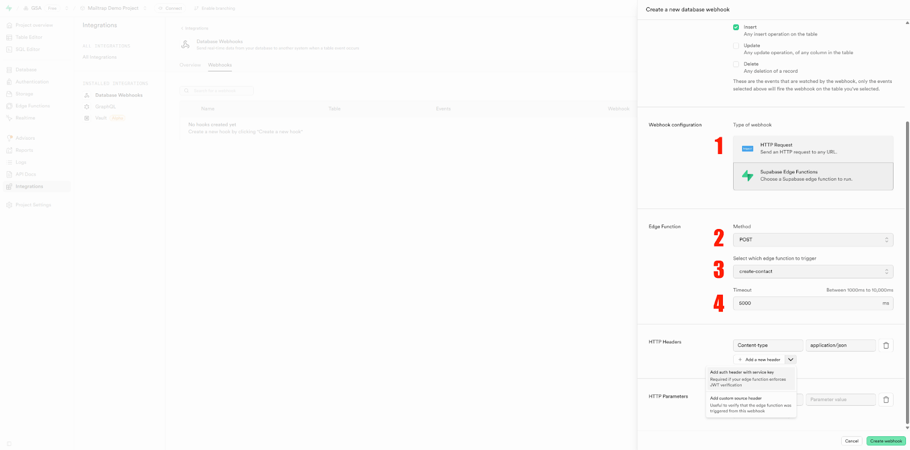



### Set HTTP Headers

Set HTTP headers for Auth:

* **Content-type**: application/json
* **Authorization**: Bearer \[your-token]

Click **Create webhook** to activate it.

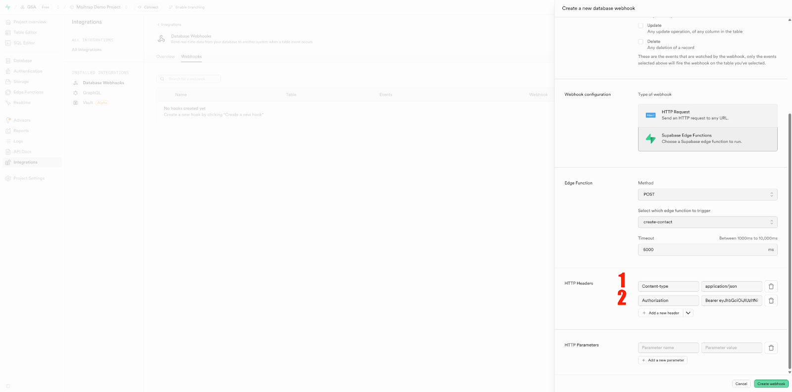



## Updating contacts

Here, the flow is quite similar to creating contacts, with the major difference being the code we'll use.

How it works:

* A registered user updates their name/account info
* The newly updated info appears not only in Supabase but also in the Mailtrap Contacts page
* Then, you can send more personalized emails (e.g., name or state fields)

### Step 1. Create an edge function

Again, we start by creating an Edge Function and adding Mailtrap API token to it.



### Open Edge Functions

Open your Supabase [project dashboard](https://supabase.com/dashboard/projects) and go to **Edge Functions**.





### Deploy New Function

Click on **Deploy a new function** in the upper-right corner and select **Via Editor**.





### Add Function Code

Inside the function editor, you should see the default serverless function template.


Replace it with the following code snippet, which will:

* Receive user data from the webhook
* Call the Mailtrap API to update existing contact details


```javascript
// Setup type definitions for built-in Supabase Runtime APIs
import "jsr:@supabase/functions-js/edge-runtime.d.ts";
import { createClient } from 'jsr:@supabase/supabase-js@2';

// Define environment variables (you'll need to set these in Supabase)
const MAILTRAP_API_TOKEN = Deno.env.get("MAILTRAP_TOKEN") || "";
const MAILTRAP_ACCOUNT_ID = Deno.env.get("MAILTRAP_ACCOUNT_ID") || "";

const handler = async (req) => {
  const requestData = await req.json();
  let userEmail;
  try {
    const supabase = createClient(Deno.env.get('SUPABASE_URL'), Deno.env.get('SUPABASE_SERVICE_ROLE_KEY'), {
      auth: {
        autoRefreshToken: false,
        persistSession: false
      }
    });
    // Access auth admin api
    const { data, error } = await supabase.auth.admin.getUserById(requestData.record.id);
    if (error) {
      throw error;
    }
    userEmail = data.user.email;
  } catch (err) {
    // error handling
  }
  const options = {
    method: "PATCH",
    headers: {
      "Content-Type": "application/json",
      "Accept": "application/json",
      "Authorization": `Bearer ${MAILTRAP_API_TOKEN}`
    },
    body: JSON.stringify({
      contact: {
        email: userEmail,
        fields: {
          name: requestData.record.full_name
        },
        unsubscribed: false
      }
    })
  };
  return await fetch(`https://mailtrap.io/api/accounts/${MAILTRAP_ACCOUNT_ID}/contacts/${userEmail}`, options);
};

Deno.serve(handler);
```


And, of course, click on **Deploy updates/Deploy function**.

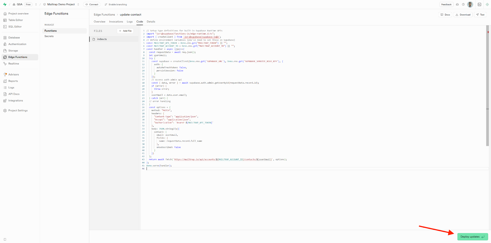



### Step 2. Set up a webhook for updating contacts



### Create Webhook

If you don't already have a webhook for updating contacts, open your Supabase Dashboard, go to **Database Webhooks**, and click on **Create a new hook**.

Navigate to **Integrations** → **Webhooks** and configure the following:

* **Name**: update\_contact
* **Table**: profiles
* **Events**: ✅ Update

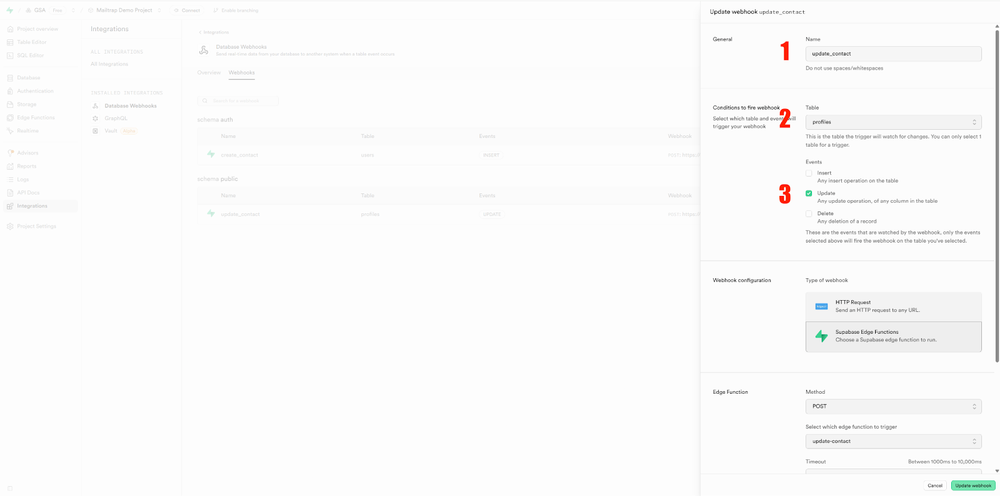



### Configure Webhook Settings

Configure the following:

* **Type of webhook**: HTTP Request
* **Method**: POST
* **Edge Function**: Select the previously created **update-contact** function
* **Add HTTP Headers**:
  * **Content-Type**: application/json
  * **Authorization**: Bearer \[your-token]

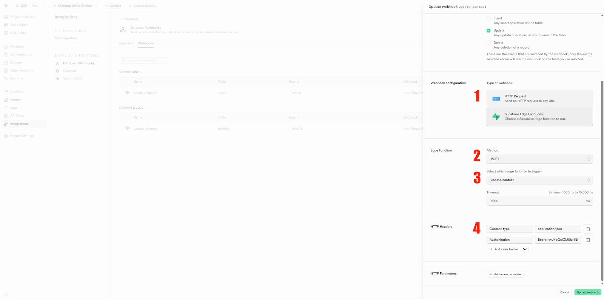



## Integration demo and testing

Finally, let's test our webhook configuration. For this example, I'll use a demo app created in FlutterFlow.



### Create Test Account

First, create an account as if you were a new user.

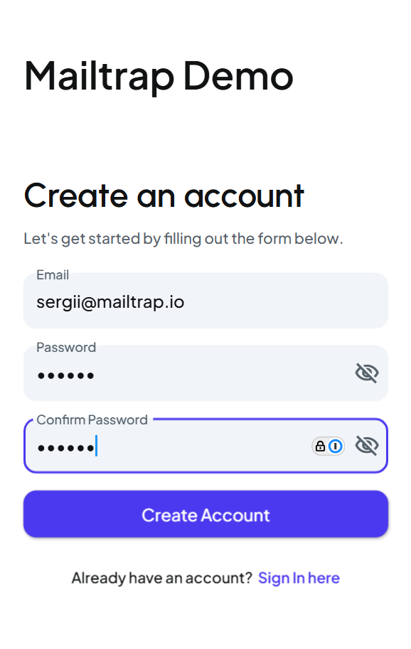



### Verify in Supabase

A new user should appear in the **Users** page within your Supabase Project.

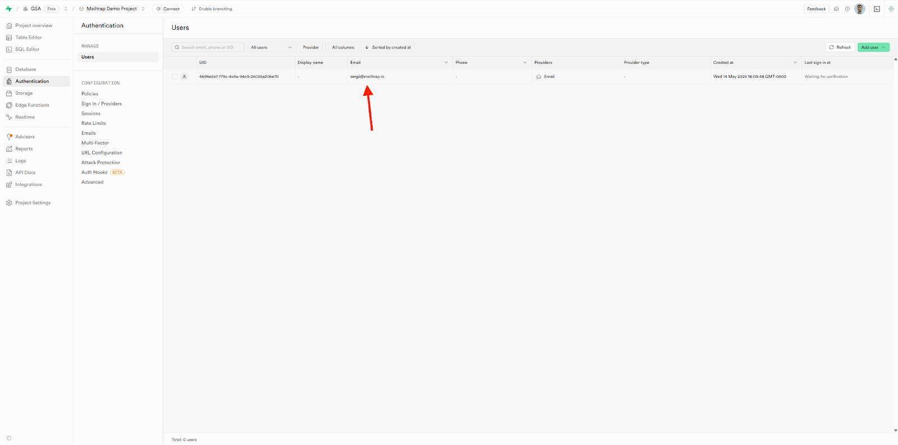



### Verify in Mailtrap

At the same time, a new user also appears in your Mailtrap Contacts page.

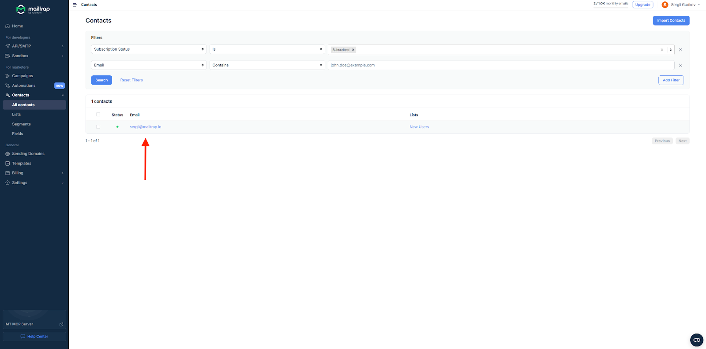



### Check Initial Data

Since the demo app only requires email and password upon registration, that's all the info the webhook sends to the Mailtrap Contacts page initially.

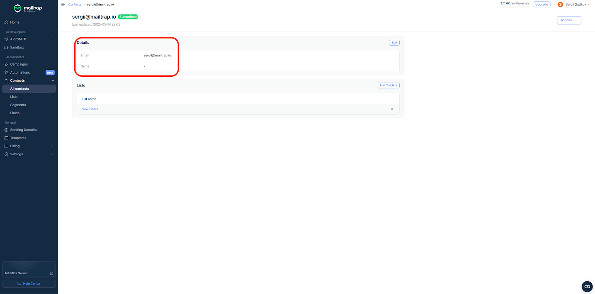



### Update Profile

If you go to your demo app and update the profile name...

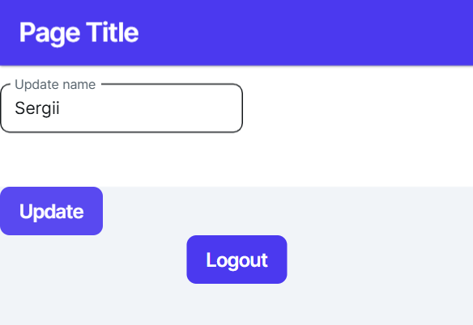



### Verify Update in Supabase

It should get updated in your Supabase Project...

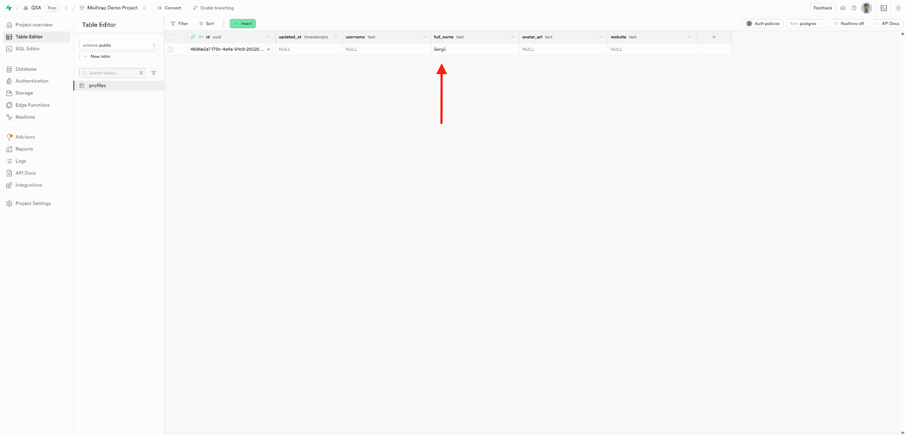



### Verify Update in Mailtrap

And the Mailtrap Contacts Page, so everything works as intended!

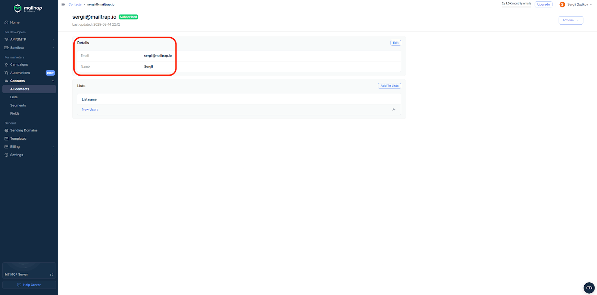

Now, every time a new user logs in and updates their name, their information will be logged in your Mailtrap Contacts page. There, you can group them into lists, segment them accordingly, and use Fields to personalize your email campaigns further.


