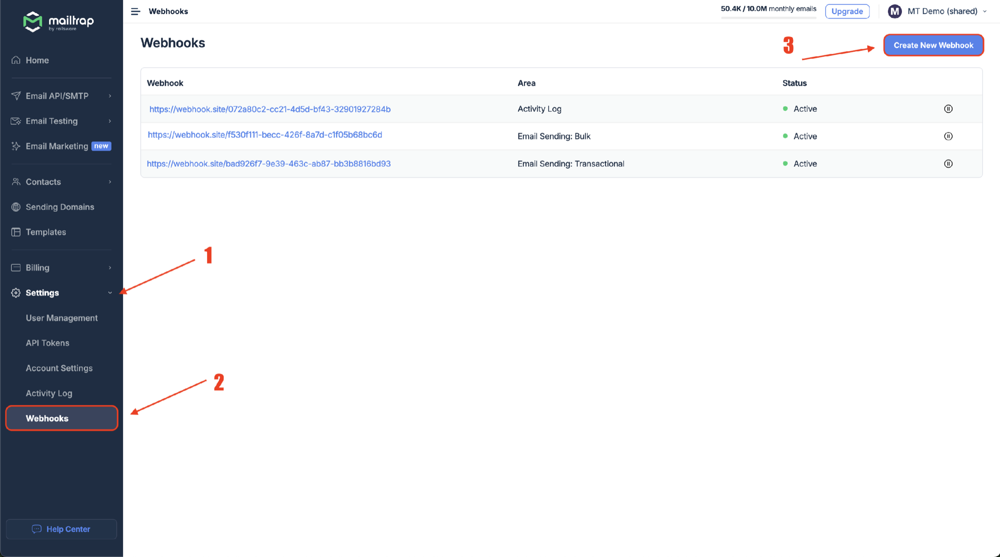
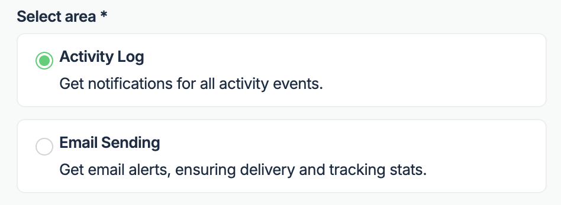
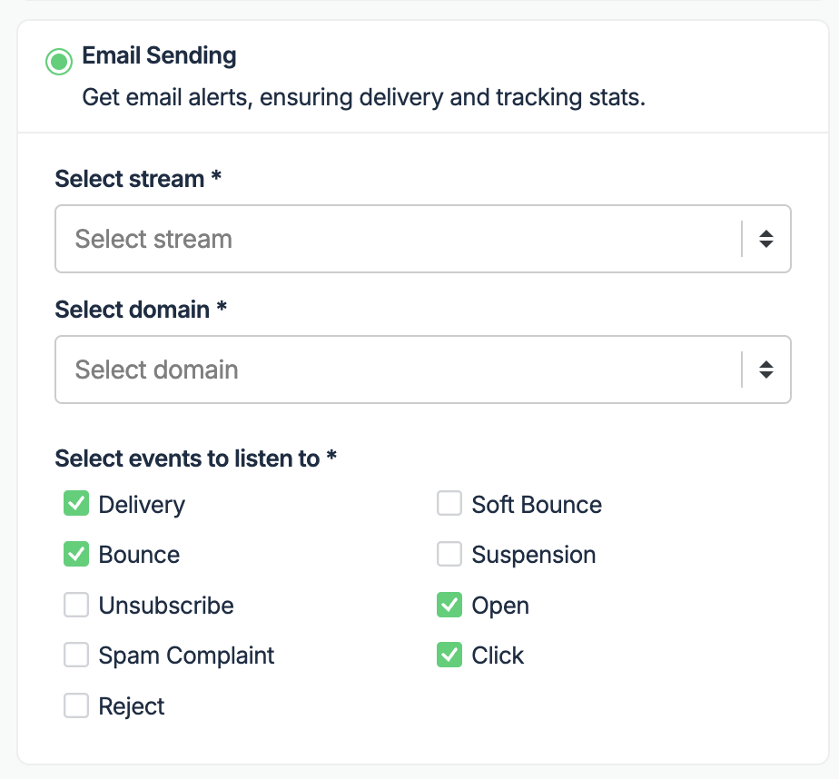
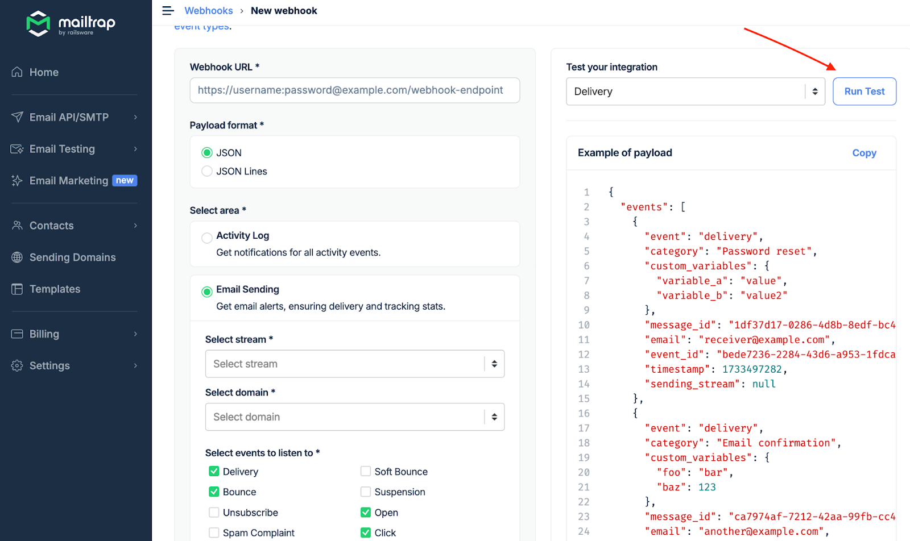

Webhooks allow you to receive all information about your deliverability and activities within your account almost in real-time.

## Event types

The event data you receive includes:

**Sending events:**
- Delivery
- Bounce
- Unsubscribe
- Spam Complaint
- Reject
- Soft Bounce
- Suspension
- Open
- Click

**Activity Log events (available for enterprise only):**
- User updated API token permissions
- User updated the email address or password
- User invited someone else to the account
- And more


To find out more about the sending event specifics, check the [Statuses and Events article](https://help.mailtrap.io/article/87-statuses-and-events).


# Overview

<i class="fa-webhook">:webhook:</i>

## How to set up webhooks

- Navigate to **Settings** → **Webhooks** and click the **Create New Webhook** button.

- Enter a valid **Webhook URL**. Use a password and username as an extra security layer with basic authorization to prevent others from sending information to that endpoint. You can also use a token as a query parameter.

- Choose the **Payload format** (JSON or JSON Lines).

- Select the webhooks area (Activity Log or Email Sending).

**If you choose Activity Log**, you will receive events related to all activities within your account that are supported by the Activity Log.

**If you choose Email Sending**, you'll also need to:

- Choose the **Sending Stream** (Transactional or Bulk) for which you want to set up the webhooks.


**Transactional Stream** is used to send non-promotional, triggered emails to one recipient at a time, while **Bulk Stream** is used to send promotional emails to multiple recipients at once.


- Choose the **domain** you want to receive events' data for
- Select one or more [event types](https://help.mailtrap.io/article/87-statuses-and-events) by ticking the corresponding checkbox.

- Click the **Run Test** button to test the webhook setup. The code represents a dummy payload of the webhook structure and how to read it correctly. If your endpoint responds with a 200 code, you'll see a confirmation in the app. All other response codes show an error during a test.


One popular way to test webhooks outside your system is [Webhook.site](https://webhook.site/#!/view/d24cebd2-99cc-46f3-8685-c779017f39a0), but don't use it for production.


- If the tests are successful, click the **Save** button. All information will be sent to your webhook endpoint.


To edit, pause, or delete an active webhook, go back to the Webhooks tab and select the webhook you want to change.


## Activity log event structure

Activity log events include the following fields:

- **event** — The event type
  - Example: `activity_log.user.updated`
- **description** — The event description. Meant to be a user-friendly representation of the event type.
  - Example: `updated the user profile`
- **actor** — Object representing the actor who executed the action or if the action was performed by the system actor.
  - Example: `{"id":1,"type":"user","name":"Jack"}` or `{"name":"Mailtrap"}`
- **resource** — Optional object representing the resource affected by the action
  - Example: `{"id":17,"type":"sandbox","name":"Main"}`
- **changes** — Optional object representing the changes made to the resource
  - Example: `{"name":{"from":"John","to":"John Doe"}}`
- **timestamp** — The timestamp in Unix epoch format
  - Example: `1735830138`

All stats are built on the events, and you get most event information from the Mailtrap UI. The complete webhook structure is available in [our API docs](https://api-docs.mailtrap.io/docs/mailtrap-api-docs/e29992ee6ad24-receive-events-json-lines-format).

## Retry schedule and batches

### Retry schedule

If your endpoint is down and doesn't respond with 200 OK, we'll retry multiple times. The scheduling logic is as follows:

- **Retry** — 40 retries every 5 minutes. The webhook will be considered failed if we don't receive 200 OK with all retries. If the webhook fails, we'll pause it and notify you by email. You'll need to check its settings and resume it manually.
- **Timeout** — 30 seconds. If your endpoint doesn't respond within that time, the webhook event batch will go to the retry schedule.

### Batches

Webhooks are sent in batches—the information we send can be grouped within one object (a **JSON array**).

For example, Mailtrap groups up to 500 events and sends them as a batch. The benefit is that we don't need to make 500 requests to your endpoint, and there's less load on your side. This is very beneficial for high-volume senders.

In an array of events, we collect and batch events every 30 seconds. After that time, everything that was grouped will be sent to you.