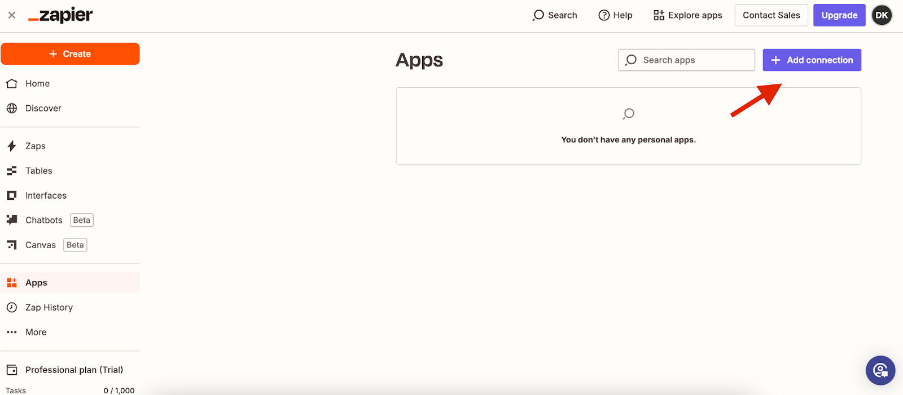
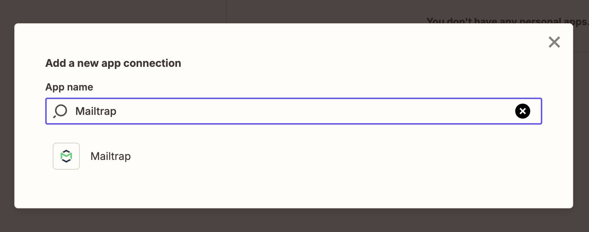
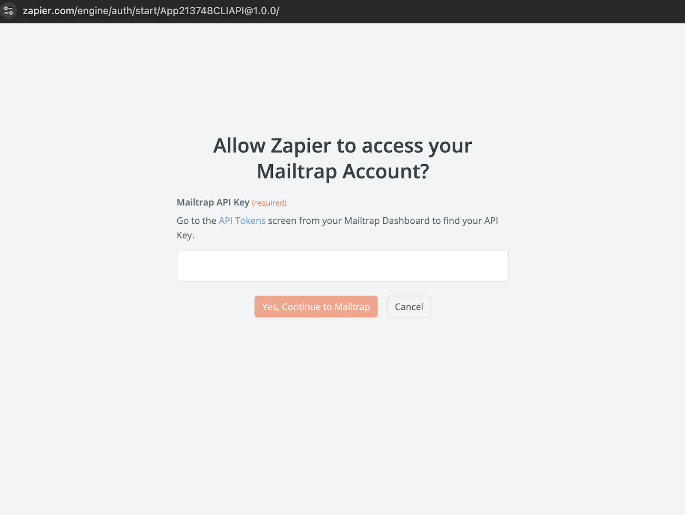
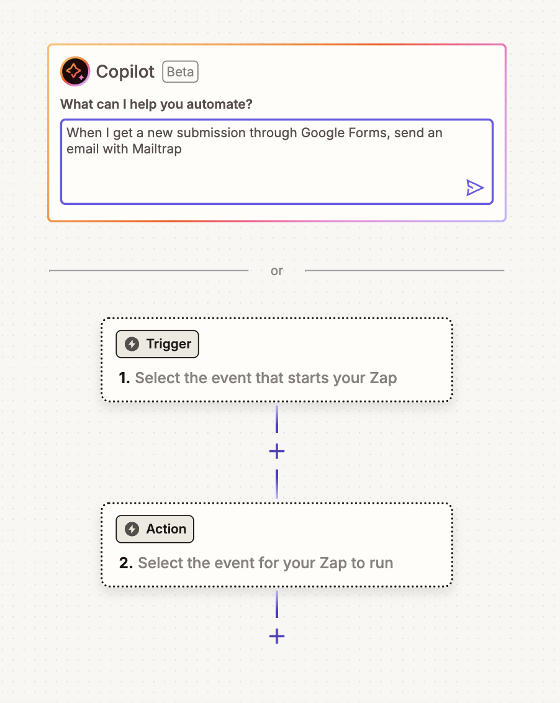
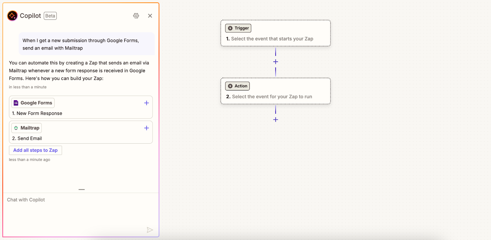
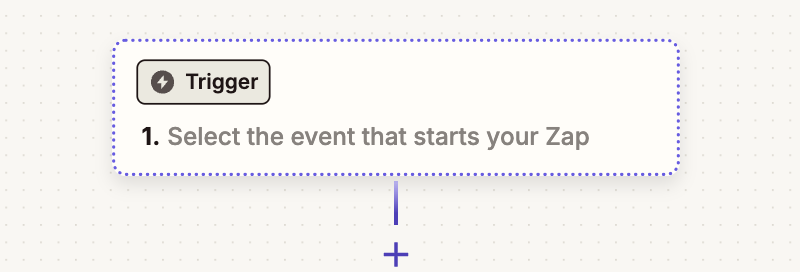
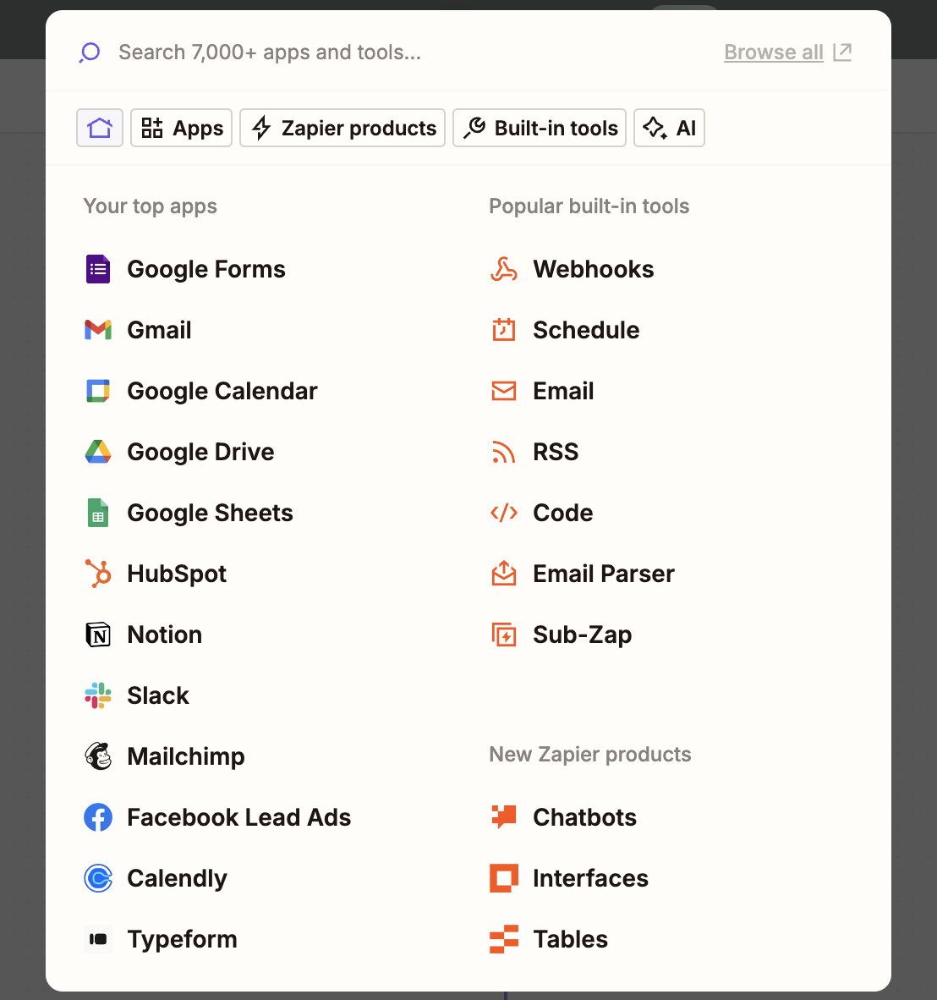
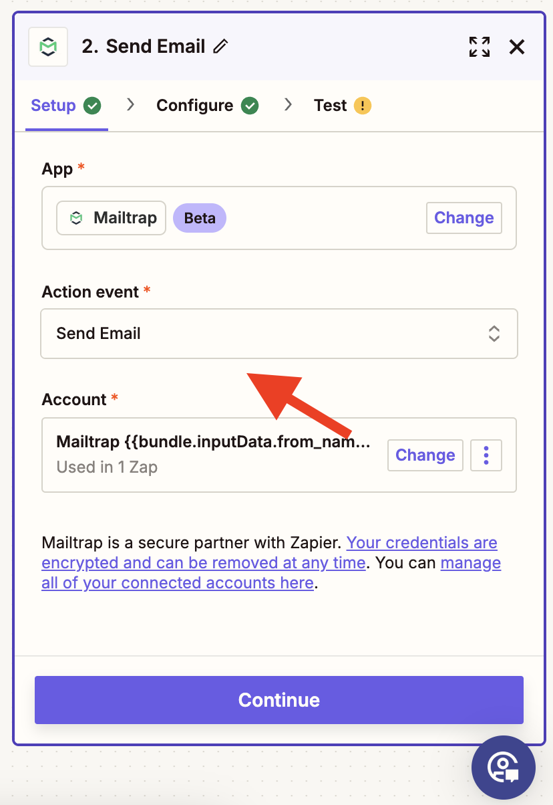
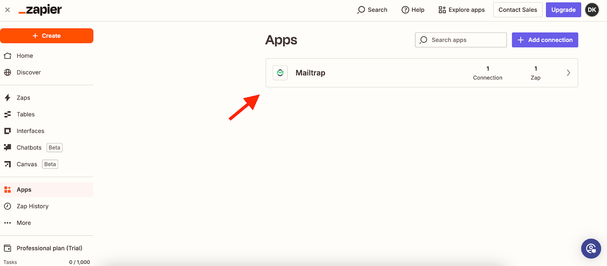
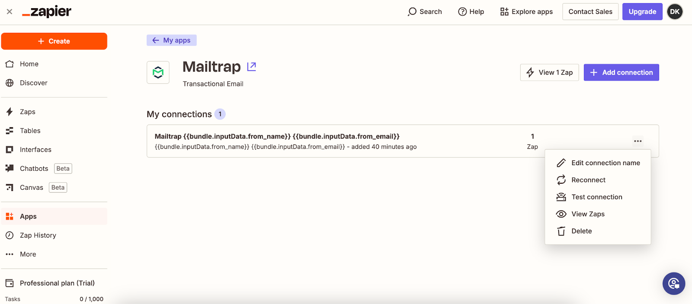

# Zapier Integration

<a href="https://zapier.com/apps/mailtrap/integrations" class="button primary">View on Zapier Marketplace</a>

## Overview

Using the Mailtrap integration with Zapier, you can automate email sending by connecting Mailtrap to over 7,000 other applications without any coding. This guide shows you how to set up the integration, create automations, and manage your connections.

### Connecting Mailtrap to Zapier



Log in to your [Zapier account](https://zapier.com/sign-up) or create a new account.



Navigate to **Apps** in the left-hand side menu.




Click **Add connection**.




Type _Mailtrap_ in the **App name** search bar.




Enter your Mailtrap API key to allow Zapier to access your account.&#x20;

**Note**: This should be the token for the domain you've added and verified in Mailtrap. You'll find it in the **Settings** → **API Tokens** menu.




### Creating an automation

To set up trigger-based email sending via Mailtrap in Zapier, you need to create a Zap.

A Zap is a workflow connecting multiple apps that consists of a trigger (an event that starts a Zap) and one or more actions (events the Zap performs).

#### Using Copilot



Describe the workflow you want to create to Copilot.




Add some or all the steps created by Copilot to the Zap or continue to prompt the chatbot to add or replace steps.




Configure the required fields for sending an email. The from email should contain the same sending domain you added and verified in Mailtrap.




Send a test email to Mailtrap (optional).




Publish the Zap.



#### Manually



Select an event (trigger) to start your Zap.

Zapier's app directory contains 7,000+ apps with triggers and actions available for each.




Search for and select **Mailtrap** as the action for your Zap to run.



Select **Send Email** as the action event.




Configure the required fields for sending an email.




Send a test email to Mailtrap (optional).




Publish the Zap.



### Removing Mailtrap credentials from Zapier



Navigate to **Apps** in the left-hand side menu.




Click on your Mailtrap connection.




Click the three-dot menu and then **Delete** in the dropdown menu. Using the same menu, you can edit the connection name, reconnect, test the connection, and view Zaps created using the connection.




## Next steps

After setting up your Mailtrap and Zapier integration, you can create unlimited Zaps to automate your email workflows and connect your favorite apps seamlessly.
