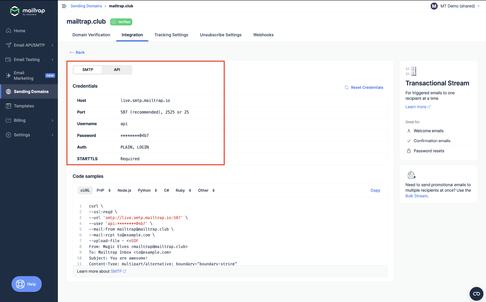
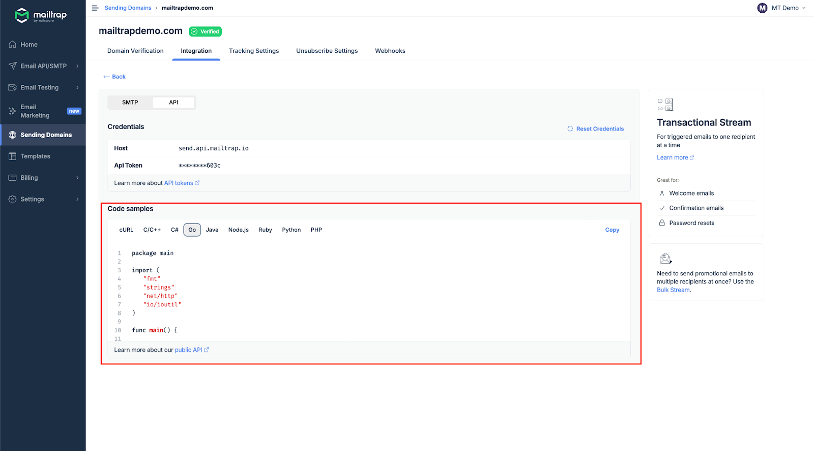

# Go

<a href="https://github.com/mailtrap/mailtrap-go" class="button primary">Mailtrap Go SDK on GitHub</a>

### Overview

Mailtrap can be integrated with Go apps and projects for email sending.

### Email API/SMTP for Go

#### SDK integration

The [Mailtrap Go SDK](https://github.com/mailtrap/mailtrap-go) provides an idiomatic Go interface for the full Mailtrap feature set, with `context.Context` support and typed errors on every call. The SDK supports:

* Transactional, bulk & batch email sending
* Email template management
* Sending domain management
* Suppression list management
* Webhook management
* Email logs and sending stats
* Sandbox email sending, projects, inboxes & message inspection
* Contact management (contacts, lists, fields, imports & exports)
* Account & organization management

### Installation

Install the SDK:


```bash
go get github.com/mailtrap/mailtrap-go
```


Requires Go 1.23 or newer.

### Minimal Example

Here's a minimal example to send your first email:


```go
package main

import (
	"context"
	"fmt"
	"log"

	mailtrap "github.com/mailtrap/mailtrap-go"
)

func main() {
	client, err := mailtrap.NewClient("your-api-token")
	if err != nil {
		log.Fatal(err)
	}

	resp, _, err := client.Send(context.Background(), &mailtrap.SendRequest{
		From:    mailtrap.Address{Email: "hello@example.com", Name: "Mailtrap Test"},
		To:      []mailtrap.Address{{Email: "recipient@example.com"}},
		Subject: "Hello from Mailtrap!",
		Text:    "Welcome to Mailtrap Email Sending!",
		HTML:    "<p>Welcome to <strong>Mailtrap</strong> Email Sending!</p>",
	})
	if err != nil {
		log.Fatal(err)
	}
	fmt.Println(resp.MessageIDs)
}
```



Get your API token from your Mailtrap account under **Settings → API Tokens**.


#### SMTP integration

To integrate SMTP with your Go app, navigate to the **Integrations** tab and copy-paste the credentials.


SMTP integration is compatible with any Go framework or library that sends emails via SMTP.


<div align="left" data-with-frame="true"></div>

The standard library's `net/smtp` package is all you need — no third-party dependencies:


```go
package main

import (
	"log"
	"net/smtp"
)

func main() {
	// Copy host, port, username, and password from the Integrations tab.
	host := "live.smtp.mailtrap.io"
	auth := smtp.PlainAuth("", "api", "your-api-token", host)

	msg := []byte("From: hello@example.com\r\n" +
		"To: recipient@example.com\r\n" +
		"Subject: Hello from Mailtrap!\r\n" +
		"\r\n" +
		"Welcome to Mailtrap Email Sending!\r\n")

	err := smtp.SendMail(host+":587", auth, "hello@example.com",
		[]string{"recipient@example.com"}, msg)
	if err != nil {
		log.Fatal(err)
	}
}
```


Read more in the [SMTP integration guide](https://app.gitbook.com/s/S3xyr7ba7aGO19rc8dSK/email-api-smtp/setup/smtp-integration).

#### RESTful API integration

To integrate Mailtrap using RESTful API, use the configuration available among **Code samples** under the API section.

API integration can be used with any Go framework or library that supports HTTP requests. For more details, refer to the [API documentation](https://api-docs.mailtrap.io/docs/mailtrap-api-docs/5tjdeg9545058-mailtrap-api).

<div align="left" data-with-frame="true"></div>

Read more about API integration [here](https://app.gitbook.com/s/S3xyr7ba7aGO19rc8dSK/email-api-smtp/setup/api-integration).
