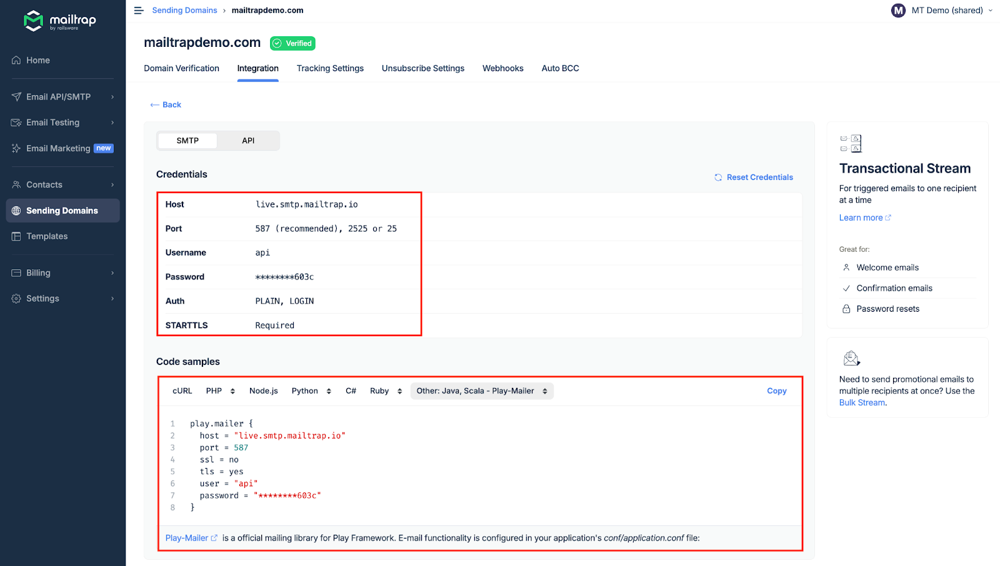
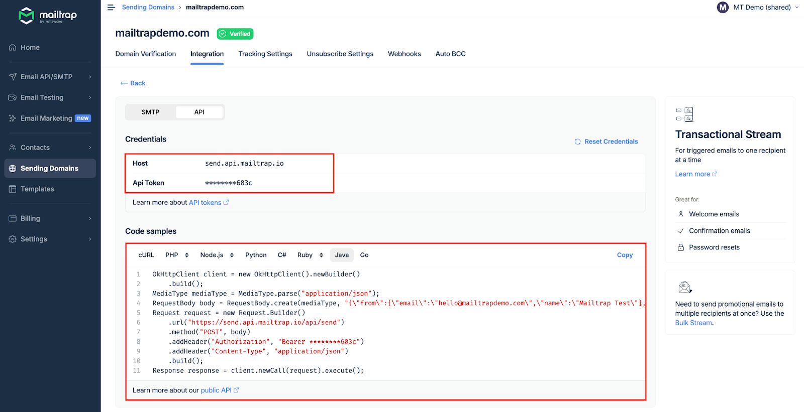

# Java

<a href="https://github.com/mailtrap/mailtrap-java" class="button primary">Mailtrap Java SDK on GitHub</a>

### Overview

Mailtrap can be integrated with Java apps and projects for email sending with SDK, SMTP, and RESTful API.

### Email API/SMTP for Java

#### SDK integration

The [Mailtrap Java SDK](https://github.com/mailtrap/mailtrap-java) is a robust, enterprise-ready library for sending transactional and bulk emails from Java applications. The SDK supports:

* Transactional email sending
* Batch email sending
* Template management
* Contact management
* Sandbox testing
* Account management
* Thread-safe operations

### Installation

Add the SDK to your project using your preferred build tool:




```xml
<dependency>
    <groupId>com.mailtrap</groupId>
    <artifactId>mailtrap-java</artifactId>
    <version>1.0.0</version>
</dependency>
```





```groovy
implementation 'com.mailtrap:mailtrap-java:1.0.0'
```





```kotlin
implementation("com.mailtrap:mailtrap-java:1.0.0")
```




### Minimal Example

Here's a minimal example to send your first email:


```java
import io.mailtrap.client.MailtrapClient;
import io.mailtrap.config.MailtrapConfig;
import io.mailtrap.factory.MailtrapClientFactory;
import io.mailtrap.model.request.emails.Address;
import io.mailtrap.model.request.emails.MailtrapMail;

import java.util.List;

public class MailtrapJavaSDKTest {

    private static final String TOKEN = "<YOUR MAILTRAP TOKEN>";
    private static final String SENDER_EMAIL = "sender@domain.com";
    private static final String RECIPIENT_EMAIL = "recipient@domain.com";

    public static void main(String[] args) {
        final MailtrapConfig config = new MailtrapConfig.Builder()
            .token(TOKEN)
            .build();

        final MailtrapClient client = MailtrapClientFactory.createMailtrapClient(config);

        final MailtrapMail mail = MailtrapMail.builder()
            .from(new Address(SENDER_EMAIL))
            .to(List.of(new Address(RECIPIENT_EMAIL)))
            .subject("Hello from Mailtrap Sending!")
            .text("Welcome to Mailtrap Sending!")
            .build();

        // Send an email using Mailtrap Sending API
        try {
            System.out.println(client.send(mail));
        } catch (Exception e) {
            System.out.println("Caught exception : " + e);
        }
    }
}
```



Get your API token from your Mailtrap account under **Settings → API Tokens**.


#### SMTP integration

To integrate SMTP with your Java app, navigate to the Integrations tab and copy-paste the credentials or ready-made code snippet into your configuration.


SMTP integration is compatible with any Java framework or library that sends emails via SMTP.


<div data-with-frame="true"></div>

For more information, read the [SMTP Integration article](https://app.gitbook.com/s/S3xyr7ba7aGO19rc8dSK/email-api-smtp/setup/smtp-integration).

#### RESTful API integration

To integrate Mailtrap using RESTful API, use the configuration available among Code samples under the API section.

API integration can be used with any Java framework or library that supports HTTP requests. For more details, refer to the [API documentation](https://api-docs.mailtrap.io/docs/mailtrap-api-docs/5tjdeg9545058-mailtrap-api).

<div data-with-frame="true"></div>

Read more about API integration [here](https://app.gitbook.com/s/S3xyr7ba7aGO19rc8dSK/email-api-smtp/setup/api-integration).
