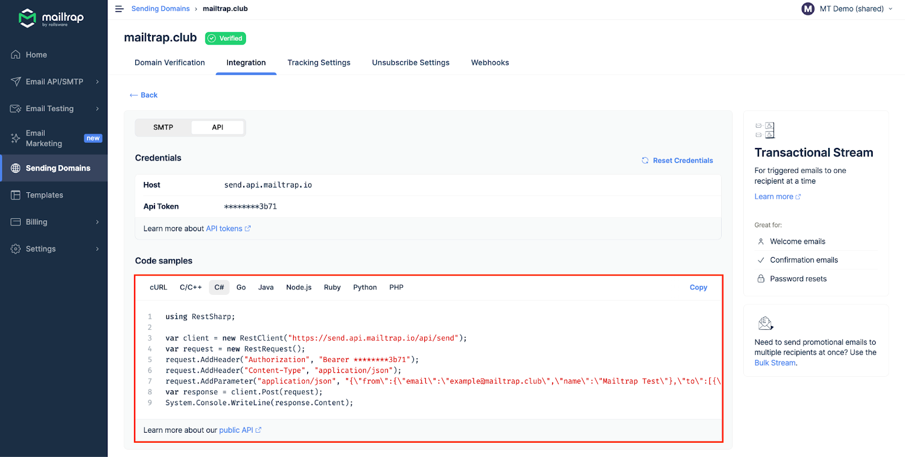

Mailtrap can be integrated with C# and C/C++ apps and projects for email sending.

# Email API/SMTP for C#, C/C++

## SMTP integration

To integrate SMTP with your C# app, navigate to the Integrations tab, choose C#, and copy-paste the credentials or ready-made code snippets.

As C/C++ doesn't have built-in support for SMTP sending, configure the library you're using with the provided credentials.

Note that SMTP integration is compatible with any C# and C/C++ framework or library that sends emails via SMTP.

<figure><figcaption>
SMTP integration for C#
</figcaption></figure>

Read more about Email API/SMTP SMTP integration [here](https://help.mailtrap.io/article/122-mailtrap-email-sending-smtp-integration).

## RESTful API integration

To integrate Mailtrap using RESTful API, use the configuration available among Code samples under the API section.

API integration can be used with any C# and C/C++ framework or library that supports HTTP requests. For more details, refer to the [API documentation](https://api-docs.mailtrap.io/docs/mailtrap-api-docs/5tjdeg9545058-mailtrap-api).

<figure><figcaption>
Email API/SMTP - API Integration for C#
</figcaption></figure>

<figure><figcaption>
Email API/SMTP - API Integration for C/C++
</figcaption></figure>

Read more about Email API/SMTP API integration [here](https://help.mailtrap.io/article/121-mailtrap-email-sending-api-integration).
