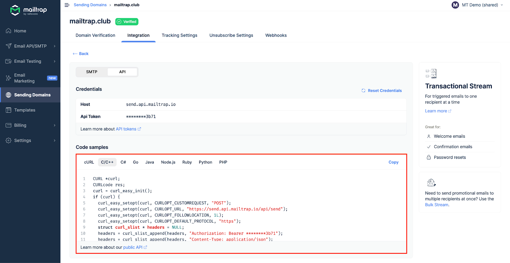

# C#/C++ Integration

## Overview

Mailtrap can be integrated with C# and C/C++ apps and projects for email sending.

## Email API/SMTP for C#, C/C++

### SMTP integration

To integrate SMTP with your C# app, navigate to the Integrations tab, choose C#, and copy-paste the credentials or ready-made code snippets.

As C/C++ doesn't have built-in support for SMTP sending, configure the library you're using with the provided credentials.


SMTP integration is compatible with any C# and C/C++ framework or library that sends emails via SMTP.


.png>)

Read more about SMTP integration [here](../../documentation/sending/smtp-sending/smtp-integration.md).

### RESTful API integration

To integrate Mailtrap using RESTful API, use the configuration available among Code samples under the API section.

API integration can be used with any C# and C/C++ framework or library that supports HTTP requests. For more details, refer to the [API documentation](https://api-docs.mailtrap.io/docs/mailtrap-api-docs/5tjdeg9545058-mailtrap-api).

.png>)

Read more about API integration [here](../../documentation/sending/api-sending/api-integration.md).
