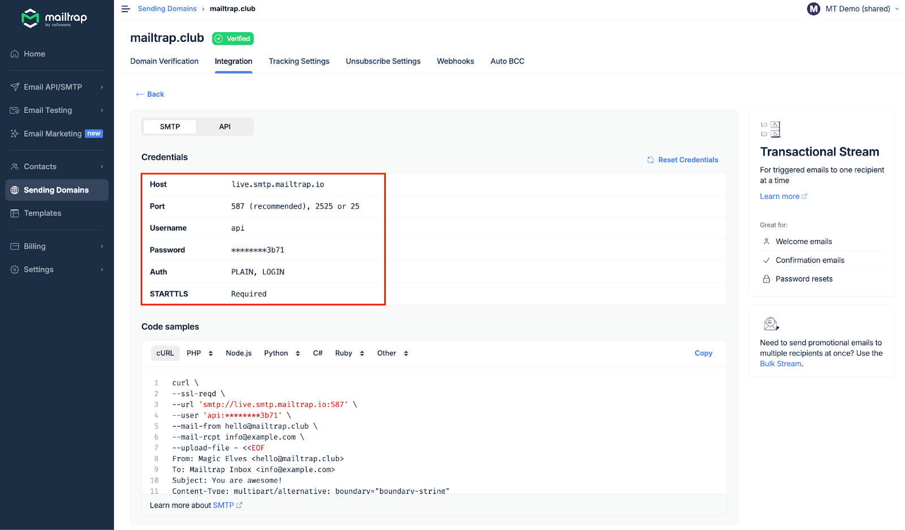
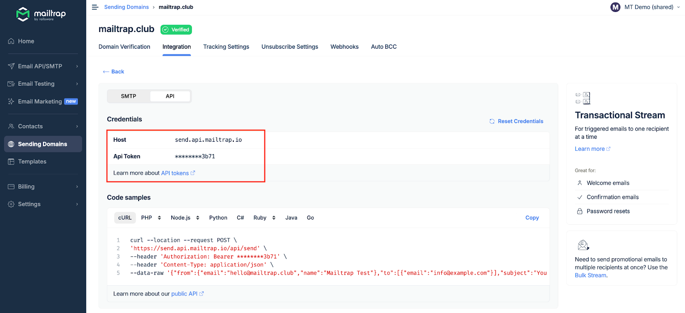

Mailtrap can be integrated with Elixir apps and projects for email sending.

# Email API/SMTP for Elixir

## SDK integration

You can integrate Mailtrap into your Elixir project or application using the [official SDK](https://github.com/railsware/mailtrap-elixir). The SDK offers access to Transactional Stream, Email Testing, and Account Management.

## SMTP integration

To integrate SMTP with your Elixir app, navigate to the Integrations tab and copy-paste the credentials.

Note that SMTP integration is compatible with any Elixir framework or library that sends emails via SMTP.

<figure><figcaption>
SMTP credentials for Elixir integration
</figcaption></figure>

Read more about SMTP integration in the [SMTP Integration guide](https://help.mailtrap.io/article/122-mailtrap-email-sending-smtp-integration).

## RESTful API integration

To integrate Mailtrap using RESTful API, simply copy/paste the API endpoint and API Token into the configuration file of the Elixir framework or library that supports HTTP requests. For more details, refer to the [API documentation](https://api-docs.mailtrap.io/docs/mailtrap-api-docs/5tjdeg9545058-mailtrap-api).

<figure><figcaption>
API credentials for Elixir integration
</figcaption></figure>

Read more about API integration in the [API Integration guide](https://help.mailtrap.io/article/121-mailtrap-email-sending-api-integration).
